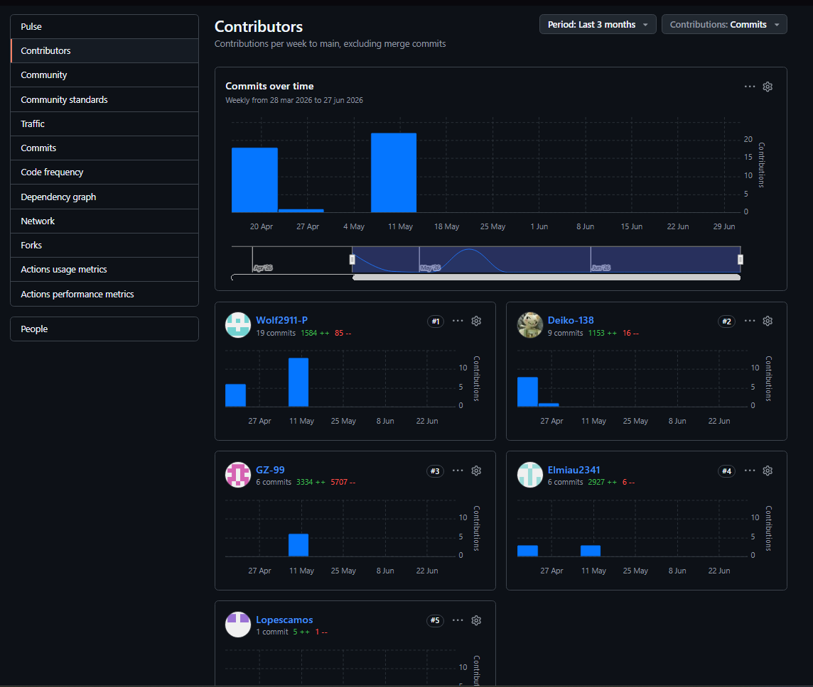
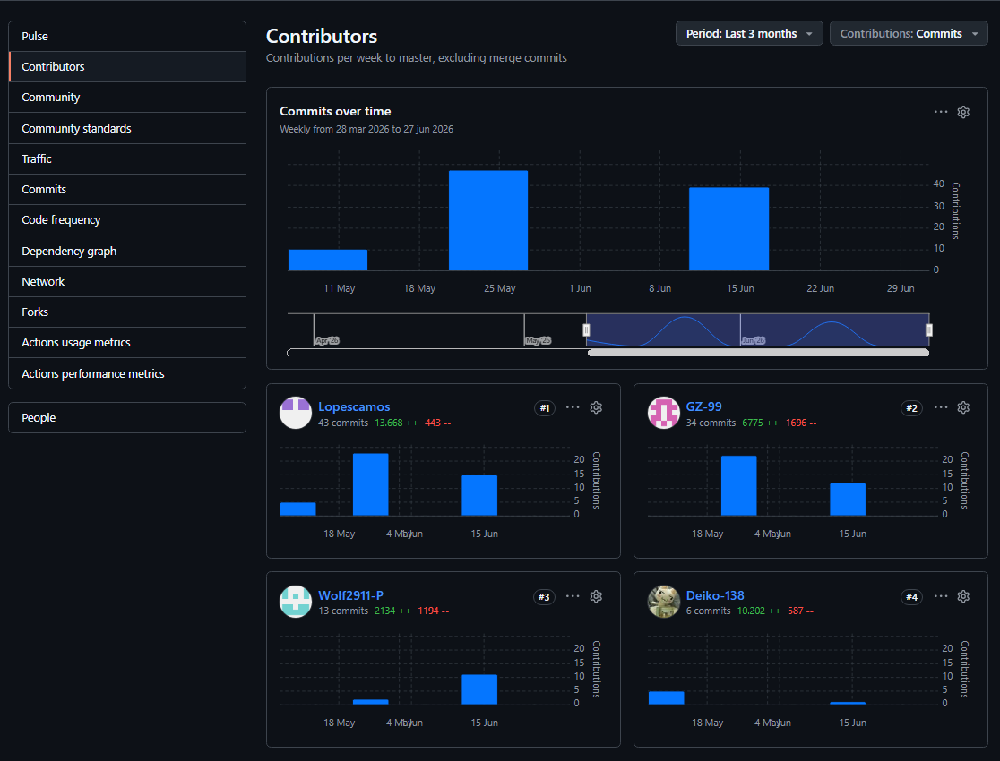
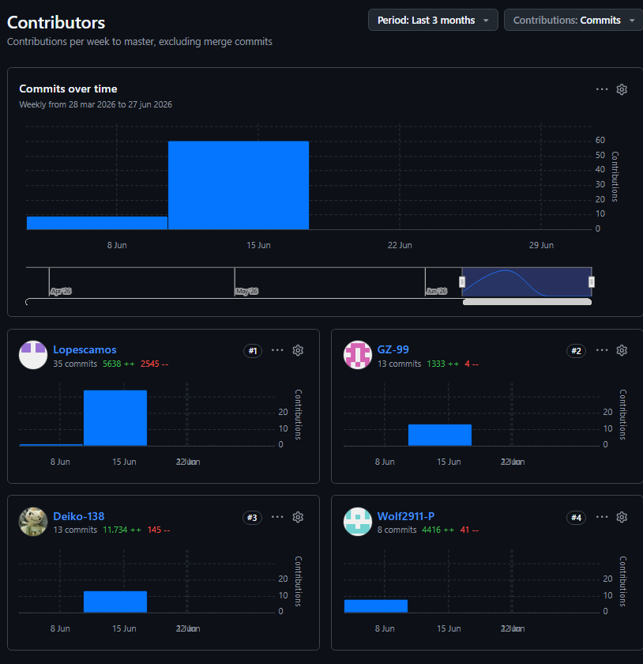

# Universidad Peruana de Ciencias Aplicadas

## Ingeniería de Software
Ciclo 2026-1

# “Informe de trabajo Final”
Open Source
NRC:

Docente: Flores Moroc, Juan Antonio

Startup: TherapyConect

Producto: Software

Integrantes:
Lopez Torres, Leonardo Gabriel - U20241A649
Lopez Montalvo, Kevin Edu - U20241D958
Conde Huashuayo, Sebasthian Alex - U20241E356
Vilchez Vite, Gabriel Alejandro - U202416903
Flores Chávez, Fabricio - U202212327

Abril, 2026

---

**Ciclo:** 2026 - 01  
**Curso:** Desarrollo de Aplicaciones Open Source  
**NRC: 11913**   
**Docente: Flores Moroco Juan Antonio **

**Startup: Conecta**   
**Producto: TherapyConnect**

| Código      | Nombre                           |
|-------------|----------------------------------|
| U20241A649  | Lopez Torres, Leonardo Gabriel   |
| U20241D958  | Lopez Montalvo, Kevin Edu        |
| U20241E356  | Conde Huashuayo, Sebasthian Alex |
| U202416903  | Vilchez Vite, Gabriel Alejandro  |
| U202212327  | Flores Chávez, Fabricio          |

**Abril - 2026**

WEBSITE: https://1asi0729-2610-11913.github.io/upc-pre-202610-1asi0729-11913-TherapyConnect-website/ 

---
# WEBSITE: https://1asi0729-2610-11913.github.io/upc-pre-202610-1asi0729-11913-TherapyConnect-website/ 

---
# Registro de Versiones del Informe

| Versión |     Fecha      |   Autor   | Descripción de modificación |
|:-------:|:--------------:|:---------:|:---------------------------:|
|    1    | 09 / 05 / 2026 | Leonardo  |       Primera versión       |
|    2    | 15 / 05 / 2026 | Leonardo  |       Segunda versión       |
|    3    | 18 / 06 / 2026 | Leonardo  |       Tercera versión       |
|    4    | 07 / 07 / 2026 | Leonardo  |       Cuarta versión        |

# Project Report Collaboration Insights

El presente informe se elabora de forma colaborativa en el repositorio de control de versiones de la organización pública de GitHub del equipo Conecta, disponible en:

**URL del repositorio:**

https://github.com/1ASI0729-2610-11913/upc-pre-202610-1asi0729-11913-TherapyConnect.git

Se aplica GitFlow y Conventional Commits para la evolución del documento, manteniendo la rama main como versión estable y develop para la integración de avances de cada entrega. Cada modificación relevante (adición de secciones, correcciones por retroalimentación del docente, mejoras por autocrítica del equipo) se registra mediante un commit individual, lo cual permite trazabilidad directa con el Registro de Versiones del Informe.

**Avance AV1**

Durante esta entrega, los commits se concentraron en los Capítulos I al IV y en el inicio del Capítulo V (Software Configuration Management y Sprint 1). Participaron los cinco integrantes del equipo, distribuyendo la redacción por bounded context y por rol asignado en el Aspect Leaders and Collaborators Matrix.

**Avance TB1**

Se incorporaron las correcciones señaladas por el docente sobre los artefactos del Capítulo IV, además del contenido de Sprint 2. Los commits reflejan participación de los cinco integrantes en la actualización del Registro de Versiones y en la expansión de la sección Student Outcome.

**Avance AV2**

Se añadió el contenido de Sprint 3, Validation Interviews y el avance de Conclusiones. Los commits muestran la colaboración de todo el equipo en la documentación del despliegue final de los tres productos digitales (Landing Page, Web Application, Web Services).

---

## **Project Report Online**

### [Capítulo I: Introducción]()
- [1.1. Startup Profile]()
    - [1.1.1 Descripción de la Startup]()
    - [1.1.2 Perfiles de integrantes del equipo]()
- [1.2 Solution Profile]()
    - [1.2.1 Antecedentes y problemática]()
    - [1.2.2 Lean UX Process]()
        - [1.2.2.1. Lean UX Problem Statements]()
        - [1.2.2.2. Lean UX Assumptions]()
        - [1.2.2.3. Lean UX Hypothesis Statements]()
        - [1.2.2.4. Lean UX Canvas]()
- [1.3. Segmentos objetivo]()

### [Capítulo II: Requirements Elicitation & Analysis]()
- [2.1. Competidores]()
    - [2.1.1. Análisis competitivo]()
    - [2.1.2. Estrategias y tácticas frente a competidores]()
- [2.2. Entrevistas]()
    - [2.2.1. Diseño de entrevistas]()
    - [2.2.2. Registro de entrevistas]()
    - [2.2.3. Análisis de entrevistas]()
- [2.3. Needfinding]()
    - [2.3.1. User Personas]()
    - [2.3.2. User Task Matrix]()
    - [2.3.3. User Journey Mapping]()
    - [2.3.4. Empathy Mapping]()
- [2.4. Big Picture Event Storming.]()
- [2.5. Ubiquitous Language]()

### [Capítulo III: Requirements Specification]()
- [3.1. User Stories]()
- [3.2. Impact Mapping]()
- [3.3. Product Backlog]()

### [Capítulo IV: Product Design]()
- [4.1. Style Guidelines]()
    - [4.1.1. General Style Guidelines]()
    - [4.1.2. Web Style Guidelines]()
- [4.2. Information Architecture]()
    - [4.2.1. Organization Systems]()
    - [4.2.2. Labeling Systems]()
    - [4.2.3. SEO Tags and Meta Tags]()
    - [4.2.4. Searching Systems]()
    - [4.2.5. Navigation Systems]()
- [4.3. Landing Page UI Design]()
    - [4.3.1. Landing Page Wireframe]()
    - [4.3.2. Landing Page Mock-up]()
- [4.4. Web Applications UX/UI Design]()
    - [4.4.1. Web Applications Wireframes]()
    - [4.4.2. Web Applications Wireflow Diagrams]()
    - [4.4.3. Web Applications Mock-ups]()
    - [4.4.4. Web Applications User Flow Diagrams]()
- [4.5. Web Applications Prototyping]()
- [4.6. Domain-Driven Software Architecture]()
    - [4.6.1. Design-Level Event Storming]()
    - [4.6.2. Software Architecture Context Diagram]()
    - [4.6.3. Software Architecture Container Diagrams]()
    - [4.6.4. Software Architecture Components Diagrams]()
- [4.7. Software Object-Oriented Design]()
    - [4.7.1. Class Diagrams]()
- [4.8. Database Design]()
    - [4.8.1. Database Diagram]()

### [Capítulo V: Product Implementation, Validation & Deployment]()
- [5.1. Software Configuration Management]()
    - [5.1.1. Software Development Environment Configuration]()
    - [5.1.2. Source Code Management]()
    - [5.1.3. Source Code Style Guide & Conventions]()
    - [5.1.4. Software Deployment Configuration]()
- [5.2. Landing Page, Services & Applications Implementation]()
    - [5.2.1. Sprint 1]()
        - [5.2.1.1. Sprint Planning 1]()
        - [5.2.1.2. Sprint Backlog 1]()
        - [5.2.1.3. Development Evidence for Sprint Review]()
        - [5.2.1.4. Testing Suite Evidence for Sprint Review]()
        - [5.2.1.5. Execution Evidence for Sprint Review]()
        - [5.2.1.6. Services Documentation Evidence for Sprint Review]()
        - [5.2.1.7. Software Deployment Evidence for Sprint Review]()
        - [5.2.1.8. Team Collaboration Insights during Sprint]()

- [Conclusiones y recomendaciones](docs/conclusiones.md)
- [Video About-the-Team](docs/video-about-the-team.md)
- [Bibliografía](docs/bibliografia.md)
- [Anexos](docs/anexos.md)

---
