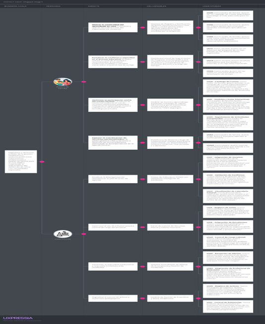

# Capítulo III: Requirements Specification

## 3.1. User Stories

A continuación, se presentan las 127 User Stories agrupadas en 10 Épicas. Cada historia incluye su identificador, descripción en formato estándar (Como... quiero... para...) y criterios de aceptación con escenarios en formato Dado/Cuando/Entonces.

Las épicas cubren los tres segmentos de la plataforma: padres de familia, instituciones terapéuticas y profesores/terapeutas.

---

| ID     | Título                                       | Descripción                                                                                                                                            | Criterios de Aceptación                                                                                                                                                                                                                                                                                                                                                                                                                                                                                                                                          | Épica |
|--------|----------------------------------------------|--------------------------------------------------------------------------------------------------------------------------------------------------------|------------------------------------------------------------------------------------------------------------------------------------------------------------------------------------------------------------------------------------------------------------------------------------------------------------------------------------------------------------------------------------------------------------------------------------------------------------------------------------------------------------------------------------------------------------------|-------|
| US01   | Inicio de sesión                             | **Como** usuario, **quiero** iniciar sesión **para** acceder a mi cuenta según mi rol.                                                                 | **Escenario 1: Inicio de sesión exitoso**: **Dado** que el usuario se encuentra en la pantalla de inicio de sesión, **Cuando** ingresa su correo y contraseña correctos y presiona "Ingresar", **Entonces** el sistema lo redirige al dashboard según su rol (padre, profesor o institución). **Escenario 2: Credenciales incorrectas**: **Dado** que el usuario intenta iniciar sesión, **Cuando** ingresa credenciales incorrectas, **Entonces** el sistema muestra un mensaje de error indicando que los datos son inválidos.                              | EP01  |
| US02   | Registro de usuario                          | **Como** usuario, **quiero** registrarme en la plataforma **para** acceder a los servicios según mi rol.                                               | **Escenario 1: Registro exitoso**: **Dado** que el usuario accede al formulario de registro, **Cuando** completa todos los campos obligatorios y selecciona su rol, **Entonces** el sistema crea su cuenta y le envía un correo de confirmación.  **Escenario 2: Correo ya registrado**: **Dado** que el usuario intenta registrarse, **Cuando** ingresa un correo ya existente en el sistema, **Entonces** el sistema muestra un aviso indicando que el correo ya está en uso.                                                                               | EP01  |
| US03   | Recuperación de contraseña                   | **Como** usuario, **quiero** recuperar mi contraseña **para** poder acceder nuevamente a la plataforma.                                                | **Escenario 1: Enlace de recuperación enviado**: **Dado** que el usuario no recuerda su contraseña, **Cuando** ingresa su correo registrado y solicita la recuperación, **Entonces** el sistema envía un enlace de restablecimiento a su correo electrónico.  **Escenario 2: Correo no registrado**: **Dado** que el usuario solicita recuperación de contraseña, **Cuando** ingresa un correo que no existe en el sistema, **Entonces** el sistema muestra un mensaje indicando que el correo no fue encontrado.                                          | EP01  |
| US04   | Configuración de perfil                      | **Como** usuario, **quiero** editar mi perfil **para** mantener actualizada mi información actual.                                                     | **Escenario 1: Edición exitosa**: **Dado** que el usuario accede a la sección de perfil, **Cuando** modifica sus datos y presiona "Guardar", **Entonces** el sistema actualiza la información y muestra un mensaje de confirmación.  **Escenario 2: Campos obligatorios vacíos**: **Dado** que el usuario intenta guardar cambios en su perfil, **Cuando** deja campos obligatorios en blanco, **Entonces** el sistema indica qué campos deben completarse antes de guardar.                                                                               | EP01  |
| US05   | Gestión de disponibilidad                    | **Como** profesor, **quiero** configurar mis horarios disponibles **para** recibir asignaciones correctamente.                                         | **Escenario 1: Disponibilidad configurada**: **Dado** que el profesor accede a la sección de disponibilidad, **Cuando** selecciona los días y bloques horarios disponibles y guarda, **Entonces** el sistema registra su disponibilidad y la refleja en el panel de asignaciones.  **Escenario 2: Sin horarios seleccionados**: **Dado** que el profesor intenta guardar su disponibilidad, **Cuando** no selecciona ningún bloque horario, **Entonces** el sistema solicita que seleccione al menos un horario disponible.                                | EP01  |
| US06   | Gestión de suscripción                       | **Como** usuario, **quiero** visualizar el estado de mi suscripción **para** conocer mis beneficios activos.                                           | **Escenario 1: Suscripción activa**: **Dado** que el usuario accede a la sección de suscripción, **Cuando** tiene un plan activo, **Entonces** visualiza el plan contratado, fecha de vencimiento y beneficios incluidos.  **Escenario 2: Sin suscripción activa**: **Dado** que el usuario accede a la sección de suscripción, **Cuando** no tiene un plan vigente, **Entonces** el sistema muestra los planes disponibles e invita al usuario a suscribirse.                                                                                             | EP01  |
| US07   | Cierre de sesión seguro                      | **Como** usuario, **quiero** cerrar sesión **para** proteger mi información personal.                                                                  | **Escenario 1: Cierre exitoso**: **Dado** que el usuario se encuentra dentro de la plataforma, **Cuando** selecciona la opción "Cerrar sesión", **Entonces** el sistema finaliza la sesión y redirige al usuario a la pantalla de inicio de sesión.  **Escenario 2: Sesión inactiva**: **Dado** que el usuario no ha interactuado con la plataforma por un tiempo prolongado, **Cuando** se supera el tiempo de inactividad configurado, **Entonces** el sistema cierra la sesión automáticamente y notifica al usuario.                                   | EP01  |
| US08   | Configuración de notificaciones              | **Como** padre de familia, **quiero** configurar las notificaciones **para** recibir solo información relevante.                                       | **Escenario 1: Configuración guardada**: **Dado** que el padre accede a la sección de notificaciones, **Cuando** selecciona los tipos de notificaciones que desea recibir y guarda, **Entonces** el sistema aplica la configuración y solo envía las notificaciones seleccionadas.  **Escenario 2: Desactivar todas las notificaciones**: **Dado** que el padre accede a la configuración de notificaciones, **Cuando** desactiva todas las opciones disponibles, **Entonces** el sistema deja de enviar notificaciones hasta que el usuario las reactive. | EP02  |
| US09   | Recepción de notificaciones                  | **Como** usuario, **quiero** recibir notificaciones del sistema **para** estar informado sobre eventos relevantes.                                     | **Escenario 1: Notificación recibida**: **Dado** que ocurre un evento relevante en la plataforma (cita, mensaje, cambio), **Cuando** el sistema lo detecta, **Entonces** envía una notificación al usuario afectado en la app y/o por correo según su configuración.  **Escenario 2: Notificación leída**: **Dado** que el usuario recibe una notificación, **Cuando** la abre o la marca como leída, **Entonces** el sistema actualiza el estado de la notificación y la elimina del contador de no leídas.                                               | EP02  |
| US10   | Notificaciones de emergencia                 | **Como** profesor, **quiero** recibir alertas de emergencia **para** responder rápidamente a incidentes.                                               | **Escenario 1: Alerta recibida estando disponible**: **Dado** que se activa una emergencia en la plataforma, **Cuando** el profesor está marcado como disponible, **Entonces** recibe una alerta inmediata con los detalles del incidente y opciones de respuesta.  **Escenario 2: Alerta ignorada por no disponibilidad**: **Dado** que se activa una emergencia, **Cuando** el profesor está en sesión o marcado como no disponible, **Entonces** el sistema omite la alerta para ese profesor y la envía a otro disponible.                             | EP02  |
| US11   | Envío de mensajes institucionales            | **Como** institución, **quiero** enviar mensajes a los profesores **para** comunicar indicaciones importantes.                                         | **Escenario 1: Mensaje enviado exitosamente**: **Dado** que el administrador accede al panel de mensajería, **Cuando** redacta un mensaje y selecciona uno o varios profesores destinatarios, **Entonces** el mensaje se envía y los profesores reciben una notificación de nuevo mensaje.  **Escenario 2: Mensaje sin destinatario**: **Dado** que el administrador intenta enviar un mensaje, **Cuando** no selecciona ningún destinatario, **Entonces** el sistema impide el envío y solicita seleccionar al menos un profesor.                         | EP02  |
| US12   | Reporte de emergencia durante clase          | **Como** profesor, **quiero** reportar incidentes durante una sesión **para** informar a la institución.                                               | **Escenario 1: Reporte enviado**: **Dado** que el profesor detecta un incidente durante la sesión, **Cuando** completa el formulario de reporte y lo envía, **Entonces** la institución recibe una notificación inmediata con el detalle del incidente.  **Escenario 2: Reporte incompleto**: **Dado** que el profesor intenta enviar un reporte, **Cuando** deja campos obligatorios en blanco, **Entonces** el sistema indica qué campos deben completarse antes de enviarlo.                                                                            | EP02  |
| US13   | Alertas previas a eventos                    | **Como** usuario, **quiero** recibir alertas antes de una sesión o actividad **para** prepararme con anticipación.                                     | **Escenario 1: Alerta enviada con anticipación**: **Dado** que existe una sesión o actividad programada, **Cuando** se aproxima el tiempo de anticipación configurado (ej. 30 minutos antes), **Entonces** el usuario recibe una alerta recordándole el evento próximo.  **Escenario 2: Sin eventos próximos**: **Dado** que el usuario no tiene sesiones programadas en las próximas horas, **Cuando** el sistema revisa el calendario, **Entonces** no se envía ninguna alerta innecesaria.                                                              | EP02  |
| US14   | Recordatorio de clases                       | **Como** usuario, **quiero** recibir notificaciones antes de cada sesión **para** no olvidarme de mis clases.                                          | **Escenario 1: Recordatorio enviado**: **Dado** que el usuario tiene una clase programada, **Cuando** se alcanza el tiempo configurado antes del inicio de la clase, **Entonces** el sistema envía un recordatorio con los detalles de la sesión (hora, lugar, profesional).  **Escenario 2: Clase cancelada**: **Dado** que una clase fue cancelada, **Cuando** el sistema detecta la cancelación antes de enviar el recordatorio, **Entonces** omite el recordatorio y notifica al usuario sobre la cancelación.                                         | EP02  |
| US15   | Notificaciones de cambios de horario         | **Como** usuario, **quiero** recibir alertas cuando haya cambios en el horario **para** estar informado.                                               | **Escenario 1: Cambio detectado y notificado**: **Dado** que la institución o terapeuta modifica el horario de una sesión, **Cuando** el sistema procesa el cambio, **Entonces** el usuario afectado recibe una notificación indicando el nuevo horario.  **Escenario 2: Cambio cancelado**: **Dado** que se realiza y luego se revierte un cambio de horario, **Cuando** el sistema detecta la reversión, **Entonces** notifica al usuario que el horario original ha sido restaurado.                                                                    | EP02  |
| US16   | Notificaciones de mensajes                   | **Como** usuario, **quiero** recibir notificaciones de nuevos mensajes **para** responder oportunamente.                                               | **Escenario 1: Notificación de mensaje entrante**: **Dado** que el usuario recibe un nuevo mensaje en la plataforma, **Cuando** el sistema lo detecta, **Entonces** envía una notificación push o de correo indicando que tiene un mensaje sin leer.  **Escenario 2: Múltiples mensajes sin leer**: **Dado** que el usuario tiene varios mensajes sin leer, **Cuando** accede al módulo de mensajería, **Entonces** visualiza el número total de mensajes pendientes agrupados por conversación.                                                           | EP02  |
| US17   | Visualización de calendario                  | **Como** usuario, **quiero** visualizar un calendario con mis sesiones y actividades **para** organizar mi tiempo.                                     | **Escenario 1: Calendario con eventos**: **Dado** que el usuario accede al módulo de calendario, **Cuando** tiene sesiones o actividades programadas, **Entonces** las visualiza organizadas por día, semana o mes según la vista seleccionada.  **Escenario 2: Calendario vacío**: **Dado** que el usuario accede al calendario, **Cuando** no tiene actividades programadas, **Entonces** el sistema muestra el calendario vacío con la opción de agendar una nueva sesión.                                                                              | EP03  |
| US18   | Visualización de detalle de sesión           | **Como** usuario, **quiero** ver el detalle de una sesión desde el calendario **para** conocer información específica.                                 | **Escenario 1: Detalle visible**: **Dado** que el usuario visualiza su calendario, **Cuando** hace clic sobre una sesión programada, **Entonces** el sistema muestra el detalle completo: fecha, hora, profesional, estudiante y modalidad.  **Escenario 2: Sesión cancelada**: **Dado** que el usuario hace clic sobre una sesión, **Cuando** dicha sesión fue cancelada, **Entonces** el sistema muestra el estado de cancelación y el motivo si fue registrado.                                                                                         | EP03  |
| US19   | Filtrado de calendario                       | **Como** usuario, **quiero** filtrar el calendario **para** visualizar información específica según mis necesidades.                                   | **Escenario 1: Filtro aplicado**: **Dado** que el usuario accede al calendario, **Cuando** aplica un filtro (por profesor, estudiante o tipo de sesión), **Entonces** el calendario muestra únicamente los eventos que coinciden con el criterio seleccionado.  **Escenario 2: Sin resultados**: **Dado** que el usuario aplica un filtro, **Cuando** no existen eventos que coincidan con el criterio, **Entonces** el sistema muestra un mensaje indicando que no hay resultados para ese filtro.                                                        | EP03  |
| US20   | Actualización automática del calendario      | **Como** usuario, **quiero** que el calendario se actualice automáticamente **para** reflejar cambios en tiempo real.                                  | **Escenario 1: Actualización al detectar cambio**: **Dado** que se realiza un cambio en una sesión o asignación, **Cuando** el sistema procesa la modificación, **Entonces** el calendario del usuario afectado se actualiza automáticamente sin necesidad de recargar.  **Escenario 2: Sin cambios pendientes**: **Dado** que no se han realizado modificaciones, **Cuando** el usuario visualiza su calendario, **Entonces** el contenido mostrado refleja el estado actual sin diferencias.                                                             | EP03  |
| US21   | Visualización de disponibilidad de recursos  | **Como** usuario, **quiero** consultar la disponibilidad de aulas y recursos **para** programar sesiones correctamente.                                | **Escenario 1: Recurso disponible**: **Dado** que el usuario consulta la disponibilidad de un aula o recurso, **Cuando** el recurso no tiene asignaciones en el horario buscado, **Entonces** el sistema lo muestra como disponible y permite seleccionarlo.  **Escenario 2: Recurso no disponible**: **Dado** que el usuario consulta la disponibilidad, **Cuando** el recurso ya está asignado en ese horario, **Entonces** el sistema lo muestra como ocupado e indica el horario más próximo disponible.                                               | EP03  |
| US22   | Realización de clases en vivo                | **Como** profesor, **quiero** iniciar clases en vivo **para** interactuar con los estudiantes y padres.                                                | **Escenario 1: Clase iniciada**: **Dado** que el profesor accede a una sesión programada, **Cuando** presiona "Iniciar clase", **Entonces** el sistema habilita el entorno de clase en vivo y notifica a los participantes asignados.  **Escenario 2: Clase sin participantes conectados**: **Dado** que el profesor inicia la clase, **Cuando** ningún participante se conecta en los primeros minutos, **Entonces** el sistema notifica al profesor y permite esperar o finalizar la sesión.                                                             | EP03  |
| US23   | Gestión de clases privadas                   | **Como** profesor, **quiero** realizar sesiones privadas solicitadas por los padres **para** atención personalizada.                                   | **Escenario 1: Sesión privada iniciada**: **Dado** que el profesor tiene una solicitud de clase privada aceptada, **Cuando** llega el horario programado y presiona "Iniciar", **Entonces** se habilita la sesión privada solo para el profesor y el padre/estudiante solicitante.  **Escenario 2: Sesión privada sin confirmar**: **Dado** que un padre solicita una clase privada, **Cuando** el profesor no ha aceptado la solicitud, **Entonces** la sesión no puede iniciarse y el sistema muestra el estado pendiente.                               | EP03  |
| US24   | Registro de desarrollo del niño              | **Como** profesor, **quiero** registrar el comportamiento del niño durante la clase **para** evaluar su progreso.                                      | **Escenario 1: Registro guardado**: **Dado** que el profesor se encuentra en una sesión activa, **Cuando** completa el formulario de comportamiento y progreso del niño, **Entonces** el registro queda guardado y asociado a la sesión y al perfil del estudiante.  **Escenario 2: Registro sin datos**: **Dado** que el profesor intenta guardar el registro, **Cuando** no ha completado los campos mínimos requeridos, **Entonces** el sistema solicita completar la información antes de guardar.                                                     | EP03  |
| US25   | Finalización de sesión                       | **Como** profesor, **quiero** cerrar la sesión **para** guardar toda la información de la clase.                                                       | **Escenario 1: Cierre exitoso**: **Dado** que el profesor ha concluido la clase, **Cuando** presiona "Finalizar sesión", **Entonces** el sistema guarda todos los registros de la sesión y actualiza el historial del estudiante.  **Escenario 2: Cierre con datos sin guardar**: **Dado** que el profesor intenta finalizar la sesión, **Cuando** existen observaciones o registros sin guardar, **Entonces** el sistema alerta al profesor para que confirme o complete la información antes de cerrar.                                                  | EP03  |
| US26   | Acceso a historial de sesiones               | **Como** usuario, **quiero** ver sesiones anteriores **para** analizar la evolución del estudiante.                                                    | **Escenario 1: Historial con registros**: **Dado** que el usuario accede al historial de sesiones de un estudiante, **Cuando** existen sesiones previas registradas, **Entonces** las visualiza ordenadas cronológicamente con fecha, terapeuta y observaciones.  **Escenario 2: Sin sesiones anteriores**: **Dado** que el usuario accede al historial, **Cuando** no existen sesiones previas, **Entonces** el sistema muestra un mensaje indicando que aún no hay sesiones registradas.                                                                 | EP03  |
| US27   | Acceso a apuntes de sesión                   | **Como** profesor, **quiero** registrar observaciones durante la clase **para** seguimiento del niño.                                                  | **Escenario 1: Apunte registrado**: **Dado** que el profesor se encuentra en una sesión activa, **Cuando** redacta y guarda una observación en el módulo de apuntes, **Entonces** el apunte queda asociado a la sesión y al perfil del estudiante.  **Escenario 2: Apunte vacío**: **Dado** que el profesor intenta guardar un apunte, **Cuando** el campo de texto está vacío, **Entonces** el sistema impide el guardado y solicita ingresar contenido.                                                                                                  | EP03  |
| US28   | Visualización de sesiones disponibles        | **Como** padre de familia, **quiero** ver las sesiones grupales programadas **para** elegir en cuál participar.                                        | **Escenario 1: Sesiones listadas**: **Dado** que el padre accede al módulo de sesiones grupales, **Cuando** existen sesiones disponibles, **Entonces** visualiza la lista con fecha, hora, terapeuta y cupos disponibles.  **Escenario 2: Sin sesiones disponibles**: **Dado** que el padre accede al módulo, **Cuando** no hay sesiones grupales programadas, **Entonces** el sistema muestra un mensaje indicando que no hay sesiones disponibles en este momento.                                                                                       | EP03  |
| US29   | Consulta de horarios de sesiones             | **Como** usuario, **quiero** ver los horarios de las sesiones grupales **para** organizar mi tiempo.                                                   | **Escenario 1: Horarios visibles**: **Dado** que el usuario accede al listado de sesiones grupales, **Cuando** selecciona una sesión, **Entonces** visualiza el horario detallado con fecha, hora de inicio, hora de fin y modalidad.  **Escenario 2: Sesión sin horario definido**: **Dado** que el usuario consulta una sesión, **Cuando** el horario aún no ha sido confirmado por la institución, **Entonces** el sistema muestra el estado como "Pendiente de confirmación".                                                                          | EP03  |
| US30   | Registro en sesión grupal                    | **Como** padre, **quiero** inscribirme en una sesión grupal **para** asegurar mi participación.                                                        | **Escenario 1: Registro exitoso**: **Dado** que el padre visualiza una sesión grupal con cupos disponibles, **Cuando** presiona "Inscribirme", **Entonces** el sistema registra su participación y le envía una confirmación con los detalles.  **Escenario 2: Sin cupos disponibles**: **Dado** que el padre intenta inscribirse en una sesión, **Cuando** no hay cupos disponibles, **Entonces** el sistema informa que la sesión está llena y ofrece la opción de unirse a lista de espera.                                                             | EP03  |
| US31   | Acceso a la sesión en tiempo real            | **Como** usuario, **quiero** ingresar a la sesión grupal en el horario indicado **para** recibir orientación.                                          | **Escenario 1: Acceso exitoso**: **Dado** que el usuario está inscrito en una sesión grupal, **Cuando** llega el horario programado y presiona "Unirme a la sesión", **Entonces** el sistema lo conecta al entorno de la sesión en tiempo real.  **Escenario 2: Acceso anticipado**: **Dado** que el usuario intenta ingresar antes del horario, **Cuando** la sesión aún no ha comenzado, **Entonces** el sistema muestra un contador de tiempo restante e indica cuándo estará disponible.                                                               | EP03  |
| US32   | Recepción de recordatorios de sesión         | **Como** padre de familia, **quiero** recibir recordatorios antes de la sesión **para** no olvidarla.                                                  | **Escenario 1: Recordatorio enviado**: **Dado** que el padre tiene una sesión inscrita próxima, **Cuando** se acerca el tiempo configurado de anticipación, **Entonces** recibe un recordatorio con los detalles de la sesión.  **Escenario 2: Sesión cancelada antes del recordatorio**: **Dado** que la sesión fue cancelada antes de enviarse el recordatorio, **Cuando** el sistema detecta la cancelación, **Entonces** notifica al padre sobre la cancelación en lugar del recordatorio.                                                             | EP03  |
| US33   | Visualización de eventos programados         | **Como** usuario, **quiero** ver todas las actividades (sesiones, cursos, recordatorios) dentro del calendario.                                        | **Escenario 1: Todos los eventos visibles**: **Dado** que el usuario accede al calendario, **Cuando** tiene sesiones, cursos y recordatorios programados, **Entonces** los visualiza todos integrados en el calendario diferenciados por tipo.  **Escenario 2: Calendario sin eventos**: **Dado** que el usuario accede al calendario, **Cuando** no tiene actividades programadas, **Entonces** el sistema muestra el calendario vacío con la opción de crear una nueva actividad.                                                                        | EP03  |
| US34   | Identificación de tipos de eventos           | **Como** padre, **quiero** diferenciar los eventos (clases, notas, recordatorios) **para** entender mejor mi planificación.                            | **Escenario 1: Eventos diferenciados visualmente**: **Dado** que el padre visualiza su calendario, **Cuando** tiene distintos tipos de eventos programados, **Entonces** cada tipo se muestra con un color o ícono diferente que facilita su identificación.  **Escenario 2: Leyenda de colores disponible**: **Dado** que el padre visualiza el calendario con múltiples eventos, **Cuando** consulta la leyenda del calendario, **Entonces** puede identificar qué color o ícono corresponde a cada tipo de evento.                                      | EP03  |
| US35   | Acceso al detalle del evento                 | **Como** usuario, **quiero** ver el detalle de cada evento **para** conocer información específica.                                                    | **Escenario 1: Detalle del evento**: **Dado** que el usuario visualiza su calendario, **Cuando** hace clic sobre cualquier evento, **Entonces** el sistema despliega el detalle completo: título, descripción, hora, lugar y participantes.  **Escenario 2: Evento modificado**: **Dado** que el usuario accede al detalle de un evento, **Cuando** el evento ha sido modificado recientemente, **Entonces** el sistema muestra los datos actualizados junto con un indicador de cambio reciente.                                                          | EP03  |
| US36   | Creación de nuevo recordatorio               | **Como** padre de familia, **quiero** crear recordatorios **para** no olvidar actividades importantes.                                                 | **Escenario 1: Recordatorio creado**: **Dado** que el padre accede al módulo de recordatorios, **Cuando** completa el formulario con título, fecha y hora y presiona "Guardar", **Entonces** el recordatorio se crea y aparece en su calendario.  **Escenario 2: Fecha en el pasado**: **Dado** que el padre intenta crear un recordatorio, **Cuando** selecciona una fecha anterior a la actual, **Entonces** el sistema muestra un aviso indicando que la fecha debe ser futura.                                                                         | EP03  |
| US37   | Gestión de recordatorio                      | **Como** usuario, **quiero** gestionar mis recordatorios **para** no olvidar actividades importantes.                                                  | **Escenario 1: Recordatorio editado**: **Dado** que el usuario accede a un recordatorio existente, **Cuando** modifica la información y guarda los cambios, **Entonces** el sistema actualiza el recordatorio con los nuevos datos.  **Escenario 2: Recordatorio eliminado**: **Dado** que el usuario accede a un recordatorio, **Cuando** selecciona la opción de eliminar y confirma la acción, **Entonces** el sistema elimina el recordatorio y lo remueve del calendario.                                                                             | EP03  |
| US38   | Visualización de horario semanal             | **Como** profesor, **quiero** ver mi horario semanal **para** organizar mis sesiones terapéuticas.                                                     | **Escenario 1: Horario con sesiones**: **Dado** que el profesor accede a su horario semanal, **Cuando** tiene sesiones asignadas en la semana actual, **Entonces** las visualiza ordenadas por día y hora con el nombre del estudiante y aula.  **Escenario 2: Semana sin sesiones**: **Dado** que el profesor consulta su horario, **Cuando** no tiene sesiones asignadas en esa semana, **Entonces** el sistema muestra el horario vacío e indica que no hay sesiones programadas.                                                                       | EP03  |
| US39   | Visualización de estudiantes asignados       | **Como** profesor, **quiero** ver qué estudiante me corresponde en cada sesión **para** prepararme adecuadamente.                                      | **Escenario 1: Estudiante visible**: **Dado** que el profesor visualiza su horario, **Cuando** selecciona una sesión, **Entonces** el sistema muestra el nombre del estudiante asignado junto con su perfil e historial reciente.  **Escenario 2: Sin estudiante asignado**: **Dado** que el profesor revisa una sesión, **Cuando** no tiene un estudiante asignado aún, **Entonces** el sistema indica que la sesión está pendiente de asignación.                                                                                                        | EP03  |
| US40   | Registro de asistencia del estudiante        | **Como** profesor, **quiero** marcar asistencia **para** llevar control de participación.                                                              | **Escenario 1: Asistencia registrada**: **Dado** que el profesor inicia una sesión, **Cuando** marca al estudiante como presente o ausente, **Entonces** el sistema guarda el registro y lo refleja en el historial del estudiante.  **Escenario 2: Sesión finalizada sin marcar asistencia**: **Dado** que el profesor finaliza una sesión sin registrar asistencia, **Cuando** el sistema detecta el cierre, **Entonces** solicita confirmar la asistencia antes de cerrar definitivamente la sesión.                                                    | EP03  |
| US41   | Eliminación o desactivación de profesores    | **Como** institución, **quiero** desactivar profesores **para** evitar asignaciones incorrectas.                                                       | **Escenario 1: Desactivación exitosa**: **Dado** que el administrador accede al perfil de un profesor, **Cuando** selecciona "Desactivar" y confirma la acción, **Entonces** el profesor queda inactivo y no aparece disponible para nuevas asignaciones.  **Escenario 2: Profesor con sesiones activas**: **Dado** que el administrador intenta desactivar a un profesor, **Cuando** dicho profesor tiene sesiones activas o pendientes, **Entonces** el sistema alerta sobre las sesiones existentes y solicita confirmar la desactivación.              | EP04  |
| US42   | Registro de profesores                       | **Como** institución, **quiero** registrar a los profesores **para** gestionar sus asignaciones dentro del sistema.                                    | **Escenario 1: Registro exitoso**: **Dado** que el administrador accede al panel de profesores, **Cuando** completa los datos del nuevo profesor y guarda, **Entonces** el sistema crea el perfil del profesor y le envía credenciales de acceso.  **Escenario 2: Correo ya registrado**: **Dado** que el administrador intenta registrar un profesor, **Cuando** el correo ingresado ya existe en el sistema, **Entonces** el sistema muestra un aviso indicando que el correo ya está en uso.                                                            | EP04  |
| US43   | Asignación de estudiantes a profesores       | **Como** institución, **quiero** asignar estudiantes a profesores **para** organizar la atención terapéutica.                                          | **Escenario 1: Asignación exitosa**: **Dado** que el administrador accede al panel de asignaciones, **Cuando** vincula a un estudiante con un profesor disponible, **Entonces** el sistema confirma la asignación y notifica al profesor.  **Escenario 2: Sobrecarga de estudiantes**: **Dado** que el administrador intenta asignar un estudiante, **Cuando** el profesor ya alcanzó el límite máximo de estudiantes, **Entonces** el sistema alerta sobre la sobrecarga y solicita confirmación para continuar.                                          | EP04  |
| US44   | Edición de datos de profesores               | **Como** institución, **quiero** actualizar la información de los profesores **para** mantener registros correctos.                                    | **Escenario 1: Edición guardada**: **Dado** que el administrador accede al perfil de un profesor, **Cuando** modifica los datos y presiona "Guardar", **Entonces** el sistema actualiza la información y confirma los cambios.  **Escenario 2: Datos inválidos**: **Dado** que el administrador edita datos de un profesor, **Cuando** ingresa información con formato incorrecto, **Entonces** el sistema indica el error específico y solicita corrección.                                                                                               | EP04  |
| US45   | Asignación de aulas a profesores             | **Como** institución, **quiero** asignar aulas a profesores **para** definir dónde se realizarán las sesiones.                                         | **Escenario 1: Aula asignada**: **Dado** que el administrador accede al panel de asignaciones, **Cuando** vincula un aula disponible a un profesor en un horario específico, **Entonces** el sistema confirma la asignación y bloquea ese horario para el aula.  **Escenario 2: Aula ya ocupada**: **Dado** que el administrador intenta asignar un aula, **Cuando** el aula ya tiene una sesión en ese horario, **Entonces** el sistema muestra un conflicto e impide la asignación.                                                                      | EP04  |
| US46   | Gestión de carga de estudiantes por profesor | **Como** institución, **quiero** controlar la cantidad de estudiantes asignados a cada profesor **para** evitar sobrecarga.                            | **Escenario 1: Carga dentro del límite**: **Dado** que el administrador visualiza la carga de un profesor, **Cuando** el número de estudiantes está dentro del límite permitido, **Entonces** el sistema muestra el estado en verde indicando disponibilidad.  **Escenario 2: Carga excedida**: **Dado** que el administrador revisa la carga de un profesor, **Cuando** el número de estudiantes supera el límite configurado, **Entonces** el sistema muestra una alerta visual y bloquea nuevas asignaciones hasta que se reduzca la carga.             | EP04  |
| US47   | Registro de padres de familia                | **Como** institución, **quiero** registrar a los padres de familia **para** vincularlos con los estudiantes.                                           | **Escenario 1: Padre registrado**: **Dado** que el administrador accede al panel de padres, **Cuando** completa los datos del padre y guarda, **Entonces** el sistema crea el perfil del padre y lo deja disponible para vinculación.  **Escenario 2: Padre ya registrado**: **Dado** que el administrador intenta registrar un padre, **Cuando** el correo ya existe en el sistema, **Entonces** el sistema indica que el usuario ya está registrado y ofrece vincularlo directamente.                                                                    | EP04  |
| US48   | Gestión de usuarios                          | **Como** usuario, **quiero** visualizar la lista de usuarios registrados **para** tener control del sistema.                                           | **Escenario 1: Lista visualizada**: **Dado** que el administrador accede al panel de gestión de usuarios, **Cuando** carga la sección, **Entonces** visualiza la lista completa de usuarios filtrable por rol, estado y nombre.  **Escenario 2: Búsqueda de usuario específico**: **Dado** que el administrador busca un usuario por nombre o correo, **Cuando** ingresa el criterio de búsqueda, **Entonces** el sistema muestra los resultados que coinciden con el criterio.                                                                            | EP04  |
| US49   | Registro de estudiantes                      | **Como** institución, **quiero** registrar a los niños con necesidades especiales **para** llevar su seguimiento.                                      | **Escenario 1: Estudiante registrado**: **Dado** que el administrador accede al panel de estudiantes, **Cuando** completa los datos del niño (nombre, condición, necesidades) y guarda, **Entonces** el sistema crea el perfil del estudiante disponible para asignaciones.  **Escenario 2: Datos incompletos**: **Dado** que el administrador intenta guardar el perfil de un estudiante, **Cuando** hay campos obligatorios vacíos, **Entonces** el sistema indica qué campos deben completarse antes de guardar.                                        | EP04  |
| US50   | Asignación de padres a estudiantes           | **Como** institución, **quiero** vincular a los padres con cada estudiante **para** facilitar la comunicación.                                         | **Escenario 1: Vinculación exitosa**: **Dado** que el administrador accede al perfil de un estudiante, **Cuando** selecciona al padre de la lista y confirma la vinculación, **Entonces** el sistema asocia el padre al estudiante y ambos quedan vinculados en el sistema.  **Escenario 2: Padre no registrado**: **Dado** que el administrador intenta vincular un padre a un estudiante, **Cuando** el padre no está registrado en el sistema, **Entonces** el sistema ofrece la opción de registrarlo antes de realizar la vinculación.                | EP04  |
| US51   | Visualización de estudiantes                 | **Como** usuario, **quiero** ver el listado de estudiantes **para** gestionar su información fácilmente.                                               | **Escenario 1: Listado visible**: **Dado** que el usuario accede al panel de estudiantes, **Cuando** existen estudiantes registrados, **Entonces** los visualiza en una lista con nombre, condición, profesor asignado y estado.  **Escenario 2: Búsqueda de estudiante**: **Dado** que el usuario busca un estudiante específico, **Cuando** ingresa el nombre o condición como criterio de búsqueda, **Entonces** el sistema filtra y muestra los resultados correspondientes.                                                                           | EP04  |
| US52   | Edición de datos del estudiante              | **Como** institución, **quiero** actualizar la información del estudiante **para** reflejar su estado actual.                                          | **Escenario 1: Edición exitosa**: **Dado** que el administrador accede al perfil de un estudiante, **Cuando** modifica los datos y guarda, **Entonces** el sistema actualiza la información y la refleja en el historial del estudiante.  **Escenario 2: Cambio de condición**: **Dado** que el administrador actualiza la condición de un estudiante, **Cuando** guarda el cambio, **Entonces** el sistema actualiza las actividades y recursos recomendados según la nueva condición.                                                                    | EP04  |
| US53   | Asignación de horarios según disponibilidad  | **Como** institución, **quiero** asignar horarios a los profesores según su disponibilidad **para** evitar conflictos.                                 | **Escenario 1: Horario asignado correctamente**: **Dado** que el administrador accede al panel de horarios, **Cuando** asigna una sesión a un profesor en un horario marcado como disponible, **Entonces** el sistema confirma la asignación y actualiza el calendario del profesor.  **Escenario 2: Horario no disponible**: **Dado** que el administrador intenta asignar un horario, **Cuando** el profesor no está disponible en ese bloque, **Entonces** el sistema bloquea la asignación y sugiere horarios alternativos disponibles.                | EP04  |
| US54   | Validación de conflictos de horario          | **Como** sistema, **quiero** evitar cruces de horarios **para** asegurar una correcta planificación.                                                   | **Escenario 1: Conflicto detectado**: **Dado** que se intenta asignar una sesión a un profesor o aula, **Cuando** el horario ya está ocupado por otra sesión, **Entonces** el sistema detecta el conflicto, bloquea la acción y notifica al administrador.  **Escenario 2: Sin conflicto**: **Dado** que se asigna una sesión, **Cuando** el horario, el profesor y el aula están disponibles, **Entonces** el sistema confirma la asignación sin alertas de conflicto.                                                                                    | EP04  |
| US55   | Registro de aulas                            | **Como** institución, **quiero** registrar aulas **para** organizar las sesiones terapéuticas.                                                         | **Escenario 1: Aula registrada**: **Dado** que el administrador accede al panel de aulas, **Cuando** completa los datos del aula (nombre, capacidad, equipamiento) y guarda, **Entonces** el aula queda disponible para asignaciones de sesiones.  **Escenario 2: Nombre de aula duplicado**: **Dado** que el administrador intenta registrar un aula, **Cuando** el nombre ya existe en el sistema, **Entonces** el sistema solicita usar un nombre diferente.                                                                                            | EP05  |
| US56   | Edición de aulas                             | **Como** institución, **quiero** modificar la información de las aulas **para** mantenerla actualizada.                                                | **Escenario 1: Edición guardada**: **Dado** que el administrador accede a una aula registrada, **Cuando** modifica su información y guarda, **Entonces** el sistema actualiza los datos del aula.  **Escenario 2: Aula con sesiones activas**: **Dado** que el administrador edita un aula con sesiones activas, **Cuando** modifica la capacidad a un valor menor al número de participantes actuales, **Entonces** el sistema alerta sobre el impacto en las sesiones existentes.                                                                        | EP05  |
| US57   | Visualización de disponibilidad de aulas     | **Como** usuario, **quiero** ver qué aulas están disponibles **para** planificar sesiones.                                                             | **Escenario 1: Aulas disponibles listadas**: **Dado** que el usuario accede al panel de aulas, **Cuando** consulta disponibilidad en una fecha y hora específica, **Entonces** el sistema muestra las aulas libres en ese horario.  **Escenario 2: Todas ocupadas**: **Dado** que el usuario consulta disponibilidad, **Cuando** todas las aulas están ocupadas en el horario solicitado, **Entonces** el sistema indica que no hay aulas disponibles y sugiere horarios alternativos.                                                                     | EP05  |
| US58   | Visualización de asignación de aulas         | **Como** usuario, **quiero** ver en qué aula se realiza cada sesión **para** una mejor organización.                                                   | **Escenario 1: Aula asignada visible**: **Dado** que el usuario consulta el detalle de una sesión, **Cuando** la sesión tiene un aula asignada, **Entonces** el sistema muestra el nombre del aula y su ubicación.  **Escenario 2: Sin aula asignada**: **Dado** que el usuario consulta una sesión, **Cuando** no tiene aula asignada aún, **Entonces** el sistema muestra "Sin aula asignada" e indica que está pendiente de definir.                                                                                                                    | EP05  |
| US59   | Consulta de disponibilidad de aulas          | **Como** usuario, **quiero** consultar la disponibilidad de aulas en el calendario **para** programar sesiones.                                        | **Escenario 1: Disponibilidad consultada**: **Dado** que el usuario accede al calendario de aulas, **Cuando** selecciona una fecha específica, **Entonces** el sistema muestra el estado de cada aula (disponible u ocupada) para ese día.  **Escenario 2: Fecha sin registros**: **Dado** que el usuario consulta disponibilidad, **Cuando** la fecha seleccionada no tiene sesiones registradas, **Entonces** el sistema muestra todas las aulas como disponibles.                                                                                       | EP05  |
| US60   | Recepción de solicitudes de clases privadas  | **Como** profesor, **quiero** recibir solicitudes de clases privadas de padres de familia.                                                             | **Escenario 1: Solicitud recibida**: **Dado** que un padre envía una solicitud de clase privada, **Cuando** el sistema la procesa, **Entonces** el profesor recibe una notificación con los detalles de la solicitud (padre, estudiante, horario preferido).  **Escenario 2: Sin solicitudes pendientes**: **Dado** que el profesor accede al panel de solicitudes, **Cuando** no tiene solicitudes pendientes, **Entonces** el sistema muestra un mensaje indicando que no hay solicitudes activas.                                                       | EP06  |
| US61   | Aceptación o rechazo de solicitudes          | **Como** profesor, **quiero** aceptar o rechazar solicitudes **para** gestionar mi disponibilidad.                                                     | **Escenario 1: Solicitud aceptada**: **Dado** que el profesor tiene una solicitud pendiente, **Cuando** selecciona "Aceptar", **Entonces** el sistema agenda la sesión, notifica al padre y actualiza el calendario del profesor.  **Escenario 2: Solicitud rechazada**: **Dado** que el profesor recibe una solicitud, **Cuando** selecciona "Rechazar" e ingresa un motivo opcional, **Entonces** el sistema notifica al padre indicando que la solicitud no fue aceptada.                                                                               | EP06  |
| US62   | Gestión de visitas domiciliarias             | **Como** profesor, **quiero** recibir solicitudes de visitas al hogar del niño **para** evaluación directa.                                            | **Escenario 1: Solicitud de visita recibida**: **Dado** que un padre solicita una visita domiciliaria, **Cuando** el sistema la procesa, **Entonces** el profesor recibe una notificación con dirección, fecha propuesta y datos del estudiante.  **Escenario 2: Visita fuera de zona de cobertura**: **Dado** que el padre solicita una visita, **Cuando** la dirección está fuera de la zona de cobertura del profesor, **Entonces** el sistema notifica al padre que la visita no puede realizarse en esa ubicación.                                    | EP06  |
| US63   | Programación de sesiones solicitadas         | **Como** usuario, **quiero** agendar sesiones aceptadas **para** organizar mi calendario.                                                              | **Escenario 1: Sesión agendada**: **Dado** que el profesor acepta una solicitud, **Cuando** el sistema confirma la aceptación, **Entonces** la sesión se agrega automáticamente al calendario del profesor y del padre.  **Escenario 2: Conflicto de horario al agendar**: **Dado** que se intenta agendar una sesión aceptada, **Cuando** el horario tiene conflicto con otra sesión existente, **Entonces** el sistema alerta y propone horarios alternativos disponibles.                                                                               | EP06  |
| US64   | Gestión de selección de profesionales        | **Como** usuario, **quiero** elegir a un profesional en base a las necesidades del alumno **para** agendar la sesión.                                  | **Escenario 1: Profesional seleccionado**: **Dado** que el padre accede al panel de profesionales disponibles, **Cuando** filtra por especialidad y selecciona uno, **Entonces** el sistema muestra los horarios disponibles de ese profesional para agendar la sesión.  **Escenario 2: Sin profesionales disponibles**: **Dado** que el padre busca profesionales para una especialidad específica, **Cuando** no hay ninguno disponible en el momento, **Entonces** el sistema muestra un mensaje y sugiere otras fechas con disponibilidad.             | EP06  |
| US65   | Selección de fecha y hora                    | **Como** padre de familia, **quiero** elegir fecha y hora **para** agendar la sesión privada.                                                          | **Escenario 1: Fecha y hora seleccionadas**: **Dado** que el padre accede al panel de agendamiento, **Cuando** selecciona una fecha y hora disponibles en el calendario del profesional, **Entonces** el sistema confirma la disponibilidad y habilita el siguiente paso para completar la reserva.  **Escenario 2: Horario no disponible**: **Dado** que el padre selecciona una fecha y hora, **Cuando** el horario ya está ocupado, **Entonces** el sistema indica la no disponibilidad y muestra otros horarios libres.                                | EP06  |
| US66   | Reserva de sesión a domicilio                | **Como** padre, **quiero** reservar un profesional para que atienda a mi hijo en casa **para** facilitar su tratamiento.                               | **Escenario 1: Reserva exitosa**: **Dado** que el padre completa el formulario de reserva a domicilio, **Cuando** confirma la reserva y realiza el pago, **Entonces** el sistema registra la reserva, notifica al profesional y envía confirmación al padre.  **Escenario 2: Dirección fuera de cobertura**: **Dado** que el padre intenta reservar una sesión a domicilio, **Cuando** la dirección ingresada está fuera del área de atención, **Entonces** el sistema notifica que el servicio no está disponible en esa ubicación.                       | EP06  |
| US67   | Gestión de reservas de sesiones              | **Como** padre, **quiero** poder gestionar mis reservas de sesiones **para** mi propia disposición.                                                    | **Escenario 1: Reserva cancelada**: **Dado** que el padre accede a sus reservas activas, **Cuando** selecciona "Cancelar" en una reserva y confirma, **Entonces** el sistema cancela la reserva, libera el horario y notifica al profesional.  **Escenario 2: Reprogramación de reserva**: **Dado** que el padre desea cambiar el horario de una reserva, **Cuando** selecciona un nuevo horario disponible, **Entonces** el sistema actualiza la reserva y notifica a los involucrados.                                                                   | EP06  |
| US68   | Historial de reservas                        | **Como** padre, **quiero** ver el historial de reservas **para** llevar control de las sesiones realizadas.                                            | **Escenario 1: Historial visible**: **Dado** que el padre accede al módulo de historial de reservas, **Cuando** existen reservas previas, **Entonces** las visualiza ordenadas por fecha con estado (completada, cancelada, pendiente).  **Escenario 2: Sin historial**: **Dado** que el padre accede al historial, **Cuando** no ha realizado ninguna reserva, **Entonces** el sistema muestra un mensaje indicando que aún no hay reservas registradas.                                                                                                  | EP06  |
| US69   | Visualización de planes disponibles          | **Como** padre de familia, **quiero** ver los planes de suscripción disponibles **para** elegir el que mejor se adapte a mis necesidades.              | **Escenario 1: Planes listados**: **Dado** que el padre accede a la sección de suscripción, **Cuando** carga la página, **Entonces** visualiza los planes disponibles con nombre, precio, duración y beneficios incluidos.  **Escenario 2: Plan recomendado destacado**: **Dado** que el padre visualiza los planes, **Cuando** el sistema identifica el plan más adecuado según su perfil, **Entonces** lo muestra destacado con una etiqueta de "Recomendado".                                                                                           | EP07  |
| US70   | Selección de plan                            | **Como** usuario, **quiero** seleccionar un plan de suscripción **para** acceder a los servicios de la plataforma.                                     | **Escenario 1: Plan seleccionado**: **Dado** que el usuario visualiza los planes disponibles, **Cuando** hace clic en "Seleccionar" sobre un plan, **Entonces** el sistema lo redirige al proceso de pago con el plan seleccionado precargado.  **Escenario 2: Plan no disponible**: **Dado** que el usuario intenta seleccionar un plan, **Cuando** el plan está temporalmente no disponible, **Entonces** el sistema muestra un mensaje indicando la no disponibilidad y sugiere otros planes.                                                           | EP07  |
| US71   | Ingreso de datos de pago                     | **Como** padre, **quiero** ingresar mis datos de pago **para** completar la suscripción.                                                               | **Escenario 1: Datos ingresados correctamente**: **Dado** que el padre accede al formulario de pago, **Cuando** ingresa sus datos de tarjeta o cuenta válidos, **Entonces** el sistema valida los datos y habilita el botón de confirmar pago.  **Escenario 2: Datos de pago inválidos**: **Dado** que el padre ingresa sus datos de pago, **Cuando** algún dato es incorrecto (número de tarjeta, fecha de vencimiento), **Entonces** el sistema indica el error específico y solicita corrección.                                                        | EP07  |
| US72   | Confirmación de suscripción                  | **Como** usuario, **quiero** recibir una confirmación de mi suscripción **para** asegurarme de que el proceso fue exitoso.                             | **Escenario 1: Confirmación recibida**: **Dado** que el usuario completa el pago de la suscripción, **Cuando** el sistema procesa el pago exitosamente, **Entonces** muestra una pantalla de confirmación y envía un correo con los detalles del plan activo.  **Escenario 2: Pago fallido**: **Dado** que el usuario intenta completar la suscripción, **Cuando** el pago no puede procesarse, **Entonces** el sistema notifica el error e invita al usuario a intentarlo nuevamente o usar otro método.                                                  | EP07  |
| US73   | Renovación automática                        | **Como** padre de familia, **quiero** que mi suscripción se renueve automáticamente **para** no perder acceso a los servicios.                         | **Escenario 1: Renovación exitosa**: **Dado** que la suscripción del padre está próxima a vencer, **Cuando** se alcanza la fecha de renovación y el método de pago es válido, **Entonces** el sistema renueva la suscripción automáticamente y notifica al padre.  **Escenario 2: Pago de renovación fallido**: **Dado** que se intenta renovar automáticamente, **Cuando** el pago falla por fondos insuficientes o tarjeta vencida, **Entonces** el sistema notifica al padre y otorga un período de gracia para actualizar el método de pago.           | EP07  |
| US74   | Cancelación de suscripción                   | **Como** usuario, **quiero** poder cancelar mi suscripción **para** dejar de pagar cuando lo decida.                                                   | **Escenario 1: Cancelación exitosa**: **Dado** que el usuario accede a la sección de suscripción, **Cuando** selecciona "Cancelar suscripción" y confirma la acción, **Entonces** el sistema cancela la renovación automática y mantiene el acceso hasta el fin del período pagado.  **Escenario 2: Cancelación con período activo**: **Dado** que el usuario cancela su suscripción, **Cuando** aún tiene días restantes del período pagado, **Entonces** el sistema informa que el acceso continuará activo hasta la fecha de vencimiento.               | EP07  |
| US75   | Validación de acceso según suscripción       | **Como** padre, **quiero** que la plataforma valide mi suscripción **para** acceder solo a los contenidos disponibles.                                 | **Escenario 1: Acceso permitido**: **Dado** que el padre intenta acceder a un contenido, **Cuando** tiene una suscripción activa que incluye dicho contenido, **Entonces** el sistema permite el acceso sin restricciones.  **Escenario 2: Acceso restringido**: **Dado** que el padre intenta acceder a un contenido premium, **Cuando** su suscripción no incluye ese servicio, **Entonces** el sistema muestra un mensaje indicando que debe actualizar su plan para acceder.                                                                           | EP07  |
| US76   | Acceso a cursos incluidos                    | **Como** usuario, **quiero** acceder a los cursos incluidos en mi suscripción **para** aprender a apoyar a mi hijo.                                    | **Escenario 1: Curso accesible**: **Dado** que el usuario accede al catálogo de cursos, **Cuando** selecciona un curso incluido en su plan, **Entonces** el sistema abre el contenido del curso y registra el inicio del usuario.  **Escenario 2: Curso no incluido en el plan**: **Dado** que el usuario intenta acceder a un curso, **Cuando** el curso no está incluido en su suscripción activa, **Entonces** el sistema muestra el costo adicional y opciones para desbloquearlo.                                                                     | EP07  |
| US77   | Acceso a sesiones grupales                   | **Como** padre de familia, **quiero** participar en sesiones grupales incluidas **para** recibir orientación profesional.                              | **Escenario 1: Acceso a sesión grupal**: **Dado** que el padre tiene una suscripción que incluye sesiones grupales, **Cuando** selecciona una sesión disponible e ingresa, **Entonces** el sistema lo conecta a la sesión grupal en tiempo real.  **Escenario 2: Plan sin sesiones grupales**: **Dado** que el padre intenta acceder a una sesión grupal, **Cuando** su plan no incluye este servicio, **Entonces** el sistema le indica que debe actualizar su suscripción.                                                                               | EP07  |
| US78   | Restricción de contenido premium             | **Como** usuario, **quiero** visualizar qué contenidos requieren pagos adicionales **para** decidir si acceder a ellos.                                | **Escenario 1: Contenido premium identificado**: **Dado** que el usuario navega por la plataforma, **Cuando** encuentra un contenido que requiere pago adicional, **Entonces** el sistema lo muestra con una etiqueta "Premium" y el costo para desbloquearlo.  **Escenario 2: Vista previa disponible**: **Dado** que el usuario accede a un contenido premium, **Cuando** el sistema ofrece vista previa, **Entonces** el usuario puede ver una muestra del contenido antes de decidir si pagar.                                                         | EP07  |
| US79   | Visualización de beneficios activos          | **Como** padre, **quiero** ver los beneficios incluidos en mi suscripción **para** aprovecharlos al máximo.                                            | **Escenario 1: Beneficios listados**: **Dado** que el padre accede a la sección de suscripción, **Cuando** visualiza su plan activo, **Entonces** el sistema lista todos los beneficios incluidos con su estado de uso.  **Escenario 2: Beneficio próximo a agotarse**: **Dado** que el padre revisa sus beneficios, **Cuando** uno de ellos está próximo a su límite de uso, **Entonces** el sistema muestra una alerta indicando el uso restante.                                                                                                        | EP07  |
| US80   | Visualización de catálogo de cursos          | **Como** padre de familia, **quiero** ver un catálogo de cursos disponibles **para** elegir el más adecuado para mi hijo.                              | **Escenario 1: Catálogo visible**: **Dado** que el padre accede al módulo de cursos, **Cuando** carga la sección, **Entonces** visualiza el catálogo completo con nombre, descripción, duración y condición objetivo de cada curso.  **Escenario 2: Sin cursos disponibles**: **Dado** que el padre accede al catálogo, **Cuando** no existen cursos registrados, **Entonces** el sistema muestra un mensaje indicando que próximamente habrá contenido disponible.                                                                                        | EP07  |
| US81   | Filtrado de cursos por necesidad             | **Como** usuario, **quiero** filtrar los cursos según la condición de mi hijo (autismo, TDAH, Asperger) **para** encontrar contenido relevante.        | **Escenario 1: Filtro aplicado**: **Dado** que el usuario accede al catálogo de cursos, **Cuando** selecciona una condición como filtro, **Entonces** el sistema muestra únicamente los cursos diseñados para esa condición.  **Escenario 2: Sin resultados para el filtro**: **Dado** que el usuario aplica un filtro, **Cuando** no hay cursos para esa condición, **Entonces** el sistema muestra un mensaje indicando que no hay cursos disponibles y sugiere revisar otros filtros.                                                                   | EP07  |
| US82   | Selección de curso                           | **Como** padre, **quiero** seleccionar un curso **para** acceder a su contenido educativo.                                                             | **Escenario 1: Curso seleccionado**: **Dado** que el padre visualiza el catálogo, **Cuando** hace clic sobre un curso incluido en su suscripción, **Entonces** el sistema abre el detalle del curso con el índice de módulos y el botón de inicio.  **Escenario 2: Curso en progreso**: **Dado** que el padre ya ha iniciado un curso, **Cuando** lo selecciona nuevamente, **Entonces** el sistema lo redirige al último módulo visto.                                                                                                                    | EP07  |
| US83   | Acceso al contenido del curso                | **Como** usuario, **quiero** ingresar al curso seleccionado **para** comenzar mi aprendizaje.                                                          | **Escenario 1: Acceso exitoso**: **Dado** que el usuario selecciona un curso, **Cuando** presiona "Iniciar curso", **Entonces** el sistema carga el primer módulo del curso y registra el inicio del progreso.  **Escenario 2: Contenido no cargado**: **Dado** que el usuario intenta acceder a un módulo del curso, **Cuando** hay problemas de conectividad, **Entonces** el sistema muestra un mensaje de error y opción de reintentar.                                                                                                                | EP07  |
| US84   | Control de sesiones grupales                 | **Como** profesor, **quiero** gestionar sesiones grupales **para** múltiples niños según programación.                                                 | **Escenario 1: Sesión grupal iniciada**: **Dado** que el profesor accede a una sesión grupal programada, **Cuando** presiona "Iniciar sesión grupal", **Entonces** el sistema habilita el entorno grupal con todos los participantes asignados.  **Escenario 2: Participante que no asiste**: **Dado** que el profesor gestiona una sesión grupal activa, **Cuando** marca a un participante como ausente, **Entonces** el sistema registra la ausencia en el historial individual de ese estudiante.                                                      | EP07  |
| US85   | Envío de recomendaciones a padres            | **Como** profesor, **quiero** enviar recomendaciones personalizadas **para** apoyar el desarrollo del niño.                                            | **Escenario 1: Recomendación enviada**: **Dado** que el profesor accede al perfil de un estudiante, **Cuando** redacta una recomendación y la envía al padre, **Entonces** el padre recibe una notificación con la recomendación del profesor.  **Escenario 2: Recomendación sin contenido**: **Dado** que el profesor intenta enviar una recomendación, **Cuando** el campo de texto está vacío, **Entonces** el sistema impide el envío y solicita ingresar el contenido.                                                                                | EP08  |
| US86   | Historial de conversaciones                  | **Como** usuario, **quiero** ver el historial de chat **para** mantener continuidad en la comunicación.                                                | **Escenario 1: Historial visible**: **Dado** que el usuario accede al módulo de mensajería, **Cuando** selecciona una conversación, **Entonces** visualiza el hilo completo de mensajes ordenados cronológicamente.  **Escenario 2: Conversación sin mensajes**: **Dado** que el usuario accede a una conversación nueva, **Cuando** no se han enviado mensajes aún, **Entonces** el sistema muestra el chat vacío con un mensaje invitando a iniciar la conversación.                                                                                     | EP08  |
| US87   | Creación de nota                             | **Como** padre de familia, **quiero** crear notas sobre el comportamiento de mi hijo **para** registrar observaciones importantes.                     | **Escenario 1: Nota creada**: **Dado** que el padre accede al módulo de notas, **Cuando** completa el formulario con título, descripción y fecha y guarda, **Entonces** la nota queda registrada y aparece en su lista de notas.  **Escenario 2: Nota sin título**: **Dado** que el padre intenta guardar una nota, **Cuando** el campo de título está vacío, **Entonces** el sistema solicita ingresar un título antes de guardar.                                                                                                                        | EP08  |
| US88   | Edición de nota                              | **Como** usuario, **quiero** editar mis notas **para** actualizar la información cuando sea necesario.                                                 | **Escenario 1: Nota editada**: **Dado** que el usuario accede a una nota existente, **Cuando** modifica el contenido y guarda, **Entonces** el sistema actualiza la nota y registra la fecha de modificación.  **Escenario 2: Sin cambios realizados**: **Dado** que el usuario abre una nota para editar, **Cuando** no realiza ningún cambio y presiona guardar, **Entonces** el sistema no realiza ninguna actualización y mantiene la nota original.                                                                                                   | EP08  |
| US89   | Eliminación de nota                          | **Como** padre, **quiero** eliminar notas que ya no sean relevantes **para** mantener organizado mi espacio.                                           | **Escenario 1: Nota eliminada**: **Dado** que el padre accede a una nota existente, **Cuando** selecciona "Eliminar" y confirma la acción, **Entonces** el sistema elimina la nota permanentemente y la remueve de la lista.  **Escenario 2: Cancelar eliminación**: **Dado** que el padre selecciona eliminar una nota, **Cuando** en el diálogo de confirmación presiona "Cancelar", **Entonces** el sistema no realiza ninguna acción y la nota permanece intacta.                                                                                      | EP08  |
| US90   | Registro de detalles en la nota              | **Como** usuario, **quiero** agregar información detallada (situaciones, comportamientos, reacciones) **para** tener un mejor seguimiento.             | **Escenario 1: Detalle añadido**: **Dado** que el usuario accede al formulario de creación o edición de nota, **Cuando** agrega información detallada en los campos de situación, comportamiento y reacción, **Entonces** el sistema guarda todos los campos y los muestra en el detalle de la nota.  **Escenario 2: Campo excede límite**: **Dado** que el usuario ingresa información en una nota, **Cuando** el texto supera el límite de caracteres del campo, **Entonces** el sistema indica el límite alcanzado e impide ingresar más texto.         | EP08  |
| US91   | Visualización de lista de notas              | **Como** padre de familia, **quiero** ver todas mis notas en una lista **para** acceder fácilmente a ellas.                                            | **Escenario 1: Lista con notas**: **Dado** que el padre accede al módulo de notas, **Cuando** tiene notas registradas, **Entonces** las visualiza en una lista ordenada por fecha con título y resumen.  **Escenario 2: Sin notas registradas**: **Dado** que el padre accede al módulo de notas, **Cuando** no tiene notas creadas, **Entonces** el sistema muestra un mensaje invitando a crear la primera nota.                                                                                                                                         | EP08  |
| US92   | Búsqueda de notas                            | **Como** usuario, **quiero** buscar notas por palabras clave **para** encontrarlas rápidamente.                                                        | **Escenario 1: Búsqueda con resultados**: **Dado** que el usuario accede al buscador de notas, **Cuando** ingresa una palabra clave, **Entonces** el sistema muestra las notas que contienen esa palabra en el título o contenido.  **Escenario 2: Sin resultados**: **Dado** que el usuario realiza una búsqueda, **Cuando** ninguna nota coincide con la palabra clave, **Entonces** el sistema muestra un mensaje indicando que no se encontraron resultados.                                                                                           | EP08  |
| US93   | Clasificación de notas                       | **Como** padre, **quiero** organizar mis notas según categorías o temas **para** mantener ordenada la información.                                     | **Escenario 1: Nota categorizada**: **Dado** que el padre crea o edita una nota, **Cuando** selecciona una categoría de la lista disponible, **Entonces** la nota queda asociada a esa categoría y puede filtrarse por ella.  **Escenario 2: Nueva categoría**: **Dado** que el padre no encuentra una categoría adecuada, **Cuando** crea una nueva categoría desde el formulario, **Entonces** el sistema la registra y la hace disponible para futuras notas.                                                                                           | EP08  |
| US94   | Asociación de notas con fechas               | **Como** usuario, **quiero** asignar fechas a mis notas **para** relacionarlas con eventos específicos.                                                | **Escenario 1: Fecha asignada**: **Dado** que el usuario crea o edita una nota, **Cuando** selecciona una fecha específica del selector, **Entonces** la nota queda asociada a esa fecha y aparece vinculada en el calendario.  **Escenario 2: Fecha no seleccionada**: **Dado** que el usuario guarda una nota sin seleccionar fecha, **Cuando** el sistema la almacena, **Entonces** usa la fecha actual del sistema como fecha predeterminada.                                                                                                          | EP08  |
| US95   | Vinculación con calendario                   | **Como** padre de familia, **quiero** vincular mis notas con el calendario **para** recordar situaciones importantes.                                  | **Escenario 1: Nota vinculada al calendario**: **Dado** que el padre crea una nota con fecha asignada, **Cuando** activa la opción de vincular al calendario, **Entonces** la nota aparece como evento en el calendario en la fecha indicada.  **Escenario 2: Nota sin fecha**: **Dado** que el padre intenta vincular una nota al calendario, **Cuando** la nota no tiene fecha asignada, **Entonces** el sistema solicita asignar una fecha antes de realizar la vinculación.                                                                            | EP08  |
| US96   | Envío de mensajes a profesores               | **Como** institución, **quiero** enviar mensajes a los profesores **para** comunicar indicaciones importantes.                                         | **Escenario 1: Mensaje enviado**: **Dado** que el administrador accede al panel de mensajería institucional, **Cuando** redacta y envía un mensaje a uno o varios profesores, **Entonces** los profesores reciben la notificación y el mensaje queda en su bandeja de entrada.  **Escenario 2: Mensaje masivo**: **Dado** que el administrador necesita comunicar algo a todos los profesores, **Cuando** usa la opción "Enviar a todos", **Entonces** el mensaje se distribuye a todos los profesores activos simultáneamente.                            | EP08  |
| US97   | Registro de apuntes por sesión               | **Como** profesor, **quiero** registrar observaciones de cada clase **para** hacer seguimiento del estudiante.                                         | **Escenario 1: Apunte registrado en sesión activa**: **Dado** que el profesor se encuentra en una sesión activa, **Cuando** redacta una observación en el campo de apuntes y guarda, **Entonces** el apunte queda asociado a esa sesión y al perfil del estudiante.  **Escenario 2: Apunte registrado post-sesión**: **Dado** que la sesión ha finalizado, **Cuando** el profesor accede al historial y agrega un apunte a una sesión pasada, **Entonces** el sistema lo guarda con la fecha de creación real y lo asocia a la sesión correspondiente.     | EP08  |
| US98   | Visualización de apuntes anteriores          | **Como** profesor, **quiero** revisar apuntes previos **para** continuar adecuadamente la siguiente sesión.                                            | **Escenario 1: Apuntes previos visibles**: **Dado** que el profesor accede al perfil de un estudiante, **Cuando** selecciona la sección de apuntes, **Entonces** visualiza todos los apuntes registrados ordenados cronológicamente.  **Escenario 2: Sin apuntes previos**: **Dado** que el profesor consulta los apuntes de un estudiante, **Cuando** no existen apuntes registrados, **Entonces** el sistema indica que aún no hay observaciones y ofrece la opción de agregar una.                                                                      | EP08  |
| US99   | Edición de apuntes                           | **Como** profesor, **quiero** editar mis observaciones **para** corregir o ampliar información.                                                        | **Escenario 1: Apunte editado**: **Dado** que el profesor accede a un apunte existente, **Cuando** modifica el contenido y guarda, **Entonces** el sistema actualiza el apunte y registra la fecha y hora de modificación.  **Escenario 2: Apunte de otra sesión**: **Dado** que el profesor intenta editar un apunte, **Cuando** el apunte pertenece a una sesión de otro profesor, **Entonces** el sistema bloquea la edición y muestra un mensaje de acceso denegado.                                                                                   | EP08  |
| US100  | Organización de apuntes por estudiante       | **Como** profesor, **quiero** ver los apuntes organizados por estudiante **para** facilitar su seguimiento.                                            | **Escenario 1: Apuntes por estudiante**: **Dado** que el profesor accede al módulo de apuntes, **Cuando** selecciona un estudiante específico, **Entonces** el sistema muestra todos sus apuntes agrupados por sesión y ordenados por fecha.  **Escenario 2: Múltiples estudiantes**: **Dado** que el profesor tiene varios estudiantes asignados, **Cuando** accede al panel general de apuntes, **Entonces** puede cambiar entre estudiantes fácilmente mediante un selector.                                                                            | EP08  |
| US101  | Transmisión en vivo de sesiones              | **Como** profesor, **quiero** transmitir la sesión en vivo **para** que el padre pueda observar la clase.                                              | **Escenario 1: Transmisión iniciada**: **Dado** que el profesor inicia una sesión activa, **Cuando** activa la opción de transmisión en vivo, **Entonces** el sistema habilita el stream y notifica al padre para que pueda conectarse.  **Escenario 2: Padre que se conecta tarde**: **Dado** que la transmisión está activa, **Cuando** el padre ingresa después del inicio, **Entonces** el sistema lo conecta al stream en curso desde el momento actual.                                                                                              | EP08  |
| US102  | Compartir observaciones con padres           | **Como** profesor, **quiero** que los padres puedan ver mis apuntes **para** mantener transparencia.                                                   | **Escenario 1: Observación compartida**: **Dado** que el profesor tiene un apunte registrado, **Cuando** activa la opción "Compartir con el padre", **Entonces** el padre recibe una notificación y puede acceder a la observación desde su panel.  **Escenario 2: Apunte privado**: **Dado** que el profesor crea un apunte marcado como privado, **Cuando** el padre intenta acceder a los apuntes del profesor, **Entonces** el sistema no muestra los apuntes marcados como privados.                                                                  | EP08  |
| US103  | Acceso a observaciones del padre             | **Como** profesor, **quiero** ver comentarios del padre **para** entender mejor el contexto del estudiante.                                            | **Escenario 1: Comentarios del padre visibles**: **Dado** que el profesor accede al perfil del estudiante, **Cuando** el padre ha registrado notas u observaciones compartidas, **Entonces** el profesor las visualiza en la sección de contexto del hogar.  **Escenario 2: Sin observaciones del padre**: **Dado** que el profesor consulta las observaciones del padre, **Cuando** el padre no ha registrado ninguna, **Entonces** el sistema indica que no hay observaciones disponibles del padre.                                                     | EP08  |
| US104  | Historial compartido de sesión               | **Como** usuario, **quiero** que se registre la información compartida en cada sesión **para** futuras consultas.                                      | **Escenario 1: Historial disponible**: **Dado** que finaliza una sesión con información compartida, **Cuando** el usuario accede al historial de la sesión, **Entonces** visualiza todos los elementos compartidos (apuntes, recomendaciones, evidencias).  **Escenario 2: Sesión sin información compartida**: **Dado** que el usuario consulta el historial de una sesión, **Cuando** no se compartió ninguna información durante la sesión, **Entonces** el sistema indica que la sesión no tiene contenido compartido registrado.                      | EP08  |
| US105  | Mensajería con la institución                | **Como** profesor, **quiero** comunicarme con la institución **para** coordinar temas administrativos.                                                 | **Escenario 1: Mensaje enviado a la institución**: **Dado** que el profesor accede al chat institucional, **Cuando** redacta y envía un mensaje, **Entonces** el administrador lo recibe y aparece en la bandeja institucional.  **Escenario 2: Mensaje urgente**: **Dado** que el profesor necesita comunicar algo urgente, **Cuando** marca el mensaje como urgente antes de enviarlo, **Entonces** el administrador recibe una notificación prioritaria.                                                                                                | EP08  |
| US106  | Mensajería con padres de familia             | **Como** profesor, **quiero** comunicarme con los padres **para** dar seguimiento al estudiante.                                                       | **Escenario 1: Mensaje enviado al padre**: **Dado** que el profesor accede al chat con un padre, **Cuando** redacta y envía un mensaje, **Entonces** el padre lo recibe con una notificación de nuevo mensaje.  **Escenario 2: Padre sin sesión activa**: **Dado** que el profesor envía un mensaje a un padre, **Cuando** el padre no tiene la app abierta, **Entonces** el sistema envía una notificación push o correo para alertar del mensaje.                                                                                                        | EP08  |
| US107  | Envío de mensajes en tiempo real             | **Como** usuario, **quiero** enviar mensajes instantáneos **para** una comunicación fluida.                                                            | **Escenario 1: Mensaje entregado instantáneamente**: **Dado** que el usuario redacta un mensaje en el chat, **Cuando** presiona "Enviar", **Entonces** el mensaje aparece inmediatamente en la conversación para ambas partes.  **Escenario 2: Sin conexión**: **Dado** que el usuario intenta enviar un mensaje, **Cuando** no tiene conexión a internet, **Entonces** el sistema guarda el mensaje como pendiente y lo envía automáticamente al recuperar la conexión.                                                                                   | EP08  |
| US108  | Chat con el profesor                         | **Como** padre de familia, **quiero** comunicarme mediante chat con el profesor **para** resolver dudas.                                               | **Escenario 1: Mensaje enviado al profesor**: **Dado** que el padre accede al chat con el profesor de su hijo, **Cuando** redacta y envía un mensaje, **Entonces** el profesor lo recibe con una notificación de nuevo mensaje.  **Escenario 2: Profesor fuera de horario**: **Dado** que el padre envía un mensaje fuera del horario de atención del profesor, **Cuando** el sistema detecta el horario, **Entonces** muestra un aviso indicando el horario de respuesta esperado.                                                                        | EP08  |
| US109  | Recepción de mensajes                        | **Como** usuario, **quiero** recibir mensajes del profesor **para** estar informado.                                                                   | **Escenario 1: Mensaje recibido con notificación**: **Dado** que el profesor envía un mensaje al padre, **Cuando** el sistema lo procesa, **Entonces** el padre recibe el mensaje con una notificación visual o push según su configuración.  **Escenario 2: Múltiples mensajes sin leer**: **Dado** que el padre tiene varios mensajes sin leer, **Cuando** accede al módulo de mensajería, **Entonces** visualiza el número de mensajes pendientes agrupados por conversación.                                                                           | EP08  |
| US110  | Descarga de reportes                         | **Como** usuario, **quiero** descargar reportes **para** revisarlos o compartirlos.                                                                    | **Escenario 1: Reporte descargado**: **Dado** que el usuario accede a un reporte generado, **Cuando** selecciona "Descargar", **Entonces** el sistema genera el archivo en formato PDF y lo descarga en el dispositivo del usuario.  **Escenario 2: Error al descargar**: **Dado** que el usuario intenta descargar un reporte, **Cuando** ocurre un error en la generación del archivo, **Entonces** el sistema muestra un mensaje de error e invita al usuario a intentarlo nuevamente.                                                                  | EP08  |
| US111  | Visualización de catálogo de productos       | **Como** padre de familia, **quiero** ver un catálogo de productos recomendados **para** apoyar el desarrollo de mi hijo.                              | **Escenario 1: Catálogo visible**: **Dado** que el padre accede al marketplace, **Cuando** carga la sección, **Entonces** visualiza el catálogo completo con imagen, nombre, descripción y precio de cada producto.  **Escenario 2: Sin productos disponibles**: **Dado** que el padre accede al marketplace, **Cuando** no hay productos registrados, **Entonces** el sistema muestra un mensaje indicando que próximamente habrá productos disponibles.                                                                                                  | EP09  |
| US112  | Visualización de productos destacados        | **Como** usuario, **quiero** ver productos destacados **para** identificar opciones recomendadas rápidamente.                                          | **Escenario 1: Productos destacados visibles**: **Dado** que el usuario accede al marketplace, **Cuando** carga la pantalla principal, **Entonces** visualiza una sección de productos destacados con etiqueta de recomendado.  **Escenario 2: Sin productos destacados configurados**: **Dado** que el administrador no ha marcado productos como destacados, **Cuando** el usuario accede al marketplace, **Entonces** el sistema muestra los productos más recientes en esa sección.                                                                    | EP09  |
| US113  | Acceso al detalle del producto               | **Como** padre, **quiero** ver información detallada del producto **para** entender cómo ayuda a mi hijo.                                              | **Escenario 1: Detalle del producto visible**: **Dado** que el padre visualiza el catálogo, **Cuando** selecciona un producto, **Entonces** el sistema muestra el detalle completo: nombre, descripción, beneficios, precio, condición objetivo y enlace de compra.  **Escenario 2: Producto sin descripción completa**: **Dado** que el padre accede al detalle de un producto, **Cuando** el producto no tiene toda la información cargada, **Entonces** el sistema muestra los datos disponibles e indica que la información está siendo actualizada.   | EP09  |
| US114  | Visualización por categorías                 | **Como** usuario, **quiero** explorar productos por categorías **para** encontrar opciones según el tipo de necesidad.                                 | **Escenario 1: Categoría seleccionada**: **Dado** que el usuario accede al marketplace, **Cuando** selecciona una categoría (juguetes, materiales educativos, herramientas), **Entonces** el sistema filtra y muestra solo los productos de esa categoría.  **Escenario 2: Categoría sin productos**: **Dado** que el usuario selecciona una categoría, **Cuando** no hay productos en esa categoría, **Entonces** el sistema muestra un mensaje indicando que no hay productos disponibles en esa sección.                                                | EP09  |
| US115  | Filtrado por condición del niño              | **Como** padre de familia, **quiero** filtrar productos según la condición de mi hijo (autismo, TDAH, Asperger) **para** encontrar opciones adecuadas. | **Escenario 1: Filtro por condición aplicado**: **Dado** que el padre accede al marketplace, **Cuando** selecciona una condición como filtro, **Entonces** el sistema muestra únicamente los productos recomendados para esa condición.  **Escenario 2: Múltiples condiciones seleccionadas**: **Dado** que el padre aplica filtros de más de una condición, **Cuando** el sistema procesa la selección, **Entonces** muestra los productos que aplican para al menos una de las condiciones seleccionadas.                                                | EP09  |
| US116  | Filtrado por tipo de producto                | **Como** usuario, **quiero** filtrar productos por tipo (juguetes, materiales educativos, herramientas) **para** facilitar la búsqueda.                | **Escenario 1: Filtro por tipo aplicado**: **Dado** que el usuario accede al marketplace, **Cuando** selecciona un tipo de producto, **Entonces** el sistema muestra solo los productos de ese tipo.  **Escenario 2: Filtro combinado con condición**: **Dado** que el usuario aplica filtros de tipo y condición simultáneamente, **Cuando** el sistema procesa la combinación, **Entonces** muestra los productos que cumplen ambos criterios.                                                                                                           | EP09  |
| US117  | Filtrado por nivel de necesidad              | **Como** padre, **quiero** filtrar productos según el nivel de apoyo requerido para mi hijo.                                                           | **Escenario 1: Filtro por nivel aplicado**: **Dado** que el padre accede al marketplace, **Cuando** selecciona un nivel de necesidad (básico, intermedio, avanzado), **Entonces** el sistema muestra los productos adecuados para ese nivel de apoyo.  **Escenario 2: Sin productos para ese nivel**: **Dado** que el padre aplica el filtro por nivel, **Cuando** no hay productos disponibles para ese nivel, **Entonces** el sistema indica que no hay resultados y sugiere revisar otros niveles.                                                      | EP09  |
| US118  | Aplicación de múltiples filtros              | **Como** usuario, **quiero** combinar filtros **para** encontrar productos más específicos.                                                            | **Escenario 1: Múltiples filtros aplicados**: **Dado** que el usuario accede al marketplace, **Cuando** combina filtros de condición, tipo y nivel, **Entonces** el sistema muestra los productos que coinciden con todos los criterios seleccionados.  **Escenario 2: Sin resultados con múltiples filtros**: **Dado** que el usuario combina varios filtros, **Cuando** no hay productos que cumplan todos los criterios, **Entonces** el sistema sugiere reducir los filtros para ampliar los resultados.                                               | EP09  |
| US119  | Generación de recomendaciones                | **Como** padre de familia, **quiero** recibir recomendaciones basadas en el perfil de mi hijo **para** encontrar productos adecuados.                  | **Escenario 1: Recomendaciones generadas**: **Dado** que el padre tiene el perfil de su hijo completo, **Cuando** accede a la sección de recomendaciones, **Entonces** el sistema muestra productos sugeridos basados en la condición y necesidades registradas.  **Escenario 2: Perfil incompleto**: **Dado** que el padre accede a recomendaciones, **Cuando** el perfil del niño no está completamente configurado, **Entonces** el sistema solicita completar el perfil para generar recomendaciones precisas.                                         | EP09  |
| US120  | Recomendaciones basadas en progreso          | **Como** usuario, **quiero** que las recomendaciones se ajusten según el progreso de mi hijo **para** mejorar su desarrollo.                           | **Escenario 1: Recomendaciones actualizadas por progreso**: **Dado** que el sistema registra avances en el progreso del estudiante, **Cuando** el padre accede a las recomendaciones, **Entonces** el sistema muestra productos ajustados a la etapa de desarrollo actual del niño.  **Escenario 2: Sin progreso registrado**: **Dado** que el padre accede a recomendaciones, **Cuando** no hay registros de progreso, **Entonces** el sistema muestra recomendaciones generales basadas solo en el perfil del niño.                                      | EP09  |
| US121  | Visualización de productos sugeridos         | **Como** padre, **quiero** ver productos sugeridos dentro de la plataforma.                                                                            | **Escenario 1: Sugerencias visibles**: **Dado** que el padre navega por la plataforma, **Cuando** el sistema identifica productos relevantes para el perfil de su hijo, **Entonces** muestra una sección de "Productos sugeridos" en el dashboard o marketplace.  **Escenario 2: Sin sugerencias disponibles**: **Dado** que el padre accede a la sección de sugerencias, **Cuando** el sistema no tiene datos suficientes para generar sugerencias, **Entonces** muestra los productos más valorados por otros padres de la plataforma.                   | EP09  |
| US122  | Acceso a enlaces de compra                   | **Como** usuario, **quiero** acceder a enlaces donde comprar los productos recomendados.                                                               | **Escenario 1: Enlace de compra disponible**: **Dado** que el usuario visualiza un producto en el marketplace, **Cuando** selecciona "Ir a la tienda", **Entonces** el sistema abre el enlace de compra externo en una nueva pestaña.  **Escenario 2: Enlace no disponible**: **Dado** que el usuario intenta acceder al enlace de compra, **Cuando** el enlace no está configurado o está caído, **Entonces** el sistema muestra un mensaje indicando que el enlace no está disponible temporalmente.                                                     | EP09  |
| US123  | Registro de materiales/juguetes              | **Como** institución, **quiero** registrar los juguetes y materiales disponibles.                                                                      | **Escenario 1: Material registrado**: **Dado** que el administrador accede al panel de inventario, **Cuando** completa los datos del material (nombre, tipo, cantidad) y guarda, **Entonces** el material queda registrado y disponible para asignación a sesiones.  **Escenario 2: Material duplicado**: **Dado** que el administrador intenta registrar un material, **Cuando** el nombre ya existe en el inventario, **Entonces** el sistema alerta y ofrece actualizar el stock del existente en vez de crear uno nuevo.                               | EP09  |
| US124  | Control de inventario                        | **Como** institución, **quiero** llevar un control de la cantidad disponible de materiales.                                                            | **Escenario 1: Stock suficiente**: **Dado** que el administrador revisa el inventario, **Cuando** un material tiene stock disponible, **Entonces** el sistema lo muestra en estado "Disponible" con la cantidad actual.  **Escenario 2: Stock bajo**: **Dado** que el administrador revisa el inventario, **Cuando** la cantidad de un material cae por debajo del mínimo configurado, **Entonces** el sistema muestra una alerta de stock bajo e invita a realizar reposición.                                                                            | EP09  |
| US125  | Actualización de stock                       | **Como** institución, **quiero** actualizar el stock de materiales.                                                                                    | **Escenario 1: Stock actualizado por uso**: **Dado** que el administrador accede al inventario, **Cuando** registra el uso de una cantidad de un material, **Entonces** el sistema descuenta la cantidad usada y actualiza el stock disponible.  **Escenario 2: Reposición registrada**: **Dado** que el administrador registra una reposición, **Cuando** ingresa la cantidad añadida y confirma, **Entonces** el sistema incrementa el stock y registra la fecha de reposición.                                                                          | EP09  |
| US126  | Visualización de inventario                  | **Como** usuario, **quiero** ver el inventario disponible.                                                                                             | **Escenario 1: Inventario visible**: **Dado** que el usuario accede al panel de inventario, **Cuando** carga la sección, **Entonces** visualiza la lista completa de materiales con nombre, tipo, cantidad disponible y estado.  **Escenario 2: Filtro por tipo de material**: **Dado** que el usuario revisa el inventario, **Cuando** aplica un filtro por tipo de material, **Entonces** el sistema muestra solo los materiales del tipo seleccionado.                                                                                                  | EP09  |
| US127  | Menú de navegación                           | **Como** usuario, **quiero** acceder a un menú de navegación.                                                                                          | **Escenario 1: Menú accesible**: **Dado** que el usuario se encuentra en cualquier pantalla de la plataforma, **Cuando** hace clic o toca el menú de navegación, **Entonces** el sistema despliega las opciones disponibles según su rol (padre, profesor o institución).  **Escenario 2: Sección activa resaltada**: **Dado** que el usuario navega entre secciones, **Cuando** se encuentra en una sección específica, **Entonces** el menú resalta visualmente la opción activa para indicar la ubicación actual del usuario.                           | EP10  |
| US128  | Visualización de la landing page             | **Como** visitante, **quiero** ver una página principal atractiva e informativa.                                                                       | **Escenario 1: Landing cargada correctamente**: **Dado** que el visitante accede a la URL principal, **Cuando** la página carga, **Entonces** visualiza la landing page completa con todas sus secciones sin errores.  **Escenario 2: Carga en dispositivo móvil**: **Dado** que el visitante accede desde un celular, **Cuando** la página carga, **Entonces** el contenido se adapta correctamente al tamaño de la pantalla.                                                                                                                             | EP10  |
| US129  | Sección Hero con llamada a la acción         | **Como** visitante, **quiero** ver una sección principal con un mensaje claro y un botón de registro.                                                  | **Escenario 1: Hero visible con CTA**: **Dado** que el visitante llega a la landing page, **Cuando** visualiza la sección Hero, **Entonces** ve el título principal, subtítulo descriptivo y un botón "Comenzar ahora" o "Regístrate".  **Escenario 2: CTA redirige al registro**: **Dado** que el visitante hace clic en el botón de la sección Hero, **Cuando** el sistema procesa el clic, **Entonces** redirige al formulario de registro de la plataforma.                                                                                            | EP10  |
| US130  | Sección de funcionalidades principales       | **Como** visitante, **quiero** conocer las funcionalidades clave de la plataforma.                                                                     | **Escenario 1: Funcionalidades listadas**: **Dado** que el visitante navega por la landing page, **Cuando** llega a la sección de funcionalidades, **Entonces** visualiza las características principales (reserva de citas, seguimiento, marketplace, monitoreo) con íconos y descripción breve.  **Escenario 2: Más detalle disponible**: **Dado** que el visitante quiere saber más sobre una funcionalidad, **Cuando** hace clic en "Ver más" o en el ícono, **Entonces** el sistema despliega una descripción ampliada sin abandonar la landing.      | EP10  |
| US131  | Sección de segmentos objetivo                | **Como** visitante, **quiero** identificar si la plataforma está dirigida a mi perfil.                                                                 | **Escenario 1: Segmentos claramente diferenciados**: **Dado** que el visitante navega la landing, **Cuando** llega a la sección de segmentos, **Entonces** visualiza tres tarjetas diferenciadas: padres de familia, instituciones terapéuticas y profesores.  **Escenario 2: Información por segmento**: **Dado** que el visitante selecciona un segmento, **Cuando** hace clic en la tarjeta correspondiente, **Entonces** el sistema muestra los beneficios específicos para ese perfil.                                                                | EP10  |
| US132  | Sección de planes y precios                  | **Como** visitante, **quiero** ver los planes de suscripción desde la landing page.                                                                    | **Escenario 1: Planes visibles**: **Dado** que el visitante navega la landing, **Cuando** llega a la sección de precios, **Entonces** visualiza los planes disponibles con nombre, precio, duración y beneficios incluidos.  **Escenario 2: Botón de selección de plan**: **Dado** que el visitante identifica el plan que desea, **Cuando** hace clic en "Elegir plan", **Entonces** el sistema redirige al formulario de registro con el plan preseleccionado.                                                                                           | EP10  |
| US133  | Sección de testimonios                       | **Como** visitante, **quiero** leer testimonios de otros usuarios.                                                                                     | **Escenario 1: Testimonios visibles**: **Dado** que el visitante navega la landing page, **Cuando** llega a la sección de testimonios, **Entonces** visualiza al menos tres testimonios con nombre, foto o avatar y comentario.  **Escenario 2: Carrusel de testimonios**: **Dado** que hay más testimonios de los que caben en pantalla, **Cuando** el visitante hace clic en las flechas de navegación, **Entonces** el carrusel avanza mostrando los siguientes testimonios.                                                                            | EP10  |
| US134  | Sección de preguntas frecuentes (FAQ)        | **Como** visitante, **quiero** acceder a una sección de preguntas frecuentes.                                                                          | **Escenario 1: FAQ desplegable**: **Dado** que el visitante navega la landing, **Cuando** llega a la sección FAQ y hace clic en una pregunta, **Entonces** el sistema despliega la respuesta correspondiente.  **Escenario 2: Múltiples preguntas abiertas**: **Dado** que el visitante abre varias preguntas del FAQ, **Cuando** el sistema las procesa, **Entonces** permite tener varias respuestas abiertas simultáneamente.                                                                                                                           | EP10  |
| US135  | Sección de contacto y footer                 | **Como** visitante, **quiero** encontrar información de contacto, redes sociales y enlaces útiles en el footer.                                        | **Escenario 1: Footer completo**: **Dado** que el visitante llega al final de la landing page, **Cuando** visualiza el footer, **Entonces** encuentra información de contacto, redes sociales, términos y condiciones y política de privacidad.  **Escenario 2: Formulario de contacto funcional**: **Dado** que el visitante completa el formulario de contacto, **Cuando** presiona "Enviar", **Entonces** el sistema confirma el envío y el equipo recibe el mensaje.                                                                                   | EP10  |
| US136  | Navegación interna de la landing page        | **Como** visitante, **quiero** usar el menú de navegación de la landing.                                                                               | **Escenario 1: Scroll suave entre secciones**: **Dado** que el visitante hace clic en una opción del menú de la landing, **Cuando** el sistema procesa el clic, **Entonces** realiza un desplazamiento suave hasta la sección seleccionada.  **Escenario 2: Menú fijo al hacer scroll**: **Dado** que el visitante hace scroll hacia abajo en la landing, **Cuando** baja de la sección hero, **Entonces** el menú de navegación se fija en la parte superior de la pantalla.                                                                              | EP10  |
| US137  | Diseño responsive de la landing page         | **Como** visitante, **quiero** que la landing page se visualice correctamente en cualquier dispositivo.                                                | **Escenario 1: Vista en móvil**: **Dado** que el visitante accede desde un smartphone, **Cuando** la página carga, **Entonces** todos los elementos se adaptan al ancho de la pantalla sin desbordamiento ni pérdida de contenido.  **Escenario 2: Vista en tablet**: **Dado** que el visitante accede desde una tablet, **Cuando** la página carga, **Entonces** el layout se ajusta al tamaño intermedio mostrando el contenido de forma organizada.                                                                                                     | EP10  |
| US138  | Definición de paleta de colores              | **Como** equipo de desarrollo, **quiero** establecer la paleta de colores oficial.                                                                     | **Escenario 1: Paleta definida y documentada**: **Dado** que el equipo accede a la guía de estilos, **Cuando** consulta la paleta de colores, **Entonces** encuentra los colores primarios, secundarios, de acento y de estado con sus códigos hexadecimales.  **Escenario 2: Paleta aplicada en componentes**: **Dado** que se desarrolla un nuevo componente, **Cuando** se aplican los colores, **Entonces** se usan únicamente los definidos en la paleta oficial sin colores externos.                                                                | EP10  |
| US139  | Definición de tipografía                     | **Como** equipo de desarrollo, **quiero** establecer las fuentes, tamaños y pesos tipográficos.                                                        | **Escenario 1: Tipografía documentada**: **Dado** que el equipo consulta la guía de estilos, **Cuando** revisa la sección de tipografía, **Entonces** encuentra la fuente principal, tamaños para títulos (H1–H4), cuerpo y etiquetas con sus pesos correspondientes.  **Escenario 2: Tipografía aplicada uniformemente**: **Dado** que se desarrolla cualquier pantalla, **Cuando** se agregan textos, **Entonces** se usan exclusivamente las tipografías y tamaños definidos en la guía.                                                                | EP10  |
| US140  | Diseño de componentes base de UI             | **Como** equipo, **quiero** diseñar y documentar los componentes base (botones, inputs, cards, alertas, badges).                                       | **Escenario 1: Componentes base disponibles**: **Dado** que el desarrollador necesita un componente UI, **Cuando** consulta la guía de estilos, **Entonces** encuentra los componentes base documentados con sus variantes (primario, secundario, deshabilitado).  **Escenario 2: Componente reutilizable**: **Dado** que el mismo componente se usa en distintas pantallas, **Cuando** se renderiza, **Entonces** mantiene el mismo aspecto visual en todos los contextos.                                                                                | EP10  |

---

### Technical Stories

| #   | Story ID | Título                                               | Descripción                                                                               | SP |
|-----|----------|------------------------------------------------------|-------------------------------------------------------------------------------------------|----|
| 01  | TS01     | Definición de paleta de colores                      | Establecer la paleta de colores oficial para consistencia visual.                         | 3  |
| 02  | TS02     | Definición de tipografía                             | Establecer fuentes, tamaños y pesos tipográficos.                                         | 2  |
| 03  | TS03     | Diseño de componentes base de UI                     | Documentar componentes base (botones, inputs, cards, alertas). Angular · Figma Components | 3  |
| 04  | TS04     | Definición de espaciados y grilla                    | Establecer sistema de espaciados, márgenes y grilla.                                      | 2  |
| 05  | TS05     | Implementación de autenticación JWT                  | Tokens JWT para sesiones seguras en la API REST.                                          | 3  |
| 06  | TS06     | Endpoint de registro de usuario                      | Endpoint de registro para cuentas por rol.                                                | 3  |
| 07  | TS07     | Endpoint de recuperación de contraseña               | Flujo de recuperación vía email con token temporal.                                       | 3  |
| 08  | TS08     | Control de acceso por roles (RBAC)                   | Control de acceso basado en roles para proteger endpoints.                                | 3  |
| 09  | TS09     | Cierre de sesión e invalidación de token             | Endpoint de logout para invalidar tokens activos.                                         | 2  |
| 10  | TS10     | Validación y saneamiento de entradas de la API       | Validación en todos los endpoints para prevenir datos maliciosos.                         | 2  |
| 11  | TS11     | Documentación de la API con OpenAPI/Swagger          | Documentar endpoints con OpenAPI/Swagger para el frontend Angular.                        | 2  |
| 12  | TS12     | Endpoints CRUD de sesiones terapéuticas              | CRUD de sesiones para gestión de reservas y cancelaciones.                                | 5  |
| 13  | TS13     | Endpoints CRUD de perfiles de usuario                | Endpoints de perfil para consulta y actualización.                                        | 3  |
| 14  | TS14     | Endpoint de historial de sesiones y reportes         | Endpoints de historial para consultar sesiones y exportar reportes.                       | 3  |
| 15  | TS15     | Endpoint de disponibilidad de terapeutas             | Endpoint para consultar y actualizar horarios libres.                                     | 3  |
| 16  | TS16     | Configuración de CORS para Angular                   | Configurar CORS en Spring Boot para el frontend Angular.                                  | 2  |
| 17  | TS17     | Diseño e implementación del esquema de base de datos | Esquema relacional para todas las entidades del dominio.                                  | 5  |
| 18  | TS18     | Paginación y filtros en endpoints de listado         | Paginación y filtros para optimizar rendimiento.                                          | 3  |
| 19  | TS19     | Manejo centralizado de errores de la API             | Manejador global de excepciones en Spring Boot.                                           | 2  |
| 20  | TS20     | Servicio de detección de conflictos de horario       | Lógica de negocio para detectar solapamiento de sesiones.                                 | 3  |
| 21  | TS21     | Configuración de perfiles de Spring Boot             | Perfiles dev y prod con variables de entorno.                                             | 2  |
| 22  | TS22     | Despliegue del backend en Railway/Render             | Despliegue automático del backend Spring Boot.                                            | 3  |
| 23  | TS23     | Servicio de notificaciones push                      | Servicio para enviar alertas en tiempo real ante eventos clave.                           | 3  |
| 24  | TS24     | Servicio de envío de emails transaccionales          | Emails de bienvenida, recuperación de contraseña y recordatorios.                         | 2  |
| 25  | TS25     | Implementación de GitFlow y Conventional Commits     | GitFlow con Conventional Commits en todos los repositorios.                               | 2  |

**Total Story Points: 65**

---

## 3.2 Impact Mapping

El Impact Mapping de TherapyConnect es un diagrama estratégico que resume la hoja de ruta para digitalizar la gestión terapéutica. El mapa evidencia cómo el sistema elimina la desorganización operativa de las instituciones y empodera a los padres mediante herramientas de seguimiento y aprendizaje adaptado en casa. En esencia, conecta los objetivos de negocio con User Stories específicas para asegurar un tratamiento integral, transparente y eficiente.

El Impact Mapping es una herramienta que conecta los objetivos del proyecto con los resultados esperados y las acciones necesarias. Permite identificar quiénes están involucrados, qué cambios se buscan y cómo se lograrán. Ayuda a enfocar el desarrollo en generar valor real para el usuario.

---

## 3.3. Product Backlog

| #    | Story ID | Título                                       | Descripción                                                                                         | SP |
|------|----------|----------------------------------------------|-----------------------------------------------------------------------------------------------------|----|
| 01   | US-LP01  | Visualización de la landing page             | Como visitante, quiero ver una página principal atractiva para entender de qué trata la plataforma. | 5  |
| 02   | US-LP02  | Sección Hero con llamada a la acción         | Como visitante, quiero ver una sección principal con mensaje claro y botón de registro.             | 3  |
| 03   | US-LP03  | Sección de funcionalidades principales       | Como visitante, quiero conocer las funcionalidades clave para evaluar si cubre mis necesidades.     | 3  |
| 04   | US-LP04  | Sección de segmentos objetivo                | Como visitante, quiero identificar si la plataforma está dirigida a mi perfil.                      | 3  |
| 05   | US-LP05  | Sección de planes y precios                  | Como visitante, quiero ver los planes de suscripción desde la landing.                              | 3  |
| 06   | US-LP06  | Sección de testimonios                       | Como visitante, quiero leer testimonios para generar confianza.                                     | 2  |
| 07   | US-LP07  | Sección de preguntas frecuentes (FAQ)        | Como visitante, quiero acceder a preguntas frecuentes para resolver dudas.                          | 2  |
| 08   | US-LP08  | Sección de contacto y footer                 | Como visitante, quiero encontrar información de contacto y enlaces útiles.                          | 2  |
| 09   | US-LP09  | Navegación interna con scroll suave          | Como visitante, quiero usar la barra de navegación para desplazarme a cada sección.                 | 2  |
| 10   | US-LP10  | Diseño responsive                            | Como visitante, quiero que la landing se adapte a mi dispositivo móvil.                             | 3  |
| 11   | US-SG01  | Definición de paleta de colores              | Como equipo, quiero establecer la paleta de colores del sistema.                                    | 3  |
| 12   | US-SG02  | Definición de tipografía                     | Como equipo, quiero establecer fuentes, tamaños y pesos tipográficos.                               | 2  |
| 13   | US-SG03  | Diseño de componentes base de UI             | Como equipo, quiero diseñar los componentes base para reutilizarlos.                                | 3  |
| 14   | US-SG04  | Definición de espaciados y grilla            | Como equipo, quiero establecer un sistema de espaciados y grilla.                                   | 2  |
| 15   | US01     | Registro de usuario                          | Como usuario, quiero registrarme en la plataforma.                                                  | 3  |
| 16   | US02     | Inicio de sesión                             | Como usuario, quiero iniciar sesión para acceder a mi cuenta.                                       | 2  |
| 17   | US03     | Recuperación de contraseña                   | Como usuario, quiero recuperar mi contraseña.                                                       | 2  |
| 18   | US04     | Configuración de perfil                      | Como usuario, quiero editar mi perfil.                                                              | 2  |
| 19   | US05     | Gestión de disponibilidad                    | Como profesor, quiero configurar mis horarios disponibles.                                          | 2  |
| 20   | US06     | Gestión de suscripción                       | Como usuario, quiero visualizar el estado de mi suscripción.                                        | 2  |
| 21   | US07     | Cierre de sesión seguro                      | Como usuario, quiero cerrar sesión para proteger mi información.                                    | 1  |
| 22   | US08     | Configuración de notificaciones              | Como padre de familia, quiero configurar las notificaciones.                                        | 2  |
| 23   | US09     | Recepción de notificaciones                  | Como usuario, quiero recibir notificaciones del sistema.                                            | 2  |
| 24   | US10     | Notificaciones de emergencia                 | Como profesor, quiero recibir alertas de emergencia.                                                | 2  |
| 25   | US11     | Envío de mensajes grupales                   | Como institución, quiero enviar mensajes a grupos de usuarios.                                      | 3  |
| 26   | US12     | Historial de notificaciones                  | Como usuario, quiero ver el historial de notificaciones.                                            | 2  |
| 27   | US13     | Alertas previas a eventos                    | Como usuario, quiero recibir alertas antes de eventos programados.                                  | 2  |
| 28   | US14     | Notificaciones push                          | Como usuario, quiero recibir notificaciones push en mi dispositivo.                                 | 3  |
| 29   | US15     | Notificaciones de cambios en sesiones        | Como usuario, quiero recibir avisos cuando haya cambios en mis sesiones.                            | 2  |
| 30   | US16     | Vista general del calendario                 | Como usuario, quiero ver un calendario con todas mis actividades.                                   | 3  |
| 31   | US17     | Visualización de calendario                  | Como usuario, quiero visualizar el calendario mensual/semanal.                                      | 3  |
| 32   | US18     | Creación de eventos                          | Como usuario, quiero crear eventos en el calendario.                                                | 3  |
| 33   | US19     | Filtrado de calendario                       | Como usuario, quiero filtrar el calendario por tipo de evento.                                      | 2  |
| 34   | US20     | Exportación de calendario                    | Como usuario, quiero exportar el calendario para sincronizarlo.                                     | 2  |
| 35   | US21     | Visualización de recursos de sesión          | Como usuario, quiero ver los recursos disponibles en cada sesión.                                   | 2  |
| 36   | US22     | Gestión de horarios de sesiones              | Como institución, quiero gestionar los horarios de sesiones.                                        | 3  |
| 37   | US23     | Gestión de clases privadas                   | Como profesor, quiero gestionar mis clases privadas.                                                | 3  |
| 38   | US24     | Registro de asistencia                       | Como profesor, quiero registrar la asistencia de los estudiantes.                                   | 2  |
| 39   | US25     | Finalización de sesión                       | Como profesor, quiero finalizar y cerrar una sesión.                                                | 2  |
| 40   | US26     | Reprogramación de sesiones                   | Como usuario, quiero reprogramar una sesión.                                                        | 3  |
| 41   | US27     | Acceso a apuntes de sesión                   | Como profesor, quiero acceder a los apuntes de sesiones anteriores.                                 | 2  |
| 42   | US28     | Visualización de agenda diaria               | Como usuario, quiero ver mi agenda del día.                                                         | 2  |
| 43   | US29     | Consulta de horarios de terapeutas           | Como usuario, quiero consultar los horarios disponibles.                                            | 2  |
| 44   | US30     | Historial de sesiones                        | Como usuario, quiero ver el historial de sesiones pasadas.                                          | 3  |
| 45   | US31     | Acceso a la sesión en curso                  | Como usuario, quiero acceder a la sesión activa en tiempo real.                                     | 3  |
| 46   | US32     | Cancelación de sesión                        | Como usuario, quiero cancelar una sesión programada.                                                | 2  |
| 47   | US33     | Visualización de todos los eventos           | Como usuario, quiero ver todos los eventos del mes.                                                 | 2  |
| 48   | US34     | Detalle de evento                            | Como usuario, quiero ver el detalle de un evento.                                                   | 2  |
| 49   | US35     | Acceso al detalle de sesión                  | Como usuario, quiero ver el detalle de una sesión.                                                  | 2  |
| 50   | US36     | Edición de sesión programada                 | Como profesor, quiero editar una sesión programada.                                                 | 2  |
| 51   | US37     | Gestión de recordatorios                     | Como usuario, quiero configurar recordatorios.                                                      | 2  |
| 52   | US38     | Vista de sesiones por estudiante             | Como profesor, quiero ver las sesiones asignadas por estudiante.                                    | 2  |
| 53   | US39     | Visualización de estudiantes asignados       | Como profesor, quiero ver qué estudiantes tengo asignados.                                          | 2  |
| 54   | US40     | Reportes de asistencia                       | Como institución, quiero ver reportes de asistencia.                                                | 3  |
| 55   | US41     | Desactivación de usuario                     | Como institución, quiero desactivar cuentas de usuarios.                                            | 2  |
| 56   | US42     | Registro de profesores                       | Como institución, quiero registrar profesores.                                                      | 3  |
| 57   | US43     | Asignación de estudiantes a profesores       | Como institución, quiero asignar estudiantes a profesores.                                          | 3  |
| 58   | US44     | Edición de datos de usuario                  | Como institución, quiero editar los datos de mis usuarios.                                          | 2  |
| 59   | US45     | Asignación de aulas                          | Como institución, quiero asignar aulas a los profesores.                                            | 2  |
| 60   | US46     | Gestión de roles                             | Como institución, quiero gestionar los roles de los usuarios.                                       | 3  |
| 61   | US47     | Registro de padres de familia                | Como institución, quiero registrar a los padres.                                                    | 2  |
| 62   | US48     | Vinculación padre-estudiante                 | Como institución, quiero vincular un padre con su hijo.                                             | 2  |
| 63   | US49     | Registro de estudiantes                      | Como institución, quiero registrar a los niños con necesidades especiales.                          | 3  |
| 64   | US50     | Gestión de perfil institucional              | Como institución, quiero gestionar mi perfil.                                                       | 2  |
| 65   | US51     | Visualización de usuarios registrados        | Como usuario, quiero ver el listado de usuarios registrados.                                        | 2  |
| 66   | US52     | Búsqueda de usuarios                         | Como institución, quiero buscar usuarios por nombre o rol.                                          | 2  |
| 67   | US53     | Asignación de horarios a profesores          | Como institución, quiero asignar horarios a los profesores.                                         | 3  |
| 68   | US54     | Reportes de usuarios activos                 | Como institución, quiero ver reportes de usuarios activos.                                          | 3  |
| 69   | US55     | Registro de aulas                            | Como institución, quiero registrar aulas.                                                           | 2  |
| 70   | US56     | Edición de aulas                             | Como institución, quiero editar los datos de un aula.                                               | 2  |
| 71   | US57     | Visualización de aulas disponibles           | Como usuario, quiero ver las aulas disponibles.                                                     | 2  |
| 72   | US58     | Eliminación de aulas                         | Como institución, quiero eliminar aulas que ya no están en uso.                                     | 1  |
| 73   | US59     | Consulta de disponibilidad de aulas          | Como usuario, quiero consultar la disponibilidad de aulas.                                          | 2  |
| 74   | US60     | Asignación de recursos a aulas               | Como institución, quiero asignar recursos a las aulas.                                              | 2  |
| 75   | US61     | Aceptación o rechazo de solicitudes          | Como profesor, quiero aceptar o rechazar solicitudes de sesión.                                     | 2  |
| 76   | US62     | Envío de solicitud de sesión                 | Como padre de familia, quiero enviar una solicitud de sesión.                                       | 3  |
| 77   | US63     | Programación de sesiones                     | Como usuario, quiero agendar sesiones terapéuticas.                                                 | 3  |
| 78   | US64     | Confirmación de reserva                      | Como usuario, quiero recibir confirmación de mi reserva.                                            | 2  |
| 79   | US65     | Selección de fecha y hora                    | Como padre de familia, quiero seleccionar fecha y hora disponible.                                  | 3  |
| 80   | US66     | Historial de reservas                        | Como usuario, quiero ver el historial de mis reservas.                                              | 2  |
| 81   | US67     | Gestión de cancelaciones                     | Como padre, quiero cancelar una reserva para liberar el horario.                                    | 2  |
| 82   | US68     | Visualización de solicitudes pendientes      | Como institución, quiero ver las solicitudes pendientes.                                            | 2  |
| 83   | US69     | Visualización de planes                      | Como padre, quiero ver los planes de suscripción disponibles.                                       | 2  |
| 84   | US70     | Selección de plan                            | Como padre, quiero seleccionar un plan de suscripción.                                              | 2  |
| 85   | US71     | Ingreso de datos de pago                     | Como padre, quiero ingresar mis datos de pago.                                                      | 3  |
| 86   | US72     | Confirmación de pago                         | Como padre, quiero recibir confirmación del pago.                                                   | 2  |
| 87   | US73     | Renovación de suscripción                    | Como padre, quiero renovar mi suscripción.                                                          | 2  |
| 88   | US74     | Cancelación de suscripción                   | Como padre, quiero cancelar mi suscripción.                                                         | 2  |
| 89   | US75     | Validación de acceso según suscripción       | Como padre, quiero que la plataforma valide mi suscripción.                                         | 3  |
| 90   | US76     | Cambio de plan                               | Como padre, quiero cambiar de plan.                                                                 | 2  |
| 91   | US77     | Acceso a sesiones según plan                 | Como padre, quiero acceder solo a las sesiones incluidas en mi plan.                                | 2  |
| 92   | US78     | Historial de pagos                           | Como padre, quiero ver el historial de pagos.                                                       | 2  |
| 93   | US79     | Visualización de beneficios del plan         | Como padre, quiero ver los beneficios de mi plan activo.                                            | 2  |
| 94   | US80     | Comparación de planes                        | Como padre, quiero comparar los planes disponibles.                                                 | 2  |
| 95   | US81     | Filtrado de cursos por plan                  | Como usuario, quiero filtrar los cursos según mi plan.                                              | 2  |
| 96   | US82     | Acceso a contenido premium                   | Como padre, quiero acceder a contenido premium según mi plan.                                       | 3  |
| 97   | US83     | Acceso al contenido del curso                | Como usuario, quiero ingresar al curso para visualizar el material.                                 | 2  |
| 98   | US84     | Visualización de progreso del estudiante     | Como padre, quiero ver el avance de mi hijo.                                                        | 3  |
| 99   | US85     | Envío de recomendaciones                     | Como profesor, quiero enviar recomendaciones a los padres.                                          | 2  |
| 100  | US86     | Registro de observaciones de sesión          | Como profesor, quiero registrar observaciones de la sesión.                                         | 3  |
| 101  | US87     | Creación de notas                            | Como padre, quiero crear notas sobre el progreso de mi hijo.                                        | 2  |
| 102  | US88     | Edición de notas                             | Como padre, quiero editar mis notas.                                                                | 1  |
| 103  | US89     | Eliminación de notas                         | Como padre, quiero eliminar notas obsoletas.                                                        | 1  |
| 104  | US90     | Compartir notas con el terapeuta             | Como padre, quiero compartir notas con el terapeuta.                                                | 2  |
| 105  | US91     | Visualización de notas                       | Como padre, quiero ver el listado de mis notas.                                                     | 2  |
| 106  | US92     | Búsqueda en notas                            | Como padre, quiero buscar dentro de mis notas.                                                      | 2  |
| 107  | US93     | Clasificación de notas                       | Como padre, quiero categorizar mis notas.                                                           | 2  |
| 108  | US94     | Adjuntar archivos a notas                    | Como padre, quiero adjuntar fotos o documentos a mis notas.                                         | 3  |
| 109  | US95     | Vinculación de notas con sesiones            | Como padre, quiero vincular mis notas a una sesión específica.                                      | 2  |
| 110  | US96     | Generación de reporte de progreso            | Como institución, quiero generar reportes del progreso de los estudiantes.                          | 5  |
| 111  | US97     | Registro de apuntes por sesión               | Como profesor, quiero registrar apuntes durante la sesión.                                          | 3  |
| 112  | US98     | Visualización de apuntes del terapeuta       | Como padre, quiero ver los apuntes del terapeuta.                                                   | 2  |
| 113  | US99     | Edición de apuntes                           | Como profesor, quiero editar los apuntes registrados.                                               | 2  |
| 114  | US100    | Historial de comunicaciones                  | Como usuario, quiero ver el historial de mensajes.                                                  | 2  |
| 115  | US101    | Transmisión en vivo de sesión                | Como profesor, quiero transmitir la sesión en vivo.                                                 | 5  |
| 116  | US102    | Grabación de sesión                          | Como institución, quiero grabar las sesiones.                                                       | 5  |
| 117  | US103    | Acceso a comentarios del padre               | Como profesor, quiero ver los comentarios del padre.                                                | 2  |
| 118  | US104    | Feedback de sesión                           | Como padre, quiero dejar feedback de la sesión.                                                     | 2  |
| 119  | US105    | Mensajería con la institución                | Como profesor, quiero comunicarme con la institución.                                               | 3  |
| 120  | US106    | Chat grupal de equipo                        | Como institución, quiero tener un chat grupal con los profesores.                                   | 3  |
| 121  | US107    | Envío de mensajes directos                   | Como usuario, quiero enviar mensajes directos a otros usuarios.                                     | 3  |
| 122  | US108    | Archivos adjuntos en mensajes                | Como usuario, quiero adjuntar archivos en los mensajes.                                             | 3  |
| 123  | US109    | Recepción de mensajes en tiempo real         | Como usuario, quiero recibir mensajes en tiempo real.                                               | 3  |
| 124  | US110    | Notificación de nuevo mensaje                | Como usuario, quiero recibir una notificación al recibir un mensaje.                                | 2  |
| 125  | US111    | Visualización del catálogo del marketplace   | Como padre, quiero ver el catálogo de materiales terapéuticos.                                      | 3  |
| 126  | US112    | Búsqueda de productos                        | Como padre, quiero buscar productos en el marketplace.                                              | 2  |
| 127  | US113    | Acceso al detalle del producto               | Como padre, quiero ver el detalle de un producto.                                                   | 2  |
| 128  | US114    | Agregar al carrito                           | Como padre, quiero agregar productos al carrito.                                                    | 3  |
| 129  | US115    | Filtrado por condición                       | Como padre, quiero filtrar productos por condición.                                                 | 2  |
| 130  | US116    | Filtrado por categoría                       | Como padre, quiero filtrar productos por categoría.                                                 | 2  |
| 131  | US117    | Filtrado por nivel                           | Como padre, quiero filtrar recursos por nivel de dificultad.                                        | 2  |
| 132  | US118    | Productos recomendados por especialistas     | Como padre, quiero ver qué productos recomienda el terapeuta.                                       | 3  |
| 133  | US119    | Generación de recomendaciones personalizadas | Como padre, quiero recibir recomendaciones personalizadas de productos.                             | 5  |
| 134  | US120    | Proceso de compra                            | Como padre, quiero completar el proceso de compra.                                                  | 5  |
| 135  | US121    | Visualización de productos sugeridos         | Como padre, quiero ver productos sugeridos según el perfil de mi hijo.                              | 2  |
| 136  | US122    | Historial de compras                         | Como padre, quiero ver mi historial de compras.                                                     | 2  |
| 137  | US123    | Registro de materiales por la institución    | Como institución, quiero registrar materiales en el marketplace.                                    | 3  |
| 138  | US124    | Edición de productos en marketplace          | Como institución, quiero editar la información de mis productos.                                    | 2  |
| 139  | US125    | Actualización de stock                       | Como institución, quiero actualizar el stock de mis productos.                                      | 2  |
| 140  | US126    | Valoraciones de productos                    | Como padre, quiero dejar valoraciones en los productos comprados.                                   | 3  |
| 141  | US127    | Menú de navegación                           | Como usuario, quiero acceder a un menú de navegación claro.                                         | 2  |
