git checkout develop# Capítulo IV: Product Design
## 4.1. Style Guidelines

En esta sección se establecen los lineamientos visuales y comunicativos que guiarán el diseño de la plataforma, con el objetivo de garantizar una experiencia consistente, accesible y alineada al dominio terapéutico.
Las decisiones de diseño se fundamentan en principios de claridad, accesibilidad y confianza, tomando como referencia buenas prácticas de sistemas de diseño como Material Design.

### 4.1.1. General Style Guidelines

### Branding:

Nuestra plataforma está dirigida a padres, profesionales de la terapia e instituciones. Su identidad visual busca transmitir confianza, accesibilidad y acompañamiento.
El sistema se presenta como una herramienta de apoyo en procesos terapéuticos y educativos. Por eso, el diseño evita elementos visuales complejos o sobrecargados. Prioriza la claridad, la empatía y la facilidad de uso.
Además, se busca generar una sensación de seguridad en los usuarios, especialmente en los padres, quienes necesitan confiar en la plataforma para seguir el desarrollo de sus hijos.

### Typography:

Se utiliza un tipo de letra sin remates, dado que es muy legible en entornos digitales y puede ser empleado por los diferentes tipos de usuarios.
La jerarquía tipográfica está estructurada de la siguiente forma:
* Títulos: tamaño grande, peso bold, para marcar las secciones de contenido principal.
* Subtítulos: tamaño medio, peso semi-bold.
* Texto general: tamaño estándar, peso regular.
* Botones y etiquetas: tamaño medio, matiz visual.
Esta estructura se traduce en una lectura fácil, lo cual resulta especialmente importante para los padres de familia, que necesitan asimilar rápidamente la información, así como para usuarios con distintas capacidades cognitivas.

### Colors:

* Morado (Color principal): El morado es el que representa mayor empatía, sensibilidad y apoyo. El morado es el color sin lugar a dudas, apropiado para un entorno relacionado con la atención y el desarrollo de personas con necesidades especiales, pues transmite la proximidad y comprensión necesarias.
* Azul (Color secundario): Refuerza la confianza, la seguridad y el profesionalismo. El azul será clave para que los padres de familia se sientan tranquilos y tengan credibilidad de que los servicios que ofrece la plataforma son verdaderos.
* Amarillo (Color de acento): Brinda energía, optimismo y dinamismo. Se utiliza en elementos interactivos o enfatizados (botones o notificaciones) para llamar la atención proporcionando una señal de alerta pero sin saturación visual.
* Colores neutros (blanco y grises): Se utilizan como base para los fondos y las estructuras así que permiten que la interfaz sea limpia, legible y fácil de navegar.

### Spacing:

Se aplica un sistema de espaciado basado en una cuadrícula modular (8px) para poder conseguir una uniformidad visual en toda la interfaz.
El espaciado correcto entre los elementos permite:

* Mejorar la legibilidad.
* Evitar la saturación visual.
* Facilitar la navegación.

| Token    | Valor (px) | Valor (DXA/rem) | Aplicación                                      |
|----------|------------|-----------------|-------------------------------------------------|
| space-1  | 4px        | 0.25rem         | Separación interna mínima (icono + texto)       |
| space-2  | 8px        | 0.5rem          | Padding interno de chips y badges               |
| space-3  | 12px       | 0.75rem         | Padding de campos de texto (input)              |
| space-4  | 16px       | 1rem            | Padding estándar de tarjetas y botones          |
| space-5  | 20px       | 1.25rem         | Separación entre componentes relacionados       |
| space-6  | 24px       | 1.5rem          | Margen entre secciones de formulario            |
| space-8  | 32px       | 2rem            | Separación entre secciones de contenido         |
| space-10 | 40px       | 2.5rem          | Padding de secciones principales (contenedores) |
| space-12 | 48px       | 3rem            | Espaciado entre bloques de página               |
| space-16 | 64px       | 4rem            | Margen vertical entre secciones de página       |
| space-24 | 96px       | 6rem            | Hero sections y márgenes de pantalla completa   |

Dado que la plataforma incluye una multitud de funcionalidades (calendario, sesiones, marketplace, etc.), los espacios en blanco se convierten en un aspecto clave para conseguir una interfaz ordenada y que el usuario pueda entender.

### Dimensiones a adoptar:

El tono de comunicación:

| Dimensión                | Posición            | Justificación                                                                   |
|--------------------------|---------------------|---------------------------------------------------------------------------------|
| Divertido / Serio        | Balanceado (50/50)  | Se usa humor con moderación; no trivializa situaciones sensibles de los niños.  |
| Formal / Casual          | Semi-formal (40/60) | Tono cercano y accesible para padres, sin perder credibilidad profesional.      |
| Respetuoso / Irreverente | Respetuoso (90/10)  | Siempre empático y sensible a las necesidades especiales.                       |
| Entusiasta / Sereno      | Sereno (30/70)      | Transmite tranquilidad y confianza; evita generar ansiedad en los padres.       |

Lenguaje aplicado: Claro, empático y directo.

Se excluye el empleo del léxico técnico complicado, preponderando mensajes fáciles de entender para los padres de familia. A la vez, se mantiene un tono respetuoso por la sensibilidad que esta problemática conlleva (niños con necesidades especiales).

### Accesibilidad:

La plataforma está diseñada para ser utilizada por personas con distintas capacidades visuales, cognitivas y motrices. Se aplican los principios WCAG 2.1 nivel AA como estándar mínimo, con aspiración a nivel AAA en los módulos más críticos.
Principios aplicados:

* Contraste de color: ratio mínimo 4.5:1 para texto normal y 3:1 para texto grande. Todos los colores de la paleta han sido verificados.
* Tamaños táctiles: todos los elementos interactivos tienen un área mínima de 44×44px (WCAG 2.5.5).
* Navegación por teclado: todos los flujos críticos son completamente navegables sin ratón.
* Etiquetas ARIA: todos los componentes interactivos incluyen atributos aria-label, aria-describedby o roles semánticos correctos.
* Texto alternativo: todas las imágenes informativas incluyen atributo alt descriptivo.
* Indicador de foco visible: se muestra un outline claro (#5B2D8E, 3px) al navegar con teclado.
* Compatibilidad multiplataforma: web (Chrome, Firefox, Safari, Edge), iOS y Android.
* Modo de alto contraste: se respetan las preferencias del sistema operativo (prefers-contrast: more).
* Reducción de movimiento: las animaciones se desactivan si el usuario tiene activado prefers-reduced-motion.

### 4.1.2. Web Style Guidelines

En esta sección se explican e ilustran las decisiones sobre los estándares visuales y de interacción para las interfaces web responsivas de la plataforma. Se definen los componentes, patrones de interacción y especificaciones técnicas para el desarrollo front-end web.

### Breakpoints y Diseño Responsivo:

La interfaz web adopta un enfoque mobile-first, escalando progresivamente hacia pantallas más grandes. Se definen los siguientes breakpoints:

* xs — < 480px: Móviles pequeños (diseño base).
* sm — 480px – 767px: Móviles grandes y phablets.
* md — 768px – 1023px: Tablets en orientación vertical.
* lg — 1024px – 1279px: Tablets en horizontal y laptops pequeñas.
* xl — 1280px – 1535px: Desktops estándar.
* 2xl — ≥ 1536px: Pantallas grandes y monitores 4K.

### Componentes Base
Los componentes de la interfaz web siguen el sistema de componentes de Material Design 3, adaptados a la identidad visual de la plataforma. A continuación se documentan los principales:

Botones:
*  Primario (Filled): Fondo #F5A623 texto blanco, border-radius 8px, padding 12px 24px. Hover: #7B4DB0. Active: #4A2070.
*  Acento (Filled Tonal): Fondo #F5A623, texto #111827, border-radius 8px. Para CTAs de alta visibilidad.
*  Ghost / Text: Sin borde ni fondo. Texto #5B2D8E. Para acciones de baja prioridad.
*  Destructivo: Fondo #C62828, texto blanco. Solo para acciones irreversibles (eliminar, cancelar sesión).
   Todos los botones incluyen: estado disabled (opacidad 38%), indicador de foco visible, estado loading con spinner, y mínimo 44px de altura para accesibilidad táctil.

Inputs y Formularios:
* Campo de texto: border 1px #5B2D8E, border-radius 6px, padding 12px 16px. Focus: border 2px #5B2D8E + box-shadow 0 0 0 3px #EDE5F7.
* Estado de error: border 2px #C62828, mensaje de error en #C62828 debajo del campo.
* Estado de éxito: border 2px #2E7D32 + icono de check en el campo.
* Labels: siempre visibles (no dependen del placeholder). Texto #343A40, Body Medium.
* Helper text: texto secundario debajo del campo, Color #6C757D, Body Small.

Tarjetas (Cards):
* Fondo: #FFFFFF, border-radius 12px, box-shadow 0 2px 8px rgba(0,0,0,0.08).
* Borde opcional: 1px #DEE2E6 para tarjetas en fondos de mismo color.
* Padding interno: 24px (space-6).
* Hover interactivo: box-shadow 0 4px 16px rgba(91,45,142,0.12), transform translateY(-2px), transición 200ms ease.

Navegación:
* Top App Bar (desktop): altura 64px, fondo #FFFFFF, sombra sutil. Logo a la izquierda, navegación principal centrada, acciones de usuario a la derecha.
* Sidebar (dashboard): ancho 260px colapsado a 72px en tablet. Fondo #F8F9FA, íconos + labels. Ítem activo: fondo #EDE5F7, texto #5B2D8E, borde izquierdo 3px #5B2D8E.
* Bottom Navigation (mobile): 4–5 destinos, íconos + labels cortos, ítem activo en #5B2D8E.
* Breadcrumbs: separador /, texto #111827, ítem activo #343A40, Body Medium.

Iconografía:
* Biblioteca base: Material Symbols (Google) en variante Rounded.
* Tamaños: 20px (inline/label), 24px (estándar), 32px (destacado), 48px (hero/vacío).
* Color por defecto: hereda del contexto. En superficies claras: #343A40. En superficies de color: #FFFFFF.
* Íconos de estado: siempre acompañados de texto (no dependen del ícono solo para transmitir información).

### Mobile Style Guidelines

Esta sección define las adaptaciones específicas de los componentes, patrones de interacción y lineamientos visuales para dispositivos móviles, manteniendo coherencia directa con el sistema definido en Web Style Guidelines (Material Design 3 adaptado a la identidad visual de la plataforma).
El diseño mobile sigue un enfoque mobile-first, priorizando claridad, accesibilidad y ejecución rápida de tareas críticas como agendar citas, revisar progreso y comunicarse.

Resoluciones y Breakpoints Mobile
Se consideran los siguientes rangos para mobile:
* xs (<480px): móviles pequeños (base del diseño).
* sm (480px – 767px): móviles grandes.
  El diseño se construye desde xs como base, escalando a sm sin alterar la jerarquía visual.

Adaptación de Componentes Base

Botones (Mobile)
Se derivan directamente de los definidos en web, con ajustes táctiles:
* Altura mínima: 44px (accesibilidad)
* Padding: 12px 16px (más compacto que web)
* Border-radius: 8px

### Tipos:
Primario (Filled):
* Fondo: #5B2D8E.
* Texto: #FFFFFF.
* Active: #4A2070.

Secundario (Outlined):
* Borde: 1.5px #5B2D8E.
* Texto: #5B2D8E.
* Fondo: transparente.

Acento (CTA):
* Fondo: #F5A623.
* Uso: acciones principales (ej: “Agendar cita”).

Destructivo:
* Fondo: #C62828.
* Uso: cancelar sesión, eliminar registro.

### Estados incluidos:
* Disabled: opacidad 38%.
* Loading: spinner centrado.
* Focus: outline visible (#5B2D8E, 3px).

Inputs y Formularios (Mobile)
Adaptación para interacción táctil:
* Padding: 12px 16px.
* Border: 1px #DEE2E6.
* Border-radius: 6px.

### Estados:
Focus:
* Border: 2px #5B2D8E.
* Shadow: 0 0 0 3px #EDE5F7.

Error:
* Border: 2px #C62828.
* Mensaje debajo.

Éxito:
* Border: 2px #2E7D32.
* Ícono check.

### Consideraciones mobile:
* Labels siempre visibles (no placeholder).
* Formularios divididos en pasos (stepper).
* Inputs ocupan 100% del ancho.

Tarjetas (Cards) – Mobile
Se mantienen consistentes con web:
* Fondo: #FFFFFF.
* Border-radius: 12px.
* Shadow: 0 2px 8px rgba(0,0,0,0.08).
* Padding: 16px–24px (space-4 a space-6).

### Uso principal:
* Sesiones
* Reportes
* Pacientes

### Interacción:
* Swipe gestures (acción rápida).
* Tap para expandir detalle.

Navegación Mobile

Bottom Navigation (Principal)
1 -> 4–5 ítems máximo:
* Inicio
* Citas
* Progreso
* Mensajes
* Perfil

2 -> Ítem activo:
* Color: #5B2D8E
* Label visible siempre

Top Bar (Mobile)
1 -> Altura: 56px
2 -> Fondo: #FFFFFF
3 -> Incluye:
* Título de pantalla
* Botón de retroceso

Componentes Específicos Mobile

FAB (Floating Action Button)
1 -> Tamaño: 56px
2 -> Color: #5B2D8E 
3 -> Ícono: blanco
4 -> Uso:
* Acción principal (ej: agendar cita).

Bottom Sheets
* Reemplazan modales web
* Altura adaptable
* Incluyen drag handle

Uso:
* Confirmar citas
* Ver detalles
* Acciones rápidas

Snackbars
* Posición: inferior
* Duración: 4 segundos
* Acción opcional (ej: “Deshacer”)

Pull-to-refresh
-> Aplicado en:
* Lista de citas
* Mensajes
* Progreso

Gestos (Swipe)
* Swipe derecha → confirmar.
* Swipe izquierda → cancelar/eliminar.

Iconografía
Se mantiene el sistema definido en web:
1 -> Biblioteca: Material Symbols Rounded.
2 -> Tamaños:
* 24px estándar
* 20px en labels

### Reglas:
1 -> Nunca usar solo ícono sin texto en acciones críticas.
2 -> Color:
* #343A40 en fondos claros.
* #FFFFFF en fondos oscuros.

Densidad y Layout Mobile
Para evitar sobrecarga cognitiva:
* Máximo 1 acción principal por pantalla.
* Listas de 3–5 elementos visibles.
* Texto mínimo: 16px.
* Uso de spacing basado en sistema de 8px.

### Accesibilidad en Mobile
Se mantiene alineación con WCAG 2.1:
1 -> Área táctil mínima: 44x44px.
2 -> Contraste mínimo 4.5:1.
3 -> Navegación compatible con lectores de pantalla.
4 -> Indicador de foco visible.
5 -> Soporte para:
* prefers-reduced-motion.
* modo alto contraste.

## 4.1.3.1. IOS Mobile Style Guidelines.
Resolución y Breakpoints iOS
Se consideran los siguientes dispositivos como referencia:
* iPhone SE / mini (375px): base mínima del diseño.
* iPhone estándar (390px – 430px): rango principal de diseño.
* iPhone Plus / Pro Max (430px+): escalado fluido sin ruptura de jerarquía.

El diseño se construye desde 375px como base, escalando hacia arriba sin alterar la estructura visual ni la densidad de información.

Componentes Base – Adaptación iOS

Botones (iOS)
Se mantiene el sistema definido en Mobile Style Guidelines con ajustes para la experiencia táctil de iOS:
* Altura mínima: 44px (alineado con las recomendaciones de Apple HIG).
* Border-radius: 10px (acercamiento a la estética de iOS).
* Feedback táctil: se usa UIImpactFeedbackGenerator (haptic feedback suave en acciones primarias).

Tipos heredados:
* Primario (Filled): fondo #5B2D8E, texto #FFFFFF.
* Secundario (Outlined): borde 1.5px #5B2D8E, fondo transparente.
* Acento (CTA): fondo #F5A623, uso en "Agendar cita".
* Destructivo: fondo #C62828, confirmación mediante Action Sheet nativo

Inputs y Formularios (iOS)
* Uso del teclado nativo de iOS según tipo de campo: emailAddress, phonePad, numberPad, default.
* Return key configurado contextualmente: "Siguiente" en campos intermedios, "Listo" en el último campo.
* Labels siempre visibles por encima del campo (no como placeholder).
* Formularios extensos divididos en pasos con stepper visible.

Estados:
* Focus: borde 2px #5B2D8E, sombra 0 0 0 3px #EDE5F7.
* Error: borde 2px #C62828 con mensaje descriptivo debajo.
* Éxito: borde 2px #2E7D32 con ícono de check.

Navegación iOS

Tab Bar (Bottom Navigation)

Reemplaza la Bottom Navigation genérica siguiendo el patrón nativo UITabBar:
* Máximo 5 ítems: Inicio, Citas, Progreso, Mensajes, Perfil.
* Ítem activo: color #5B2D8E, label siempre visible.
* Fondo: #FFFFFF con separador sutil (#DEE2E6).
* Compatible con gestos de deslizamiento horizontal entre tabs.

Navigation Bar (Top Bar)

Sigue el patrón UINavigationBar:

* Altura: 44px (sin safe area).
* Fondo: #FFFFFF.
* Título centrado en vistas de detalle; alineado a la izquierda en vistas raíz (Large Title).
* Botón de retroceso: chevron nativo + label de pantalla anterior.

Safe Area

Todos los layouts respetan las Safe Areas de iOS:
* Top: barra de estado + Navigation Bar.
* Bottom: Home Indicator (especialmente en iPhone sin botón físico).
* Ningún elemento interactivo se superpone al Home Indicator.

Componentes Específicos iOS

Action Sheets

Reemplazan modales de confirmación destructiva:
* Título descriptivo de la acción.
* Opción destructiva en rojo (#C62828).
* Siempre incluye opción "Cancelar".

Bottom Sheets / Sheets

Adaptados al patrón UISheetPresentationController:
* Altura adaptable con detents: .medium y .large.
* Drag handle visible.
* Uso: confirmar citas, ver detalles de sesión, acciones rápidas.

Alerts

Para confirmaciones críticas se usa el estilo de alerta nativo de iOS:
* Título + mensaje breve.
* Máximo 2 acciones (confirmar / cancelar).
* Nunca más de 2 botones en línea.

Pull-to-Refresh

Implementado con UIRefreshControl nativo en:
* Lista de citas.
* Mensajes.
* Progreso del estudiante.

Iconografía en iOS

Se mantiene la biblioteca Material Symbols Rounded del sistema general, garantizando consistencia multiplataforma:
* Tamaño estándar: 24px.
* Tamaño en labels y Tab Bar: 24px con label debajo.
* Color en fondos claros: #343A40.
* Color en fondos de color / oscuros: #FFFFFF.
* Nunca usar ícono solo sin texto en acciones críticas.

Tipografía en iOS

Se respeta la escala tipográfica del sistema, con adaptaciones para legibilidad en iOS:
* Fuente principal del sistema: SF Pro como fallback si la fuente propia no carga (definir en font-family).
* Texto mínimo: 16px para evitar zoom automático del navegador/app.
* Interlineado mínimo: 1.5 en párrafos de contenido.
* Soporte para Dynamic Type de iOS: los tamaños escalan con la configuración de accesibilidad del usuario.

| Gesto                         | Acción                                            |
|-------------------------------|---------------------------------------------------|
| Swipe derecha (desde borde)   | Retroceder en la navegación (back gesture nativo) |
| Swipe derecha sobre tarjeta   | Confirmar / acción positiva                       |
| Swipe izquierda sobre tarjeta | Menú contextual (acciones secundarias)            |
| Long press                    | Cancelar / eliminar                               |
| Pull down                     | Cerrar modales / sheets                           |

Accesibilidad en iOS

Alineado con WCAG 2.1 y las pautas de Apple Accessibility:
* Área táctil mínima: 44×44px.
* Contraste mínimo: 4.5:1 (texto normal), 3:1 (texto grande).
* Soporte para prefers-reduced-motion: desactivar animaciones decorativas.
* Indicador de foco visible en navegación por teclado externo (iPad / bluetooth).
* Compatible con modo de alto contraste y texto en negrita del sistema.

## 4.1.3.2. Android Mobile Style Guidelines
Resolución y Breakpoints Android

Se consideran los siguientes rangos como referencia:
* Compacto (< 360px): dispositivos de gama baja o pantallas pequeñas, base mínima del diseño.
* Estándar (360px – 480px): rango principal de diseño, cubre la mayoría de dispositivos Android del mercado.
* Grande (480px+): dispositivos Android de pantalla extendida, escalado fluido sin ruptura de jerarquía.

El diseño se construye desde 360px como base, escalando hacia arriba sin alterar la estructura visual ni la densidad de información. Se considera además la variabilidad de densidades de pantalla (mdpi, hdpi, xhdpi, xxhdpi, xxxhdpi), utilizando unidades dp y sp para garantizar consistencia visual entre dispositivos.

### Componentes Base – Adaptación Android

### Botones (Android)
Se mantiene el sistema definido en Mobile Style Guidelines con ajustes para la experiencia táctil de Android y el patrón Material Design 3:
* Altura mínima: 40dp (alineado con Material Design 3).
* Border-radius: 20dp (Full rounded, siguiendo el patrón Filled Button de M3).
* Ripple effect: efecto de onda al presionar, color #5B2D8E con opacidad 12%.
* Elevación: sombra sutil en botones primarios (2dp en reposo, 4dp en hover/focus).

Tipos heredados:
* Primario (Filled): fondo #5B2D8E, texto #FFFFFF, ripple blanco.
* Secundario (Outlined): borde 1.5dp #5B2D8E, fondo transparente, ripple #5B2D8E al 12%.
* Acento (CTA): fondo #F5A623, uso en "Agendar cita".
* Destructivo: fondo #C62828, confirmación mediante Dialog nativo de Material.
* Text Button: sin fondo ni borde, solo texto en #5B2D8E, para acciones terciarias.

Estados:
* Disabled: opacidad 38%, sin ripple.
* Loading: Circular Progress Indicator centrado, tamaño 20dp.
* Focus: outline visible, color #5B2D8E, 3dp de grosor.

### Inputs y Formularios (Android)
Basados en el componente de Material Design 3 en variante Outlined:
* Padding: 12dp 16dp.
* Border: 1dp #DEE2E6 en reposo.
* Border-radius: 4dp (esquinas ligeramente redondeadas, patrón M3 Outlined).
* Uso del teclado nativo de Android según tipo de campo: textEmailAddress, phone, number, textPersonName, text.
* IME Action configurado contextualmente: actionNext en campos intermedios, actionDone en el último campo.
* Labels flotantes sobre el campo al recibir foco (Floating Label, patrón nativo M3).
* Formularios extensos divididos en pasos con stepper visible.
* Inputs ocupan 100% del ancho del contenedor.

Estados:
* Focus: borde 2dp #5B2D8E, label en #5B2D8E.
* Error: borde 2dp #C62828, label en #C62828, mensaje de error debajo con ícono.
* Éxito: borde 2dp #2E7D32, ícono check al final del campo.

### Navegación Android

### Bottom Navigation Bar
Sigue el patrón NavigationBar de Material Design 3:
* Máximo 5 ítems: Inicio, Citas, Progreso, Mensajes, Perfil.
* Ítem activo: indicador de píldora (#EDE5F7) con ícono en #5B2D8E y label visible.
* Ítem inactivo: ícono en #6C757D, label visible.
* Fondo: #FFFFFF con elevación sutil (1dp).
* Compatible con gestos de navegación del sistema (gesture navigation de Android 10+).

### Top App Bar
Sigue el patrón TopAppBar de Material Design 3:
* Altura: 64dp.
* Fondo: #FFFFFF.
* Título alineado a la izquierda en vistas de detalle.
* Large Top App Bar (título grande) en vistas raíz: título en 22sp, colapsa al hacer scroll.
* Botón de retroceso: ícono arrow_back de Material Symbols Rounded.
* Acciones secundarias: íconos a la derecha (máximo 2 visibles, resto en menú overflow).

### Edge-to-Edge y Gesture Navigation
Todos los layouts respetan las áreas del sistema en Android:
* Status Bar: el contenido no se superpone; fondo del status bar transparente con íconos oscuros sobre fondos claros.
* Navigation Bar (gestos): padding inferior para evitar superposición con la barra de gestos del sistema.
* Se implementa WindowInsetsCompat para gestión dinámica de insets en todas las pantallas.

### Componentes Específicos Android

### Dialogs (Material)
Para confirmaciones críticas y acciones destructivas:
* Título + mensaje descriptivo breve.
* Máximo 2 acciones: confirmación (texto en #5B2D8E) y cancelar (texto en #6C757D).
* Acción destructiva en #C62828.
* Border-radius: 28dp (patrón Dialog M3).

### Bottom Sheets
Adaptados al patrón BottomSheetBehavior de Material Design 3:
* Drag handle visible (4dp × 32dp, color #DEE2E6).
* Estados: colapsado, medio expandido, completamente expandido.
* Peek height configurable según contenido.
* Uso: confirmar citas, ver detalles de sesión, acciones rápidas.

### Snackbars
* Posición: inferior (sobre la Bottom Navigation).
* Duración: 4 segundos (corta) o persistente para acciones críticas.
* Acción opcional con texto en #F5A623 (ej: "Deshacer").
* Border-radius: 4dp, fondo #343A40, texto #FFFFFF.

### FAB (Floating Action Button)
Sigue el patrón FloatingActionButton de Material Design 3:
* Tamaño estándar: 56dp.
* Color: #5B2D8E, ícono #FFFFFF.
* Ripple al presionar: blanco, opacidad 12%.
* Elevación: 6dp en reposo, 8dp al presionar.
* Uso exclusivo: acción principal de la pantalla (ej: "Agendar cita").
* Se oculta al hacer scroll hacia abajo (hide on scroll) y reaparece al subir.

### Pull-to-Refresh
Implementado con SwipeRefreshLayout nativo en:
* Lista de citas.
* Mensajes.
* Progreso del estudiante.
Indicador de carga en color #5B2D8E.

### Iconografía en Android
Se mantiene la biblioteca Material Symbols Rounded del sistema general, alineada con el ecosistema nativo de Android:
* Tamaño estándar: 24dp.
* Tamaño en Bottom Navigation: 24dp con label debajo.
* Color en fondos claros: #343A40.
* Color en fondos de color / oscuros: #FFFFFF.
* Color activo en navegación: #5B2D8E.
* Nunca usar ícono solo sin texto en acciones críticas.

### Tipografía en Android
Se respeta la escala tipográfica del sistema con adaptaciones para Android:
* Fuente principal del sistema: Roboto como fallback si la fuente propia no carga (definir en fontFamily).
* Unidades en sp para respetar las preferencias de tamaño de fuente del usuario.
* Texto mínimo: 16sp para evitar problemas de legibilidad.
* Interlineado mínimo: 1.5 en párrafos de contenido.
* Soporte para Font Scale de Android: los tamaños escalan con la configuración de accesibilidad del dispositivo.

| Gesto                              | Acción                                                        |
|------------------------------------|---------------------------------------------------------------|
| Swipe desde el borde izquierdo     | Retroceder en la navegación (back gesture nativo Android 10+) |
| Swipe derecha sobre tarjeta        | Confirmar / acción positiva                                   |
| Swipe izquierda sobre tarjeta      | Cancelar / eliminar                                           |
| Long press                         | Menú contextual (acciones secundarias)                        |
| Pull down                          | Refresh de contenido                                          |
| Swipe hacia abajo en Bottom Sheet  | Colapsar / cerrar sheet                                       |

### Accesibilidad en Android
* Alineado con WCAG 2.1 y las pautas de Android Accessibility:
* Área táctil mínima: 48×48dp (recomendación oficial de Material Design).
* Contraste mínimo: 4.5:1 para texto normal, 3:1 para texto grande.
* Soporte para Switch Access: navegación secuencial accesible para usuarios con movilidad reducida.
* Soporte para prefers-reduced-motion: desactivar animaciones decorativas cuando el sistema lo indique.
* Compatible con modo de alto contraste y texto en negrita del sistema Android.
* Indicador de foco visible en navegación por teclado externo (dispositivos con teclado físico o bluetooth).

## 4.2. Information Architecture

### 4.2.1. Organization Systems
En esta sección de sistemas de organización, se considera a la organización visual del contenido de nuestra plataforma.

Visual:

Forma jerárquica: En este campo visual, se emplea una organización jerárquica. En el contexto de nuestra aplicación, los componentes más grandes corresponderan a una jerarquía de primer orden a máximo nivel.
* Primer Nivel: Al ingresar a la aplicación como usuario, se presentan el logo, el acceso a Alertas de emergencia, el Dashboard y los botones de navegación principal.
* Segundo Nivel: Se encontrarán los componentes que acompañan directamente al primer nivel, como las tarjetas de Reportes del estudiante, descripciones de cursos en la sección de Aprendizaje y cuadros de ingreso de información.
* Tercer Nivel: Se guiará a los componentes independientes como íconos de búsqueda, fotos de perfil de los terapeutas y botones de interacción en las Sesiones en Vivo.
Organización secuencial: Este sistema se utilizará cuando los usuarios decidan cambiar sus datos de información personal o cuando realicen el flujo de Registro de cuenta del padre y del niño, el cual requiere una serie de pasos lógicos y ordenados.
Organización matricial: Esta organización se incluye en múltiples vistas del sistema que requieren cruce de información compleja, como el Calendario, donde se gestionan simultáneamente los horarios de los profesores, la disponibilidad de las aulas y las citas de los estudiantes.

### 4.2.2. Labeling Systems
En esta sección se describen las etiquetas utilizadas en la interfaz para que el usuario identifique rápidamente las funciones del sistema, basándose estrictamente en las necesidades del negocio.

### Etiquetas de navegación:
| Etiqueta             | Descripción                                                                  |
|----------------------|------------------------------------------------------------------------------|
| Dashboard            | Resumen de reportes y estado general del desarrollo del niño.                |
| Sesiones en Vivo     | Acceso a las transmisiones de las clases para transparencia con los padres.  |
| Aprendizaje          | Catálogo de cursos y videos educativos adaptados a la condición.             |
| Compra de materiales | Sección para adquirir productos recomendados por especialistas.              |
| Calendario           | Visualización de la agenda semanal y detalle de sesiones (aula, modalidad).  |

### Etiquetas para el cuerpo de la aplicación:
| Etiqueta                | Descripción                                                             |
|-------------------------|-------------------------------------------------------------------------|
| Alertas de emergencia   | Notificaciones rápidas para responder a incidentes durante la sesión.   |
| Reportes del estudiante | Documentos detallados sobre el desarrollo y progreso del niño.          |
| Apuntes de Sesión       | Registro de observaciones del profesor en tiempo real durante la clase. |
| Gestión de Recursos     | Registro y control de inventario de materiales y juguetes del centro.   |
| Perfil del Niño         | Configuración de privacidad y datos sensibles del menor.                |

### 4.2.3. SEO Tags and Meta Tags
Para asegurar la visibilidad de la plataforma y facilitar que los padres e instituciones encuentren nuestras soluciones, se han definido los siguientes parámetros:
* Indexación (Indexing): Se permite la indexación de las páginas públicas de información, mientras que las vistas con datos sensibles del niño y reportes se mantienen bloqueadas.
* Título de la página (Title Tag): Nombre del Producto | Apoyo Terapéutico para Autismo, TDAH y Asperger.
* Meta Descripción: "Plataforma integral para el seguimiento terapéutico y comunicación entre padres y profesionales. Gestión de citas, reportes de progreso y materiales educativos".
* Keywords: Terapia para autismo, seguimiento terapéutico infantil, comunicación padres terapeutas, TDAH, Asperger.

### 4.2.4. Searching Systems 
El sistema de búsqueda permite que los usuarios se trasladen de manera eficiente entre las diversas vistas de la aplicación. Se implementarán dos mecanismos principales: una barra de búsqueda global y sistemas de filtrado avanzado en vistas específicas.

Métodos de búsqueda de nuestra aplicación:
* Por condición del niño: Permite localizar cursos y materiales específicos para autismo, TDAH o Asperger.
* Por nombre del profesional: Facilita a los padres encontrar especialistas específicos para sesiones privadas o a domicilio.
* Por nombre del estudiante: Permite a instituciones y profesores acceder rápidamente al historial y seguimiento de un alumno en particular.
* Por tipo de recurso: Localización de materiales educativos, juguetes o herramientas dentro del inventario institucional.
* Por palabras clave en notas: Búsqueda dentro del historial de observaciones y apuntes de sesión para encontrar registros específicos.

Filtrado de búsqueda:
En las diversas interfaces del sistema, se habilitarán las siguientes opciones de filtrado para optimizar la navegación:

| Segmento      | Opciones de Filtrado                                                                       |
|---------------|--------------------------------------------------------------------------------------------|
| Padres        | Por necesidad especial, nivel de apoyo requerido y tipo de producto (juguete/herramienta). |
| Instituciones | Por disponibilidad de aulas, carga de estudiantes por profesor y horarios específicos.     |
| Profesores    | Por tipo de sesión (grupal o privada), aula asignada y fechas de apuntes anteriores.       |

### 4.2.5. Navigation Systems
* Gracias a nuestra aplicación, los usuarios podrán navegar de manera intuitiva por el lenguaje claro y conciso que caracteriza a cada una de las secciones. Con la facilidad de hacer clic en los íconos respectivos para poder dirigirse a las secciones correspondientes. Además de poder utilizar los botones desplegados para intercomunicar las secciones.
* Navegación Aleatoria: Nuestros usuarios pueden recorrer este contenido de manera aleatoria, por el hecho de que podrán acceder a cualquier sección en el momento que necesiten (como saltar de la Compra de materiales al Calendario o al historial de Apuntes de Sesión) sin seguir un orden estricto.
* Navegación Lineal: Se aplicará en los procesos de Inicio de sesión y Registro, los cuales serán las primeras vistas si el usuario no está registrado, guiándole paso a paso hasta completar su perfil.
* Navegación por Intercomunicación: La aplicación utiliza botones de acción y notificaciones para conectar secciones. Por ejemplo, al recibir una Alerta de Emergencia, el usuario podrá dirigirse con un solo clic desde cualquier vista hacia la sesión activa para responder al incidente.
* Navegación Global: Se mantendrá un menú persistente que permite a los padres e instituciones volver siempre a las secciones principales como el Dashboard o los Reportes del estudiante, garantizando que nunca se pierdan dentro de la plataforma.

# 4.3. Landing Page UI Design

## 4.3.1. Landing Page Wireframe

**Texto principal:**
Conecta el progreso de tu hijo en un solo lugar. Accede a tu cuenta y gestiona toda la información de manera segura y personalizada.

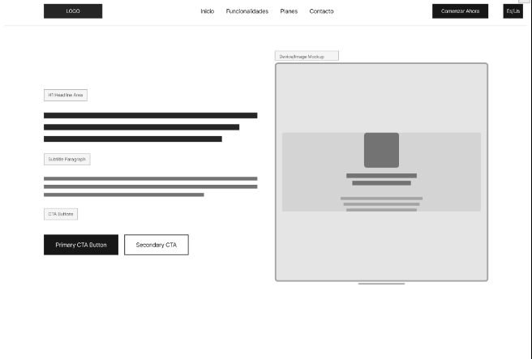

**HU relacionadas:**
- HU01: Inicio de sesión
- HU02: Registro de usuario
- HU03: Recuperación de contraseña
- HU07: Cierre de sesión seguro

---

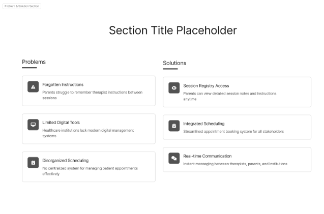

Conecta el progreso de tu hijo en un solo lugar. TherapyConnect es la plataforma que une a padres, terapeutas e instituciones para mejorar la comunicación, el seguimiento y el aprendizaje. Accede a reportes, agenda sesiones y recibe indicaciones claras en tiempo real.

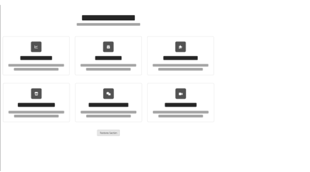

Muchas familias enfrentan desorganización, falta de seguimiento y comunicación limitada con especialistas. Nuestra solución centraliza todo en una plataforma intuitiva: reservas automatizadas, reportes claros y recursos adaptados para cada necesidad.

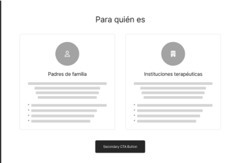

Gestiona citas sin conflictos, revisa el progreso de tu hijo, comunícate directamente con profesionales y accede a actividades personalizadas. Todo diseñado para facilitar el acompañamiento terapéutico desde cualquier lugar.

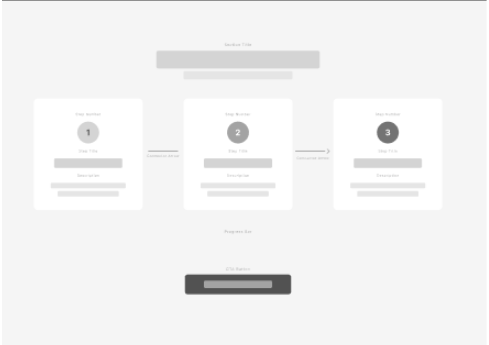

Pensado para padres comprometidos y centros terapéuticos que buscan eficiencia. TherapyConnect fortalece la colaboración entre familia e institución, asegurando un desarrollo continuo y bien guiado para cada niño.

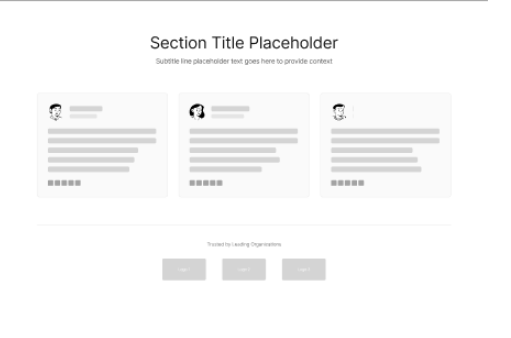

1. Regístrate en la plataforma
2. Agenda sesiones fácilmente
3. Recibe reportes y recomendaciones
4. Aplica actividades en casa y sigue el progreso

*Un flujo simple que mejora toda la experiencia terapéutica.*

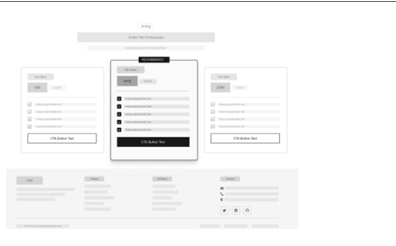

Padres e instituciones ya confían en TherapyConnect para mejorar la comunicación y el seguimiento. Descubre cómo nuestra plataforma ha optimizado procesos y brindado mayor tranquilidad a las familias.

🔗 [Ver diseño en Figma](https://www.figma.com/design/WGr7DojMDH0m122pRirLJw/Untitled?node-id=0-1&t=PMBLweziEZYLr7k2-1)

---

## 4.3.2. Landing Page Mock-Up

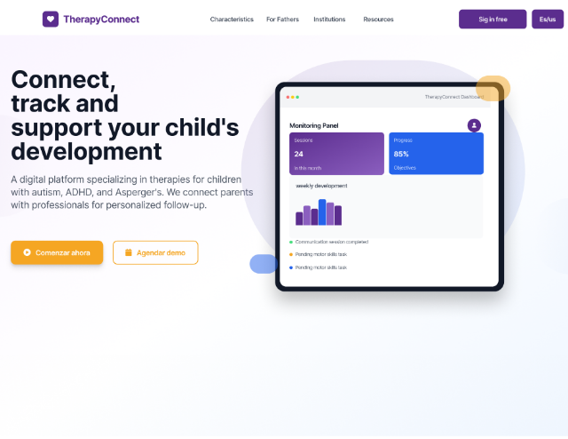

Conecta el progreso de tu hijo en un solo lugar. TherapyConnect es la plataforma que une a padres, terapeutas e instituciones para mejorar la comunicación, el seguimiento y el aprendizaje. Accede a reportes, agenda sesiones y recibe indicaciones claras en tiempo real.

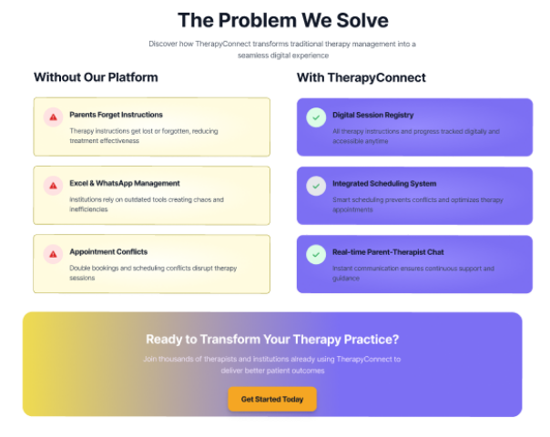

Muchas familias enfrentan desorganización, falta de seguimiento y comunicación limitada con especialistas. Nuestra solución centraliza todo en una plataforma intuitiva: reservas automatizadas, reportes claros y recursos adaptados para cada necesidad.

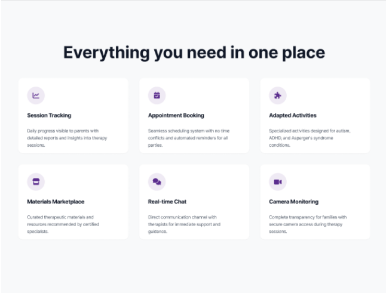

Gestiona citas sin conflictos, revisa el progreso de tu hijo, comunícate directamente con profesionales y accede a actividades personalizadas. Todo diseñado para facilitar el acompañamiento terapéutico desde cualquier lugar.

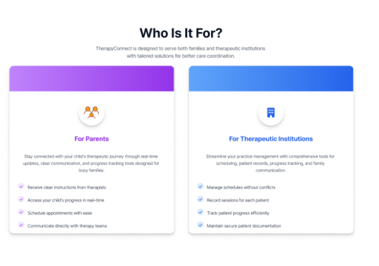

Pensado para padres comprometidos y centros terapéuticos que buscan eficiencia. TherapyConnect fortalece la colaboración entre familia e institución, asegurando un desarrollo continuo y bien guiado para cada niño.

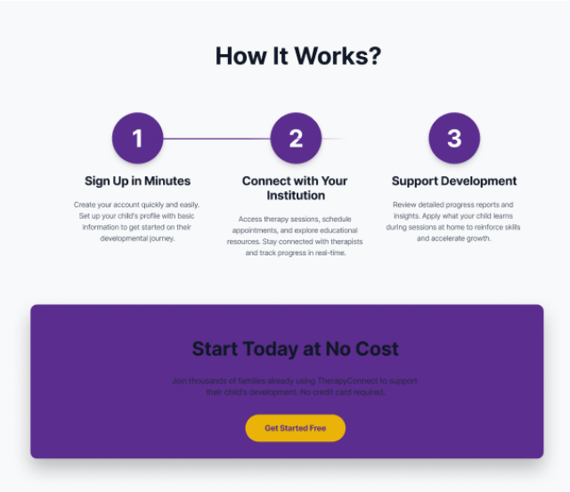

1. Regístrate en la plataforma
2. Agenda sesiones fácilmente
3. Recibe reportes y recomendaciones
4. Aplica actividades en casa y sigue el progreso

*Un flujo simple que mejora toda la experiencia terapéutica.*

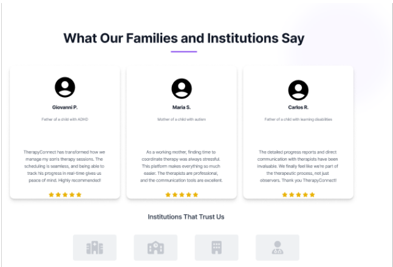

Padres e instituciones ya confían en TherapyConnect para mejorar la comunicación y el seguimiento. Descubre cómo nuestra plataforma ha optimizado procesos y brindado mayor tranquilidad a las familias.

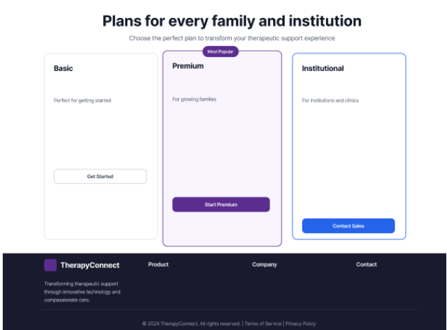

Elige el plan que mejor se adapte a tus necesidades. Ofrecemos opciones flexibles para padres e instituciones, con acceso a funcionalidades clave como seguimiento, comunicación y gestión de sesiones.

🔗 [Ver diseño en Figma](https://www.figma.com/design/WGr7DojMDH0m122pRirLJw/Untitled?node-id=0-1&t=PMBLweziEZYLr7k2-1)

---

# 4.4. Web Applications UX/UI Design

Esta sección presenta el diseño UX/UI de la aplicación web de TherapyConnect, enfocada en brindar una experiencia clara, accesible e intuitiva para padres de familia, instituciones terapéuticas y profesionales especializados. El objetivo principal es garantizar que los usuarios puedan interactuar de forma eficiente con funcionalidades clave como el agendamiento de citas, seguimiento del progreso del niño, comunicación con terapeutas, gestión institucional y acceso a recursos educativos.

El diseño web sigue los lineamientos establecidos en las Web Style Guidelines, utilizando un enfoque responsive basado en mobile-first y apoyado en los principios de Material Design 3, adaptados a la identidad visual de la plataforma. Se prioriza una navegación sencilla, una jerarquía visual clara y componentes reutilizables que reduzcan la carga cognitiva del usuario, especialmente considerando que muchos padres requieren acceso rápido a información importante y fácil comprensión de los procesos terapéuticos.

La aplicación web está estructurada alrededor de los siguientes módulos principales:

- Dashboard principal
- Gestión de citas y calendario
- Registro de sesiones terapéuticas
- Reportes de progreso del estudiante
- Comunicación entre padres y terapeutas
- Marketplace de materiales terapéuticos
- Gestión institucional de pacientes, profesores y aulas
- Alertas de emergencia y notificaciones

Cada módulo fue diseñado considerando accesibilidad, eficiencia operativa y transparencia en el seguimiento terapéutico. La plataforma busca centralizar procesos que actualmente suelen manejarse mediante herramientas dispersas como WhatsApp, Excel y Google Drive, reduciendo errores y mejorando la experiencia general del usuario.

Se aplican principios de accesibilidad bajo el estándar **WCAG 2.1 nivel AA**, incluyendo contraste adecuado, navegación por teclado, indicadores de foco visibles, tamaños táctiles mínimos y compatibilidad multiplataforma. Esto asegura que la plataforma pueda ser utilizada por personas con distintas capacidades visuales, cognitivas y motrices, reforzando el enfoque inclusivo del producto.

Para el desarrollo de wireframes, mock-ups y prototipos interactivos se utilizó **Figma**, mientras que los diagramas de flujo de navegación (Wireflows y User Flows) fueron elaborados mediante **Lucidchart** y **Miro**, permitiendo una representación clara del comportamiento de los usuarios dentro del sistema.

---

## 4.4.1. Web Applications Wireframes

### Segmento Especialistas

**Inicio de sesión:** La pantalla presenta una estructura de dos columnas donde la parte izquierda muestra una ilustración educativa con métricas de estudiantes y el texto "Bienvenido de vuelta, Profesor", mientras que la derecha contiene el formulario de acceso con campos para correo y contraseña. Su función principal es permitir el ingreso seguro de los especialistas a la plataforma, ofreciendo además opciones de autenticación rápida a través de una cuenta de Google y un enlace para el registro de nuevos usuarios.

**Recuperación de contraseña:** La interfaz consiste en un módulo minimalista centrado que solicita el correo institucional del usuario para restablecer el acceso a la cuenta en caso de olvido. Este apartado cumple la función de gestionar la seguridad de las credenciales, enviando un enlace de restauración de forma automática y mostrando una notificación de éxito en color verde cuando el proceso se ha iniciado correctamente.

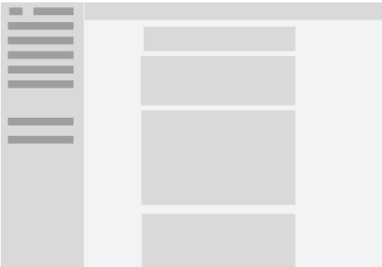

**Perfil del especialista:** El panel muestra de forma detallada los datos personales, la especialidad en psicología clínica y una descripción profesional del Dr. Roberto García, acompañados de un menú lateral de navegación con acceso a mensajes y calendario. Esta sección tiene la función de actuar como el centro de configuración de identidad del profesional, permitiéndole editar su información pública y gestionar las herramientas operativas de su consulta.

**Disponibilidad y seguridad:** Se observa un calendario semanal donde el usuario puede activar o desactivar sus días de atención y definir rangos horarios específicos para las citas. La función de esta pantalla es permitir la organización de la agenda laboral del psicólogo y proporcionar herramientas de control de cuenta, como la visualización de sesiones activas en otros dispositivos y el cierre remoto de las mismas.

**Modal de cambio de contraseña:** Es una ventana emergente que se activa sobre la vista de perfil, diseñada con campos para la clave actual y la nueva, incluyendo una lista de requisitos técnicos de seguridad. Su función es garantizar que el usuario pueda actualizar sus métodos de acceso cumpliendo con estándares de robustez, verificando en tiempo real si la nueva contraseña posee la complejidad necesaria para proteger la información.

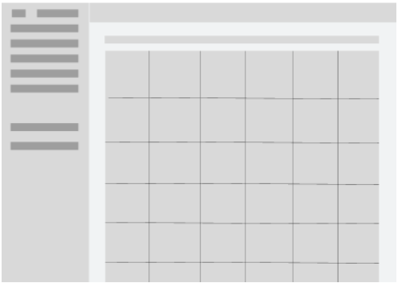

**Dashboard (Panel de control):** Presenta un saludo personalizado al Dr. Alejandro junto a cuatro tarjetas de resumen que cuantifican las sesiones del día, de la semana, solicitudes nuevas y notificaciones, además de un listado central de la agenda diaria. Su función es centralizar la gestión administrativa del profesional, ofreciendo un acceso directo a los detalles de cada cita y una vista rápida del calendario semanal para optimizar la organización del tiempo de trabajo.

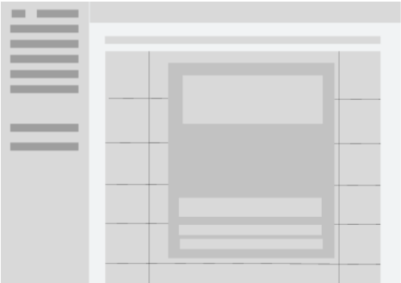

**Calendario semanal:** Esta pantalla despliega un calendario semanal detallado con una línea de tiempo roja que indica la hora actual y diversos bloques de colores que representan sesiones grupales, privadas y de emergencia distribuidas en diferentes aulas. La función de este módulo es permitir la planificación y el monitoreo logístico de todas las actividades terapéuticas, brindando al usuario una visión clara de la ocupación de espacios y los horarios asignados para cada tipo de intervención.

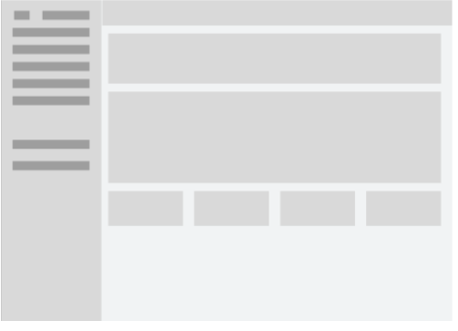

**Detalle de sesión (modal):** Se observa una ventana emergente titulada "Detalle de sesión" que superpone información específica sobre el paciente Mateo García, incluyendo su edad, nivel de TEA, aula asignada y el profesor responsable. Este componente tiene la función de actuar como un paso de verificación y control antes de comenzar una actividad, permitiendo al usuario iniciar la sesión de inmediato o consultar el historial de encuentros previos con el mismo niño para contextualizar la atención.

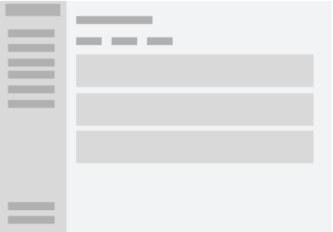

**Historial de sesiones:** La interfaz muestra una tabla organizada con filtros por paciente, fecha y tipo de sesión, complementada por métricas en la parte inferior que suman el total de sesiones completadas y el tiempo total de atención en minutos. Su función principal es el almacenamiento y la auditoría de la labor clínica, permitiendo al especialista realizar búsquedas históricas, revisar apuntes de citas pasadas y analizar datos estadísticos sobre su productividad y el cumplimiento de las metas terapéuticas.

**Videollamada activa:** La interfaz muestra una sesión de videollamada activa donde se visualiza a una profesional en una toma de oficina, acompañada de un panel lateral derecho titulado "Registro" que contiene listas de verificación sobre atención, comunicación y conducta. Esta pantalla cumple la función de facilitar la teleconsulta terapéutica, permitiendo al especialista evaluar criterios clínicos en tiempo real mediante checklists mientras mantiene la interacción visual con el paciente para asegurar un seguimiento preciso del comportamiento.

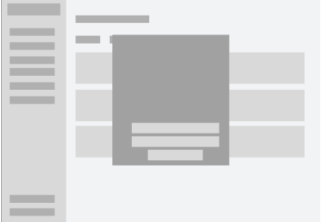

**Solicitudes pendientes:** La pantalla muestra el listado de "Solicitudes" pendientes para el Prof. Martínez, presentando tarjetas individuales de padres como Ana García y Carlos Ruiz con detalles sobre el tipo de clase y la urgencia de respuesta. Esta interfaz tiene la función de centralizar las peticiones de nuevas sesiones, permitiendo al docente gestionar su carga de trabajo mediante botones directos para aceptar, rechazar o visualizar rápidamente la información de contacto de cada alumno.

**Detalle de solicitud (modal):** Esta interfaz presenta un modal de "Detalle de solicitud" que profundiza en la petición de Ana García para su hijo Mateo, especificando que se requiere una visita a domicilio para apoyo en comunicación funcional. Su función es proporcionar al profesional todo el contexto necesario, incluyendo la dirección exacta y el diagnóstico del alumno, para que pueda tomar una decisión informada antes de confirmar o denegar la sesión de apoyo.

**Programar sesión (modal):** La imagen despliega una ventana de confirmación titulada "Programar sesión con Mateo", donde el usuario puede definir la fecha, hora de inicio, duración y modalidad presencial tras haber aceptado la solicitud previa. La función de este componente es formalizar la cita en el sistema, asegurando que la sesión se agregue automáticamente al calendario del profesor y se genere una notificación de éxito para ambas partes.

**Rechazar solicitud (modal):** Se observa un modal de "Rechazar solicitud" que permite al profesional seleccionar un motivo formal, como la falta de disponibilidad, e incluir un mensaje personalizado de recomendación para los padres. Esta pantalla cumple la función de gestionar las expectativas del solicitante de manera profesional y empática, manteniendo una comunicación clara sobre por qué no se puede realizar la sesión en ese momento.

**Notificaciones:** El panel organiza cronológicamente avisos críticos, como emergencias de salud de alumnos, asignaciones de nuevas clases de matemáticas y cambios de horario por conflictos de aula. Su función es mantener al docente actualizado en tiempo real sobre cualquier alteración en su rutina académica o situaciones que requieren atención inmediata, permitiendo una respuesta rápida mediante botones de acción integrados en cada alerta.

**Mis apuntes:** La interfaz muestra un historial detallado de notas pedagógicas y clínicas, destacando una entrada sobre el progreso de Mateo García en una sesión de fracciones y decimales con categorías de comportamiento y actitud. Su función es permitir al profesional documentar observaciones cualitativas, registrar hitos de aprendizaje y establecer pasos recomendados para futuras sesiones, manteniendo un vínculo directo con la grabación de la clase para una revisión exhaustiva del desempeño del alumno.

**Sesiones grupales:** Esta pantalla presenta tarjetas informativas para actividades colectivas como el "Grupo Arcoíris" y el "Grupo Exploradores", detallando horarios, aulas y una tabla de reuniones confirmadas o pendientes. La función de este panel es facilitar la gestión de terapias grupales y talleres de habilidades sociales, permitiendo al especialista iniciar la sesión de forma inmediata o consultar la lista de participantes e instituciones educativas vinculadas a cada evento programado.

**Centro de Emergencias:** Muestra un interruptor de disponibilidad inmediata seguido de una alerta crítica de color rojo por una crisis de ansiedad en el Aula 4B, junto con un historial de incidentes resueltos como caídas o desmayos. Su función primordial es actuar como un canal de respuesta rápida ante situaciones de riesgo, permitiendo a los jefes médicos o especialistas recibir notificaciones prioritarias, responder a emergencias activas en tiempo real y reportar incidentes menores ocurridos durante sus turnos.

---

### Segmento Padres

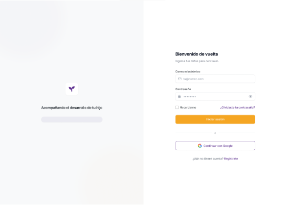

**Inicio de sesión:** La interfaz presenta un diseño limpio con una ilustración amigable de una familia y métricas sobre el progreso de los hijos, junto a un formulario lateral para ingresar con correo y contraseña. Esta pantalla tiene la función de autenticar a los tutores legales en la plataforma, permitiéndoles acceder al seguimiento terapéutico de sus hijos y ofreciendo opciones de recuperación de cuenta o registro para nuevos usuarios.

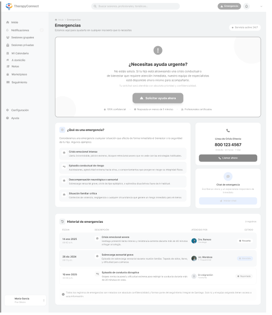

**Dashboard principal:** El panel ofrece un resumen ejecutivo que incluye el nombre del hijo, Mateo, su nivel de progreso actual y accesos rápidos a las próximas sesiones programadas y reportes recientes. Su función es centralizar la información más relevante para la familia, permitiéndoles visualizar de un vistazo el estado general del tratamiento, las notificaciones pendientes y el calendario de actividades terapéuticas de la semana.

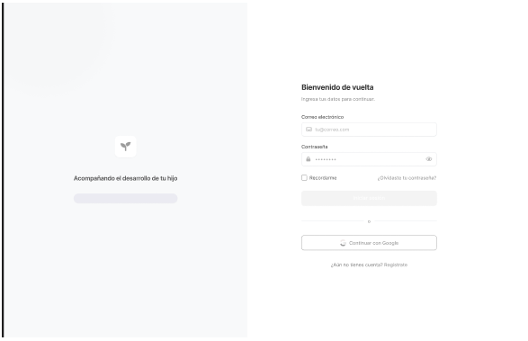

**Calendario de actividades:** Esta pantalla muestra el calendario de actividades del niño, donde se detallan las sesiones de terapia individual, grupal y talleres extracurriculares mediante bloques de tiempo organizados por días. La función de este módulo es permitir a los padres coordinar la logística familiar con el plan de intervención, facilitando la visualización de los horarios, los especialistas a cargo y los lugares específicos (aulas o virtual) donde se llevarán a cabo las sesiones.

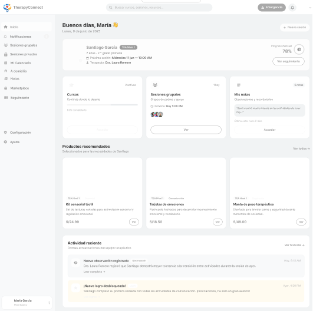

**Reportes de progreso:** La vista presenta gráficos de barras y líneas que cuantifican el avance del niño en áreas específicas como comunicación, habilidades sociales y conducta durante los últimos meses. Este apartado cumple la función de informar a los padres de manera objetiva sobre los resultados del tratamiento, permitiéndoles descargar informes detallados y entender las tendencias de mejora o las áreas que requieren mayor refuerzo en casa.

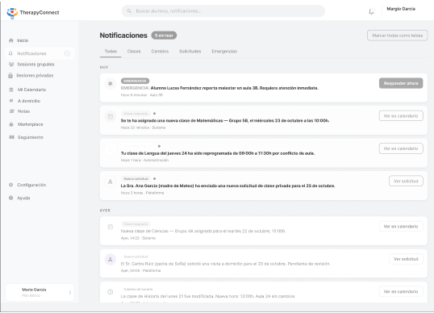

**Comunicación y solicitudes:** La interfaz permite a los padres enviar mensajes directos a los especialistas, solicitar cambios de horario o pedir nuevas citas mediante un sistema de formularios simplificado. Su función es agilizar el contacto entre la familia y el centro terapéutico, asegurando que todas las peticiones queden registradas oficialmente y permitiendo un seguimiento transparente del estado de cada solicitud enviada.

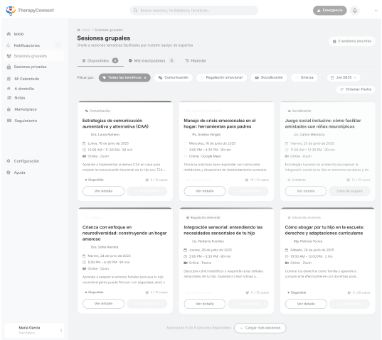

**Historial de citas:** La interfaz presenta una tabla cronológica con las sesiones pasadas de Mateo, indicando la fecha, el tipo de terapia (individual o grupal) y el estado de asistencia, acompañada de un botón para ver los apuntes del especialista. Esta pantalla tiene la función de permitir a los padres llevar un control histórico de las intervenciones recibidas, facilitando el acceso a las observaciones de los terapeutas y la descarga de documentos relacionados con cada encuentro para su archivo personal.

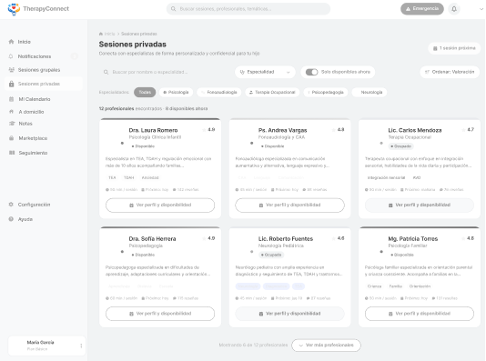

**Detalle de sesión:** Esta pantalla despliega la información específica de una cita seleccionada, incluyendo el nombre del especialista a cargo, los objetivos planteados para ese día y un resumen de las actividades realizadas. Su función es brindar total transparencia sobre el trabajo terapéutico en curso, permitiendo que la familia comprenda qué habilidades se están reforzando y reciba recomendaciones directas del profesional para dar continuidad al aprendizaje fuera del centro.

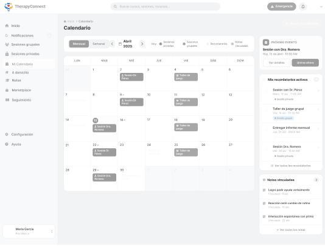

**Gestión de perfil del hijo:** La vista centraliza la información clínica y personal del niño, mostrando datos como el diagnóstico, edad, alergias y documentos cargados como certificados o informes externos. Este apartado cumple la función de ser el repositorio oficial de la historia del paciente dentro de la plataforma, permitiendo a los padres mantener actualizada la ficha médica y compartirla fácilmente con los diferentes especialistas que intervienen en el tratamiento.

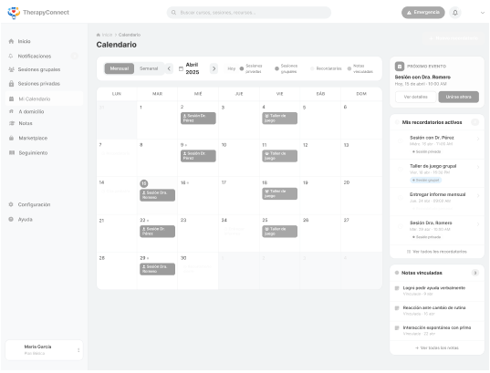

**Notificaciones y alertas:** La interfaz organiza de manera vertical los avisos recientes, como recordatorios de próximas citas, mensajes nuevos del terapeuta o alertas sobre la publicación de nuevos reportes de progreso. La función de esta pantalla es asegurar que los padres estén siempre informados sobre cualquier novedad relevante en el proceso terapéutico de su hijo, permitiéndoles actuar rápidamente ante cambios de horario o requerimientos de información por parte del centro.

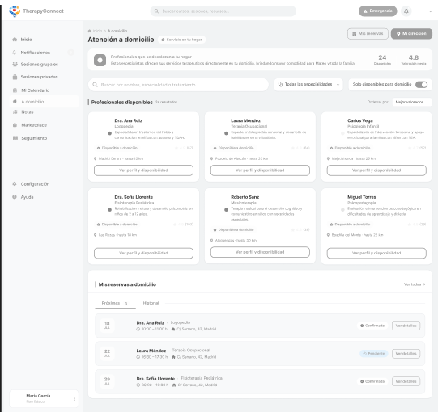

**Nueva solicitud de sesión (modal):** El modal presenta un formulario interactivo donde los padres pueden seleccionar el tipo de servicio requerido, el motivo de la consulta y proponer rangos de fecha y hora para una cita adicional o de emergencia. Su función es agilizar el proceso de agendamiento, proporcionando un canal directo y estructurado para que la familia pueda solicitar apoyo extra sin necesidad de llamadas telefónicas, quedando la petición a la espera de la confirmación del especialista.

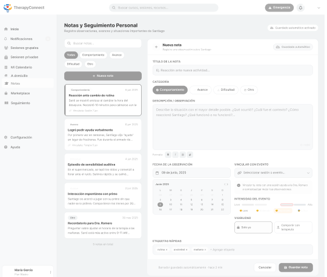

**Configuración de perfil:** La interfaz presenta el panel de "Configuración de perfil" del padre o tutor, donde se muestran campos para editar datos personales como nombre, correo electrónico, número de teléfono y la posibilidad de cambiar la foto de perfil. Esta pantalla tiene la función de permitir al usuario gestionar su propia información de contacto y preferencias de cuenta, asegurando que los datos de comunicación con el centro terapéutico estén actualizados y permitiendo también la gestión de la seguridad de la cuenta mediante opciones para modificar la contraseña de acceso.

---

## 4.4.2. Web Applications Wireflow Diagrams

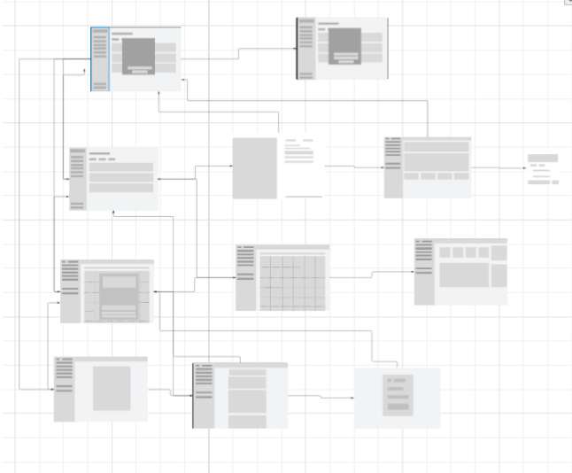

El wireflow muestra el flujo de navegación del usuario como un grafo, donde cada pantalla es un nodo y cada acción una arista. Inicia en el login y conecta con el dashboard, desde donde se accede a citas, sesiones, reportes y comunicación. Este flujo asegura una navegación clara, continua y alineada con las User Stories del sistema.

🔗 [Ver Wireflow en Lucidchart](https://lucid.app/lucidchart/8066404a-bba2-4d5e-9223-2218ade9c5c0/edit?viewport_loc=4488%2C852%2C6108%2C3332%2C0_0&invitationId=inv_1e0549ea-1406-47f4-bdb7-fe6e0b3599f1)

---

## 4.4.3. Web Applications Mock-ups

### Segmento Especialistas

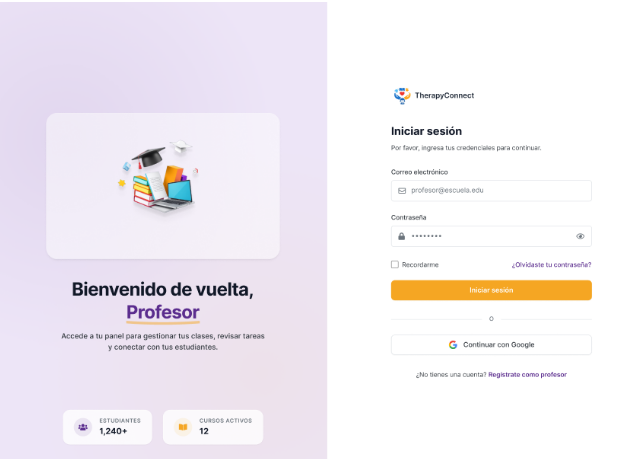

**Inicio de sesión:** La pantalla presenta una estructura de dos columnas donde la parte izquierda muestra una ilustración educativa con métricas de estudiantes y el texto "Bienvenido de vuelta, Profesor", mientras que la derecha contiene el formulario de acceso con campos para correo y contraseña. Su función principal es permitir el ingreso seguro de los especialistas a la plataforma, ofreciendo además opciones de autenticación rápida a través de una cuenta de Google y un enlace para el registro de nuevos usuarios.

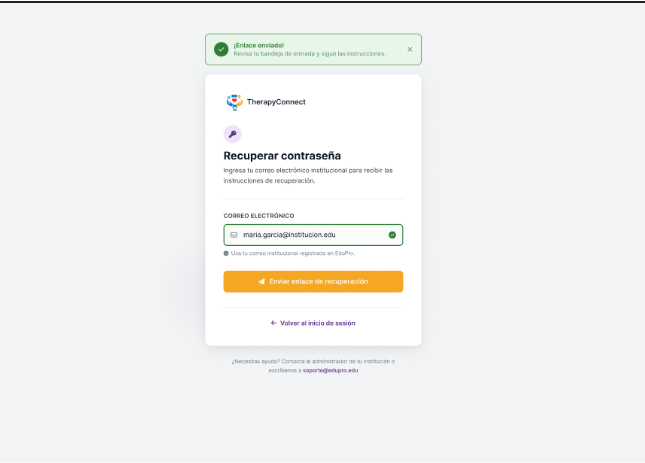

**Recuperación de contraseña:** La interfaz consiste en un módulo minimalista centrado que solicita el correo institucional del usuario para restablecer el acceso a la cuenta en caso de olvido. Este apartado cumple la función de gestionar la seguridad de las credenciales, enviando un enlace de restauración de forma automática y mostrando una notificación de éxito en color verde cuando el proceso se ha iniciado correctamente.

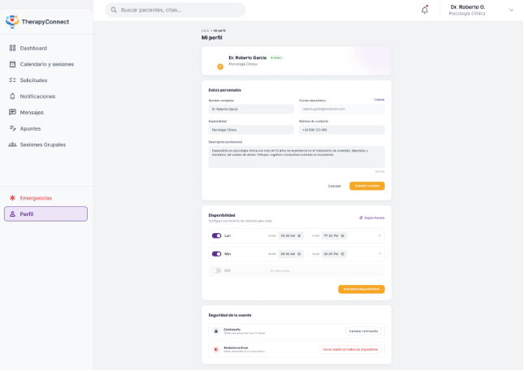

**Perfil del especialista:** El panel muestra de forma detallada los datos personales, la especialidad en psicología clínica y una descripción profesional del Dr. Roberto García, acompañados de un menú lateral de navegación con acceso a mensajes y calendario. Esta sección tiene la función de actuar como el centro de configuración de identidad del profesional, permitiéndole editar su información pública y gestionar las herramientas operativas de su consulta.

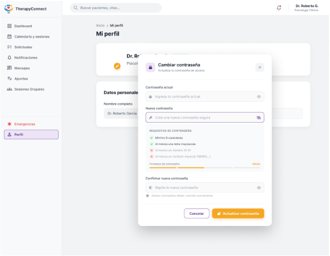

**Disponibilidad y seguridad:** Se observa un calendario semanal donde el usuario puede activar o desactivar sus días de atención y definir rangos horarios específicos para las citas. La función de esta pantalla es permitir la organización de la agenda laboral del psicólogo y proporcionar herramientas de control de cuenta, como la visualización de sesiones activas en otros dispositivos y el cierre remoto de las mismas.

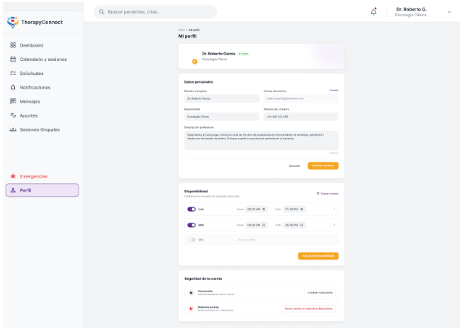

**Modal de cambio de contraseña:** Es una ventana emergente que se activa sobre la vista de perfil, diseñada con campos para la clave actual y la nueva, incluyendo una lista de requisitos técnicos de seguridad. Su función es garantizar que el usuario pueda actualizar sus métodos de acceso cumpliendo con estándares de robustez, verificando en tiempo real si la nueva contraseña posee la complejidad necesaria para proteger la información.

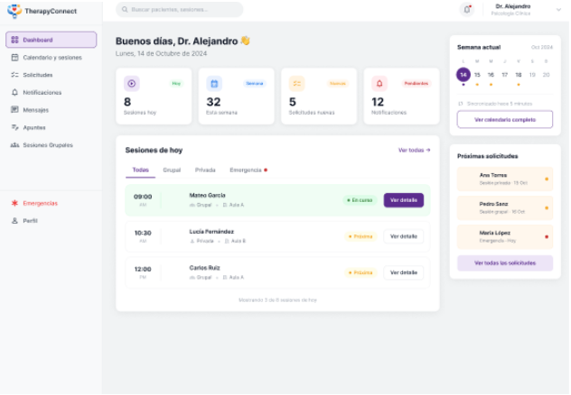

**Dashboard (Panel de control):** Presenta un saludo personalizado al Dr. Alejandro junto a cuatro tarjetas de resumen que cuantifican las sesiones del día, de la semana, solicitudes nuevas y notificaciones, además de un listado central de la agenda diaria. Su función es centralizar la gestión administrativa del profesional, ofreciendo un acceso directo a los detalles de cada cita y una vista rápida del calendario semanal para optimizar la organización del tiempo de trabajo.

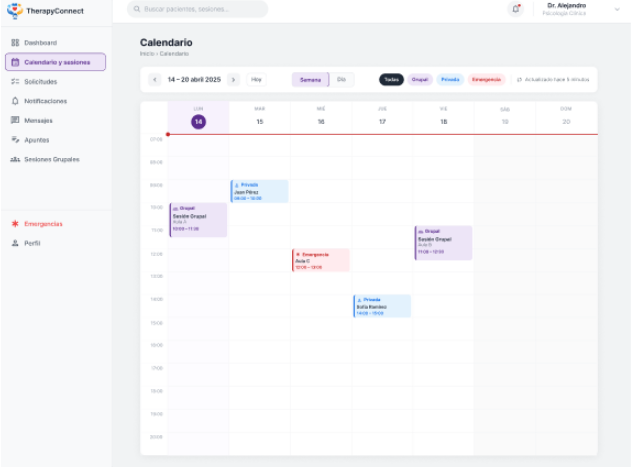

**Calendario semanal:** Esta pantalla despliega un calendario semanal detallado con una línea de tiempo roja que indica la hora actual y diversos bloques de colores que representan sesiones grupales, privadas y de emergencia distribuidas en diferentes aulas. La función de este módulo es permitir la planificación y el monitoreo logístico de todas las actividades terapéuticas, brindando al usuario una visión clara de la ocupación de espacios y los horarios asignados para cada tipo de intervención.

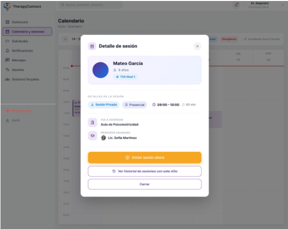

**Detalle de sesión (modal):** Se observa una ventana emergente titulada "Detalle de sesión" que superpone información específica sobre el paciente Mateo García, incluyendo su edad, nivel de TEA, aula asignada y el profesor responsable. Este componente tiene la función de actuar como un paso de verificación y control antes de comenzar una actividad, permitiendo al usuario iniciar la sesión de inmediato o consultar el historial de encuentros previos con el mismo niño para contextualizar la atención.

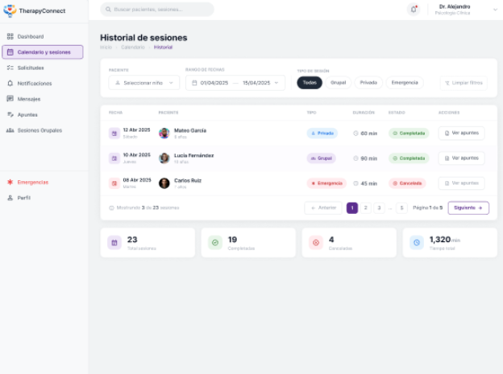

**Historial de sesiones:** La interfaz muestra una tabla organizada con filtros por paciente, fecha y tipo de sesión, complementada por métricas en la parte inferior que suman el total de sesiones completadas y el tiempo total de atención en minutos. Su función principal es el almacenamiento y la auditoría de la labor clínica, permitiendo al especialista realizar búsquedas históricas, revisar apuntes de citas pasadas y analizar datos estadísticos sobre su productividad y el cumplimiento de las metas terapéuticas.

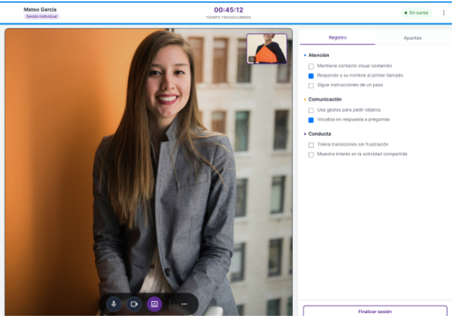

**Videollamada activa:** La interfaz muestra una sesión de videollamada activa donde se visualiza a una profesional en una toma de oficina, acompañada de un panel lateral derecho titulado "Registro" que contiene listas de verificación sobre atención, comunicación y conducta. Esta pantalla cumple la función de facilitar la teleconsulta terapéutica, permitiendo al especialista evaluar criterios clínicos en tiempo real mediante checklists mientras mantiene la interacción visual con el paciente para asegurar un seguimiento preciso del comportamiento.

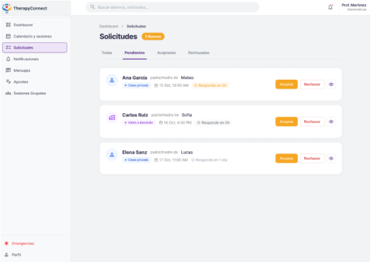

**Solicitudes pendientes:** La pantalla muestra el listado de "Solicitudes" pendientes para el Prof. Martínez, presentando tarjetas individuales de padres como Ana García y Carlos Ruiz con detalles sobre el tipo de clase y la urgencia de respuesta. Esta interfaz tiene la función de centralizar las peticiones de nuevas sesiones, permitiendo al docente gestionar su carga de trabajo mediante botones directos para aceptar, rechazar o visualizar rápidamente la información de contacto de cada alumno.

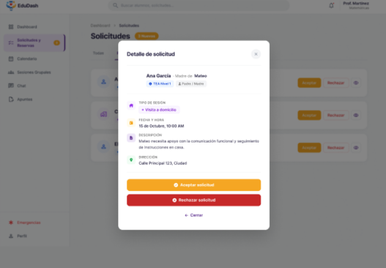

**Detalle de solicitud (modal):** Esta interfaz presenta un modal de "Detalle de solicitud" que profundiza en la petición de Ana García para su hijo Mateo, especificando que se requiere una visita a domicilio para apoyo en comunicación funcional. Su función es proporcionar al profesional todo el contexto necesario, incluyendo la dirección exacta y el diagnóstico del alumno, para que pueda tomar una decisión informada antes de confirmar o denegar la sesión de apoyo.

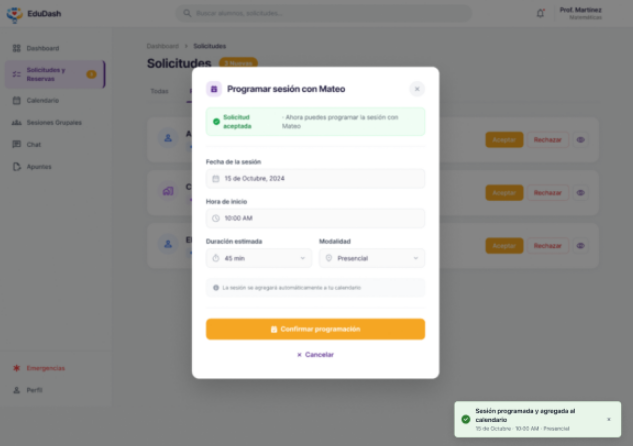

**Programar sesión (modal):** La imagen despliega una ventana de confirmación titulada "Programar sesión con Mateo", donde el usuario puede definir la fecha, hora de inicio, duración y modalidad presencial tras haber aceptado la solicitud previa. La función de este componente es formalizar la cita en el sistema, asegurando que la sesión se agregue automáticamente al calendario del profesor y se genere una notificación de éxito para ambas partes.

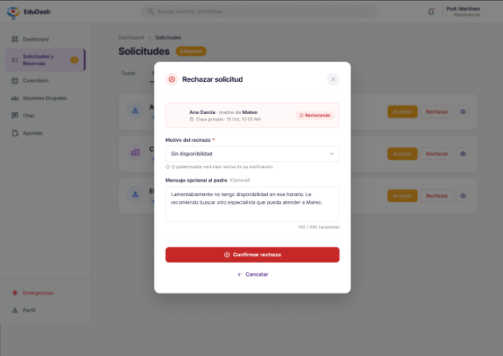

**Rechazar solicitud (modal):** Se observa un modal de "Rechazar solicitud" que permite al profesional seleccionar un motivo formal, como la falta de disponibilidad, e incluir un mensaje personalizado de recomendación para los padres. Esta pantalla cumple la función de gestionar las expectativas del solicitante de manera profesional y empática, manteniendo una comunicación clara sobre por qué no se puede realizar la sesión en ese momento.

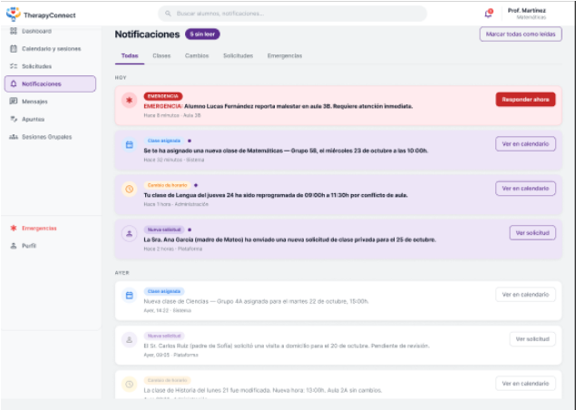

**Notificaciones:** El panel organiza cronológicamente avisos críticos, como emergencias de salud de alumnos, asignaciones de nuevas clases de matemáticas y cambios de horario por conflictos de aula. Su función es mantener al docente actualizado en tiempo real sobre cualquier alteración en su rutina académica o situaciones que requieren atención inmediata, permitiendo una respuesta rápida mediante botones de acción integrados en cada alerta.

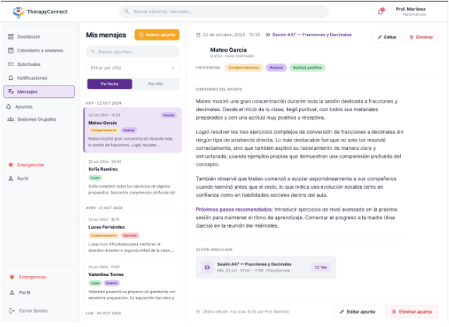

**Mis apuntes:** La interfaz muestra un historial detallado de notas pedagógicas y clínicas, destacando una entrada sobre el progreso de Mateo García en una sesión de fracciones y decimales con categorías de comportamiento y actitud. Su función es permitir al profesional documentar observaciones cualitativas, registrar hitos de aprendizaje y establecer pasos recomendados para futuras sesiones, manteniendo un vínculo directo con la grabación de la clase para una revisión exhaustiva del desempeño del alumno.

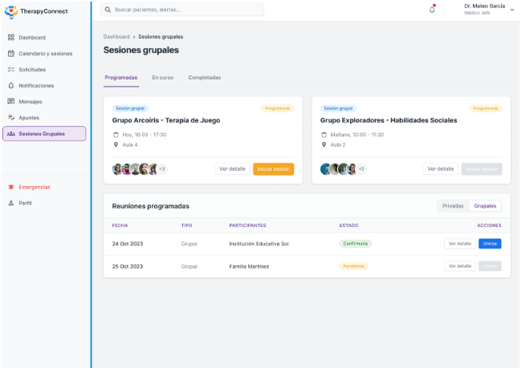

**Sesiones grupales:** Esta pantalla presenta tarjetas informativas para actividades colectivas como el "Grupo Arcoíris" y el "Grupo Exploradores", detallando horarios, aulas y una tabla de reuniones confirmadas o pendientes. La función de este panel es facilitar la gestión de terapias grupales y talleres de habilidades sociales, permitiendo al especialista iniciar la sesión de forma inmediata o consultar la lista de participantes e instituciones educativas vinculadas a cada evento programado.

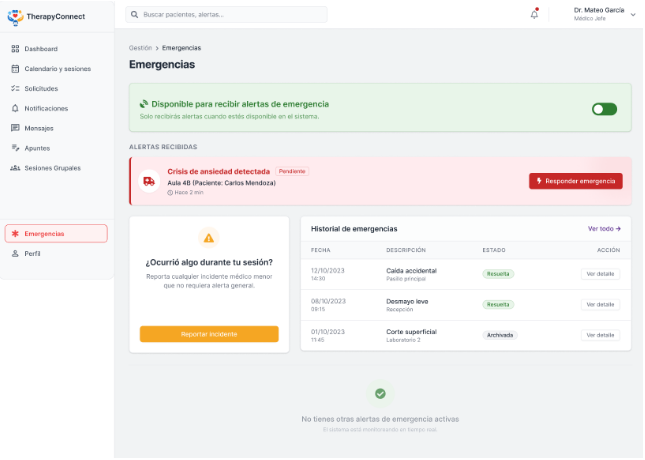

**Centro de Emergencias:** Muestra un interruptor de disponibilidad inmediata seguido de una alerta crítica de color rojo por una crisis de ansiedad en el Aula 4B, junto con un historial de incidentes resueltos como caídas o desmayos. Su función primordial es actuar como un canal de respuesta rápida ante situaciones de riesgo, permitiendo a los jefes médicos o especialistas recibir notificaciones prioritarias, responder a emergencias activas en tiempo real y reportar incidentes menores ocurridos durante sus turnos.

---

### Segmento Padres

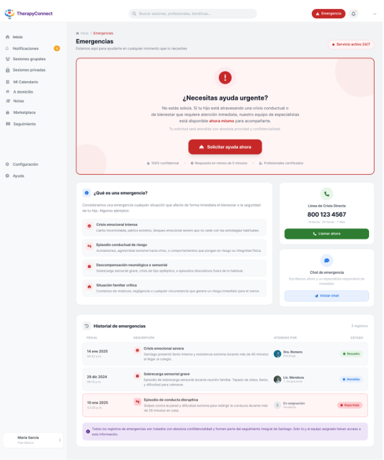

**Inicio de sesión (versión 1):** La interfaz presenta un diseño limpio con una ilustración amigable de una familia y métricas sobre el progreso de los hijos, junto a un formulario lateral para ingresar con correo y contraseña. Esta pantalla tiene la función de autenticar a los tutores legales en la plataforma, permitiéndoles acceder al seguimiento terapéutico de sus hijos y ofreciendo opciones de recuperación de cuenta o registro para nuevos usuarios.

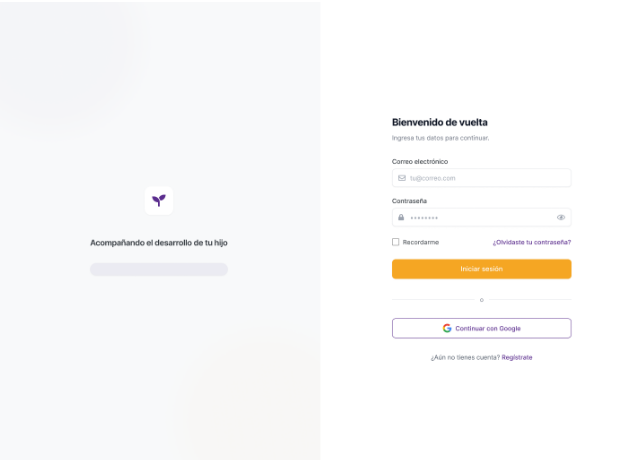

**Inicio de sesión (versión 2):** La pantalla presenta una composición visual cálida con una fotografía de una madre e hija compartiendo un momento de aprendizaje, contrastada con un formulario de acceso limpio que incluye logotipos de TherapyConnect y opciones para entrar con Google. Esta interfaz tiene la función de validar la identidad de los familiares, permitiéndoles acceder de forma segura a la plataforma personalizada donde pueden supervisar el desarrollo terapéutico de sus hijos y gestionar las credenciales de su cuenta.

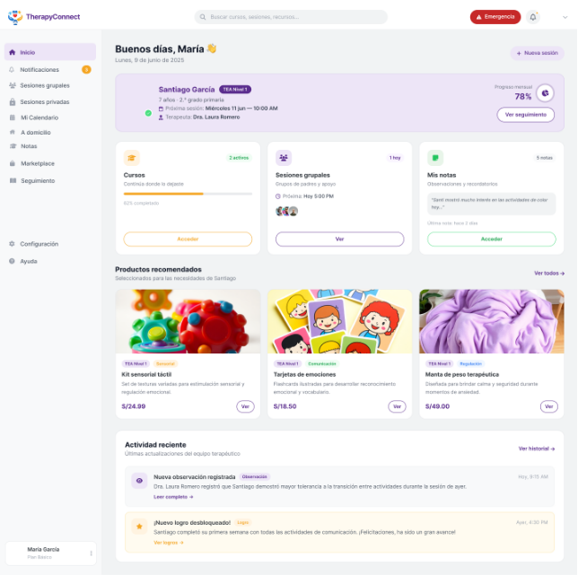

**Dashboard principal:** El panel muestra un saludo personalizado para la madre, María García, junto a un resumen visual que destaca el perfil de su hijo Mateo, su nivel de progreso actual y una tarjeta informativa sobre la próxima sesión programada. Su función es servir como el centro operativo para la familia, facilitando el acceso inmediato a las métricas de avance del niño, las notificaciones urgentes del centro y el calendario de citas para asegurar una participación activa en el tratamiento.

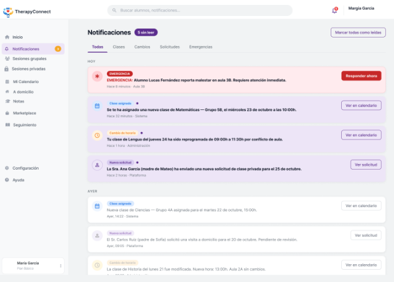

**Calendario mensual:** Esta interfaz despliega el calendario mensual de actividades de Mateo, utilizando etiquetas de colores para diferenciar entre sesiones de terapia presencial, virtual y talleres grupales en una cuadrícula de tiempo organizada. La función de este módulo es permitir a los padres organizar la agenda familiar en sincronía con el plan terapéutico, ofreciendo una visión clara de los horarios confirmados, los especialistas asignados y permitiendo la visualización detallada de cada cita con un solo clic.

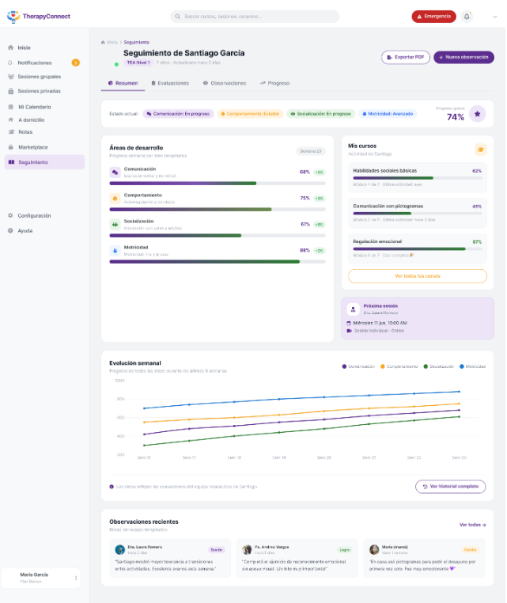

**Reportes de progreso:** La vista presenta una serie de gráficos analíticos que muestran el desempeño del niño en áreas clave como comunicación funcional y habilidades sociales, comparando los datos actuales con los de meses anteriores. Este apartado cumple la función de proporcionar evidencia cuantitativa del avance terapéutico a los padres, ayudándoles a comprender las fortalezas y áreas de oportunidad de su hijo mediante reportes descargables y visualizaciones fáciles de interpretar.

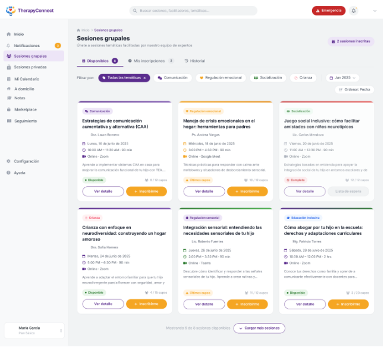

**Historial de sesiones:** La pantalla presenta un listado detallado de todas las citas completadas, indicando la fecha, el terapeuta responsable y el estado de la sesión, acompañada de botones para revisar los apuntes clínicos detallados. Su función es ofrecer una trazabilidad completa del proceso terapéutico, permitiendo a los padres consultar las observaciones dejadas por los especialistas después de cada encuentro y descargar los materiales o recomendaciones específicas para trabajar en el hogar.

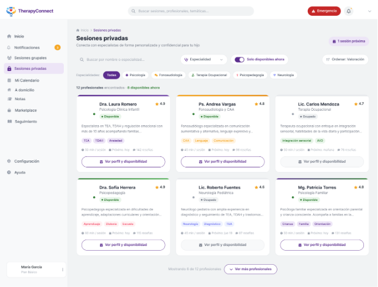

**Detalle de sesión:** Esta pantalla despliega la información específica de una cita seleccionada, incluyendo el nombre del especialista a cargo, los objetivos planteados para ese día y un resumen de las actividades realizadas. Su función es brindar total transparencia sobre el trabajo terapéutico en curso, permitiendo que la familia comprenda qué habilidades se están reforzando y reciba recomendaciones directas del profesional para dar continuidad al aprendizaje fuera del centro.

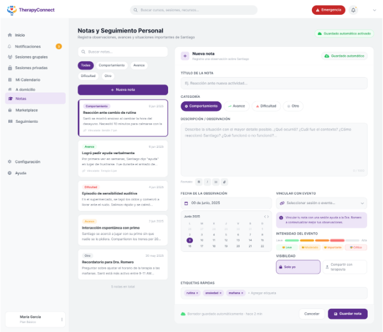

**Solicitudes enviadas:** La interfaz presenta el listado de "Solicitudes enviadas" por los padres, mostrando tarjetas organizadas con el tipo de sesión requerida, la fecha de creación y una etiqueta de estado de color naranja que indica que la petición está "Pendiente". Su función es permitir a la familia llevar un seguimiento en tiempo real de sus requerimientos de nuevas citas o cambios de horario, ofreciendo un canal transparente para verificar si el especialista ya ha revisado o aceptado la solicitud de atención para su hijo.

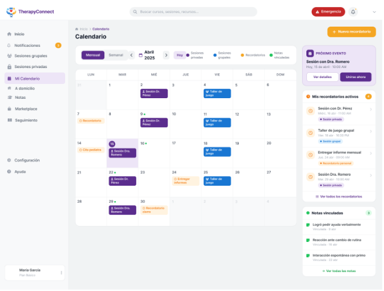

**Detalle de solicitud aceptada:** Esta pantalla muestra el detalle de una solicitud específica aceptada, donde se confirma la programación de una sesión presencial de apoyo en comunicación funcional para Mateo García con la fecha y hora acordadas. La función de este apartado es servir como comprobante de agendamiento, proporcionando a los padres la información logística completa y la opción de añadir el evento a su calendario personal para asegurar la asistencia a la terapia.

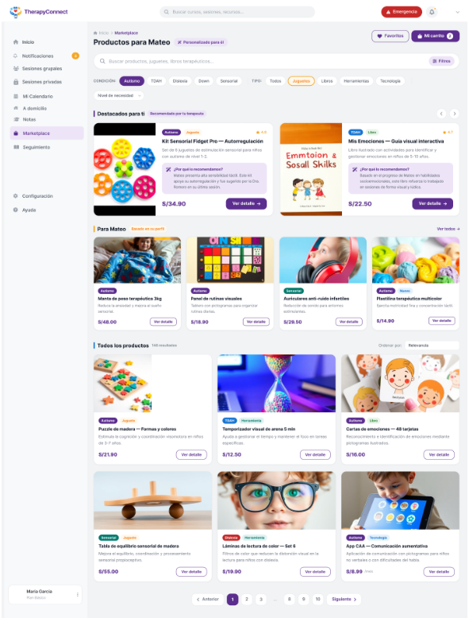

**Notificaciones:** El panel despliega una lista cronológica de alertas interactivas, como avisos de sesiones que están por comenzar, confirmaciones de nuevas citas y alertas de salud prioritarias. Esta sección tiene la función de mantener a los tutores informados sobre cualquier actualización crítica en el proceso terapéutico, permitiéndoles reaccionar de inmediato a mensajes de los especialistas o cambios de último minuto en la programación escolar y clínica.

**Mensajes:** La interfaz de "Mensajes" ofrece un sistema de chat directo y privado entre los padres y el equipo terapéutico, con una lista de contactos a la izquierda y una ventana de conversación activa a la derecha que permite el envío de textos y archivos adjuntos. Su función es facilitar una comunicación fluida y constante para resolver dudas rápidas, coordinar detalles del tratamiento diario y compartir observaciones relevantes sobre el comportamiento del niño en casa sin necesidad de esperar a la siguiente sesión presencial.

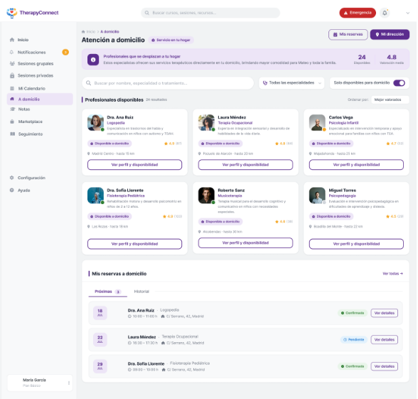

**Perfil del padre:** La pantalla muestra la información de cuenta de María García, incluyendo su foto, datos de contacto y una sección dedicada a la gestión de la seguridad con opciones para actualizar la contraseña y revisar las sesiones activas. Esta pantalla cumple la función de permitir al usuario administrar su identidad digital dentro de la plataforma, asegurando que sus datos personales estén correctos y proporcionando herramientas de privacidad para proteger el acceso a la información sensible del menor bajo su tutela.

🔗 [Ver Mock-ups en Figma](https://www.figma.com/design/WGr7DojMDH0m122pRirLJw/go?node-id=0-1&t=Izbq9BtbuFzdHYlW-1)

---

## 4.4.4. Web Applications User Flow Diagrams

*(Ver diagramas en el repositorio de Figma / Lucidchart adjunto)*

---

# 4.5. Web Applications Prototyping

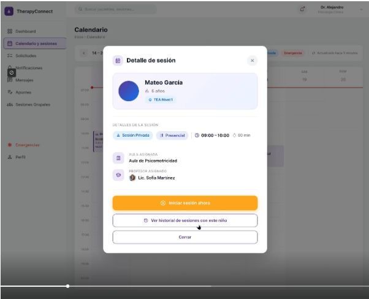

**Archivo de prototipo:**  https://upcedupe-my.sharepoint.com/personal/u20241a649_upc_edu_pe/_layouts/15/stream.aspx?id=%2Fpersonal%2Fu20241a649_upc_edu_pe%2FDocuments%2FDesktop%202026%2E04%2E24%20-%2002%2E41%2E18%2E07%2Emp4&ga=1&referrer=StreamWebApp%2EWeb&referrerScenario=AddressBarCopied%2Eview%2E2671e79a-aaf2-4548-b36a-c0996b568b20

---

# 4.6. Domain-Driven Software Architecture

## 4.6.1. Design-Level Event Storming

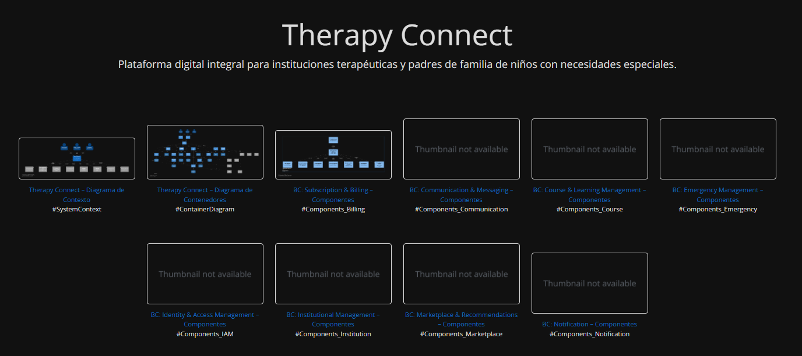

🔗 [Ver en Structurizr](https://structurizr.com/share/109683)

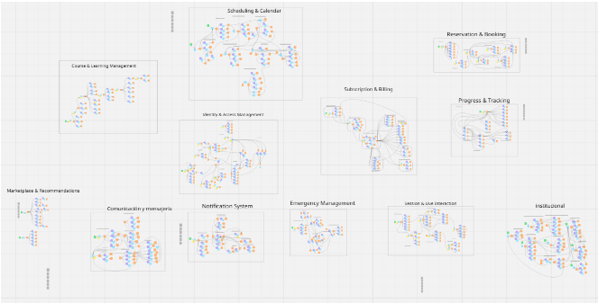

🔗 [Ver en Miro](https://miro.com/app/board/uXjVGhf69Qs=/?share_link_id=873187948679)

---

## 4.6.2. Software Architecture Context Diagram

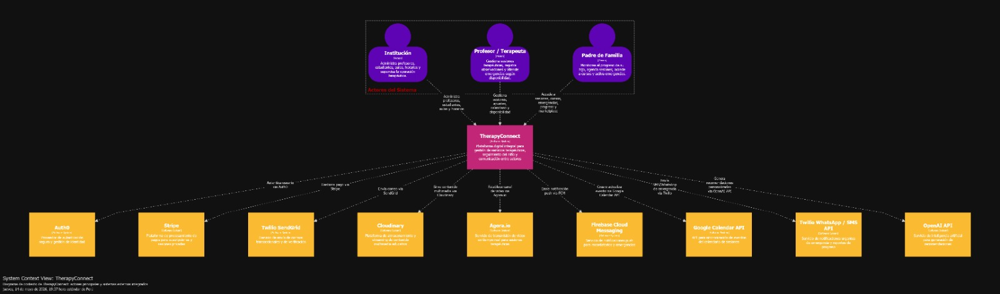

🔗 [Ver en Structurizr (actualizado)](https://structurizr.com/share/109683)

🔗 [Ver en Miro](https://miro.com/welcomeonboard/RTFIazFCR3hmbTFxTjd1LzJ2aWNSMXhuemM4RnZyWnhndll5Y1pWVDdwdHpWS0VaVDgwS09DVnJNYlVLTlduOGIydFpoRjVhYmZGUndQaCtibyttRyt6MkF0aFNORW82bmkraVJsYkNudy9zbW5Rb2t2emNwcHBsWW1IUS92RTlhWWluRVAxeXRuUUgwWDl3Mk1qRGVRPT0hdjE=?share_link_id=757361192642)

---

## 4.6.3. Software Architecture Container Diagrams

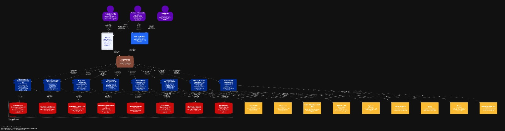

---

## 4.6.4. Software Architecture Components Diagrams

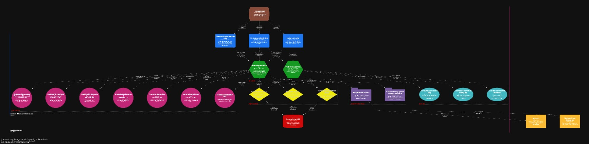

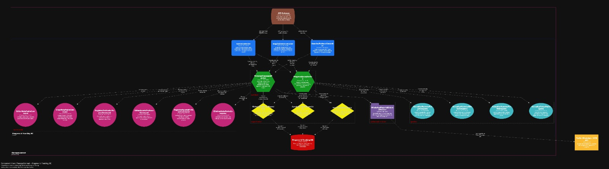

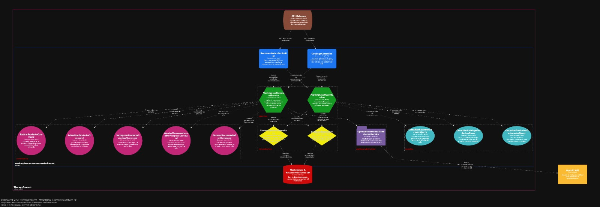

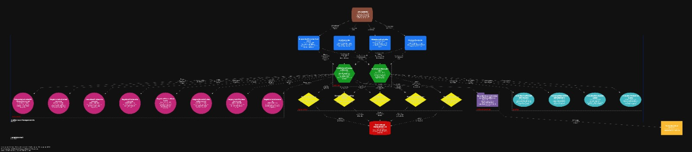

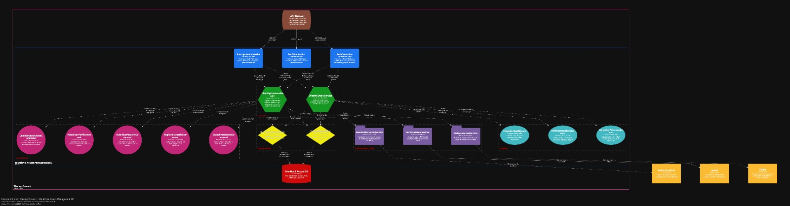

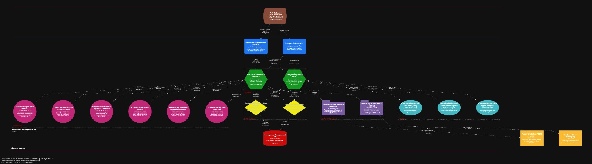

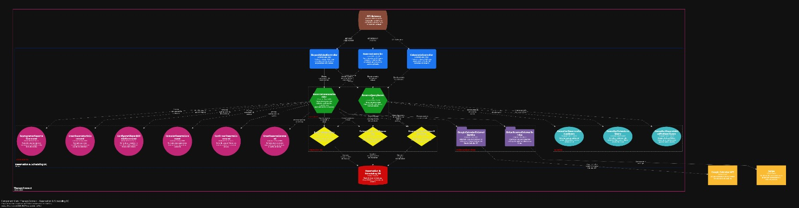

---

# 4.7. Software Object-Oriented Design

## 4.7.1. Class Diagrams

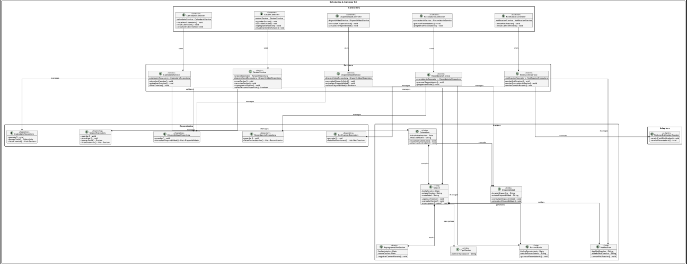

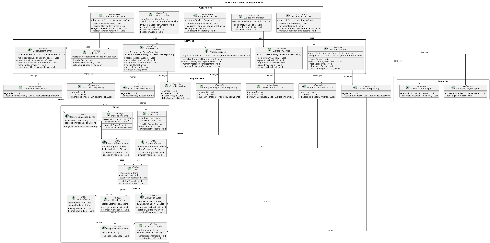

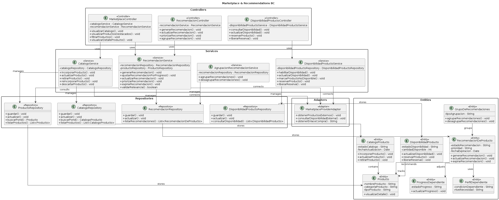

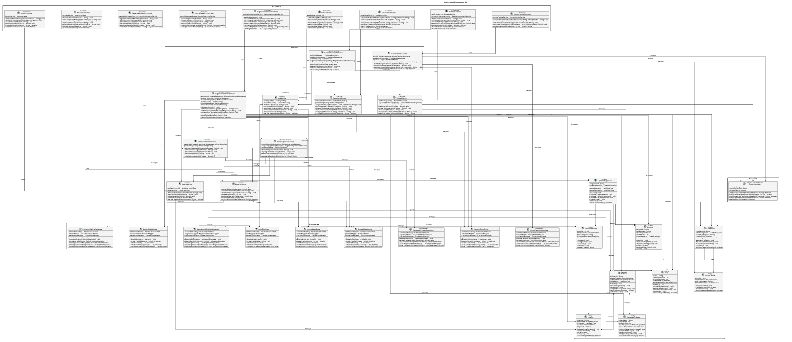

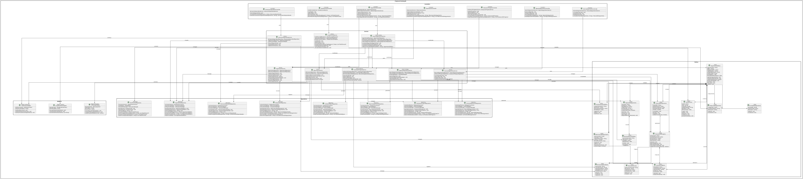

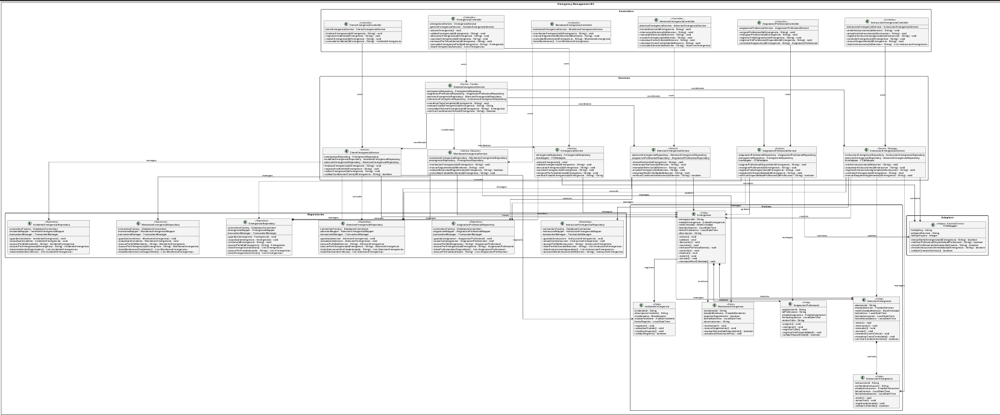

---

# 4.8. Database Design

## 4.8.1. Database Diagrams

### Bounded Context: Comunicación y Mensajería

El bounded context de Comunicación y Mensajería gestiona todas las interacciones entre padres de familia, profesionales terapéuticos e instituciones dentro de la plataforma. Su diseño de base de datos refleja los flujos de inicio, estado, seguimiento y escalamiento de comunicaciones, integrándose con el `ServicioNotificacionesPush` para alertas en tiempo real.

---

### Tablas de la base de datos

#### Tabla: `Conversacion`

| Columna | Tipo | Restricción | Descripción |
|---|---|---|---|
| idConversacion | UUID | PK, NOT NULL | Identificador único de la conversación |
| tipoConversacion | VARCHAR(30) | NOT NULL | PADRE_PROFESIONAL, INSTITUCION_PADRE, EMERGENCIA |
| estadoConversacion | VARCHAR(20) | NOT NULL | ACTIVA, INACTIVA, ESCALADA, CERRADA |
| fechaInicio | TIMESTAMP | NOT NULL | Fecha y hora de inicio de la conversación |
| fechaCierre | TIMESTAMP | NULL | Fecha de cierre; NULL si está activa |
| prioridad | VARCHAR(10) | NOT NULL | BAJA, MEDIA, ALTA, URGENTE |
| requiereSeguimiento | BOOLEAN | DEFAULT FALSE | Indica si requiere seguimiento posterior |

---

#### Tabla: `ParticipanteConversacion`

| Columna | Tipo | Restricción | Descripción |
|---|---|---|---|
| idParticipanteConversacion | UUID | PK, NOT NULL | Identificador único del participante en la conversación |
| idConversacion | UUID | FK → Conversacion | Referencia a la conversación a la que pertenece |
| tipoParticipante | VARCHAR(20) | NOT NULL | PADRE, PROFESIONAL, INSTITUCION, SISTEMA |
| referenciaActor | UUID | NOT NULL | ID del usuario según su tipo (padre, profesional, etc.) |

---

#### Tabla: `Interaccion`

| Columna | Tipo | Restricción | Descripción |
|---|---|---|---|
| idInteraccion | UUID | PK, NOT NULL | Identificador único de la interacción |
| idConversacion | UUID | FK → Conversacion | Conversación a la que pertenece esta interacción |
| tipoInteraccion | VARCHAR(30) | NOT NULL | MENSAJE, NOTA, RECOMENDACION, ALERTA |
| contenido | TEXT | NOT NULL | Texto o contenido de la interacción |
| esRelevante | BOOLEAN | DEFAULT FALSE | Marca la interacción como relevante para seguimiento |
| esCritica | BOOLEAN | DEFAULT FALSE | Indica si la interacción requiere atención inmediata |
| fechaInteraccion | TIMESTAMP | NOT NULL | Fecha y hora en que ocurrió la interacción |

---

#### Tabla: `SeguimientoCaso`

| Columna | Tipo | Restricción | Descripción |
|---|---|---|---|
| idSeguimiento | UUID | PK, NOT NULL | Identificador único del seguimiento del caso |
| idConversacion | UUID | FK → Conversacion, UNIQUE | Conversación asociada (relación 1:1) |
| estadoSeguimiento | VARCHAR(20) | NOT NULL | ACTIVO, SUSPENDIDO, CERRADO |
| requiereContinuidad | BOOLEAN | DEFAULT FALSE | Indica si el caso requiere sesiones de seguimiento continuo |
| fechaActualizacion | TIMESTAMP | NOT NULL | Última actualización del estado del seguimiento |

---

#### Tabla: `Recomendacion`

| Columna | Tipo | Restricción | Descripción |
|---|---|---|---|
| idRecomendacion | UUID | PK, NOT NULL | Identificador único de la recomendación |
| idSeguimiento | UUID | FK → SeguimientoCaso | Seguimiento de caso al que pertenece esta recomendación |
| contenido | TEXT | NOT NULL | Texto de la recomendación emitida por el profesional |
| estadoRecomendacion | VARCHAR(20) | NOT NULL | EMITIDA, APLICADA, AJUSTADA, RECHAZADA, REFORZADA |
| fechaEmision | TIMESTAMP | NOT NULL | Fecha en que fue emitida la recomendación |
| requiereAjuste | BOOLEAN | DEFAULT FALSE | Indica si la recomendación necesita ser ajustada |
| esAplicada | BOOLEAN | DEFAULT FALSE | Indica si el padre confirmó que la aplicó |

---

#### Tabla: `Escalamiento`

| Columna | Tipo | Restricción | Descripción |
|---|---|---|---|
| idEscalamiento | UUID | PK, NOT NULL | Identificador único del escalamiento |
| idConversacion | UUID | FK → Conversacion | Conversación que originó el escalamiento |
| motivo | VARCHAR(50) | NOT NULL | FALTA_RESPUESTA, EMERGENCIA, SOLICITUD_PADRE, SISTEMA |
| estadoEscalamiento | VARCHAR(20) | NOT NULL | PENDIENTE, EN_PROCESO, RESUELTO, RECHAZADO |
| fechaEscalamiento | TIMESTAMP | NOT NULL | Fecha en que se registró el escalamiento |
| fechaResolucion | TIMESTAMP | NULL | Fecha de resolución; NULL si está pendiente |

---

### Relaciones entre tablas

| Tabla origen | Cardinalidad | Tabla destino |
|---|---|---|
| Conversacion | 1 ── N | ParticipanteConversacion (una conversación tiene muchos participantes) |
| Conversacion | 1 ── N | Interaccion (una conversación tiene muchas interacciones) |
| Conversacion | 1 ── 1 | SeguimientoCaso (cada conversación tiene un único seguimiento) |
| SeguimientoCaso | 1 ── N | Recomendacion (un seguimiento puede generar múltiples recomendaciones) |
| Conversacion | 1 ── N | Escalamiento (una conversación puede tener múltiples escalamientos) |

---

### Flujos del dominio

| Flujo | Comando / Evento | Servicio externo |
|---|---|---|
| Inicio y estado de comunicación | IniciarConversacion → ConversacionIniciada | ServicioNotificacionesPush |
| Estado de la comunicación | MarcarComunicacionInactiva → ComunicacionInactiva | ServicioNotificacionesPush |
| Problemas y escalamiento | DetectarFaltaDeRespuesta → FaltaDeRespuestaDetectada | ServicioNotificacionesPush |
| Problemas y escalamiento | EscalarComunicacion → ComunicacionEscalada | ServicioNotificacionesPush |

---

### Objetos del dominio

| Objeto | Atributos clave | Métodos / Comportamientos |
|---|---|---|
| Conversacion | idConversacion, estadoConversacion, prioridad | iniciarConversacion(), cerrarConversacion(), reabrirConversacion(), derivarConversacion() |
| Interaccion | idInteraccion, tipoInteraccion, esRelevante | registrarInteraccion(), clasificarInteraccion(), descartarInteraccion() |
| SeguimientoCaso | idSeguimiento, estadoSeguimiento, requiereContinuidad | actualizarSeguimiento(), suspenderSeguimiento(), cerrarSeguimiento() |
| Recomendacion | idRecomendacion, estadoRecomendacion, contenido | emitirRecomendacion(), aplicarRecomendacion(), ajustarRecomendacion(), rechazarRecomendacion(), reforzarRecomendacion() |
| Escalamiento | idEscalamiento, estadoEscalamiento, motivo | escalarComunicacion(), resolverEscalamiento(), rechazarEscalamiento() |

[Structurizr - Diagrama de Arquitectura](https://structurizr.com/share/109683)