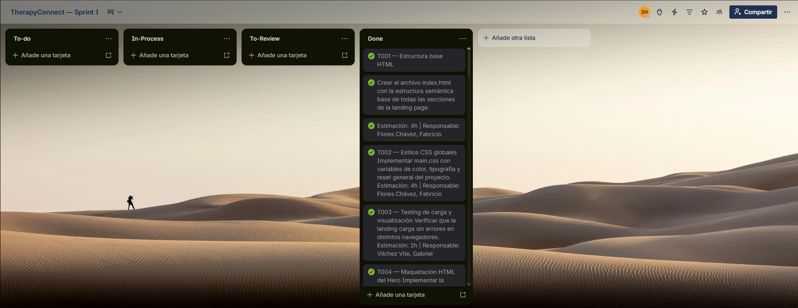
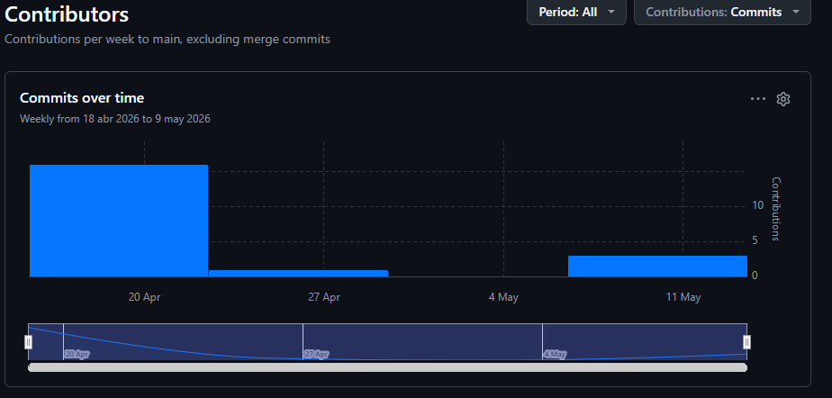
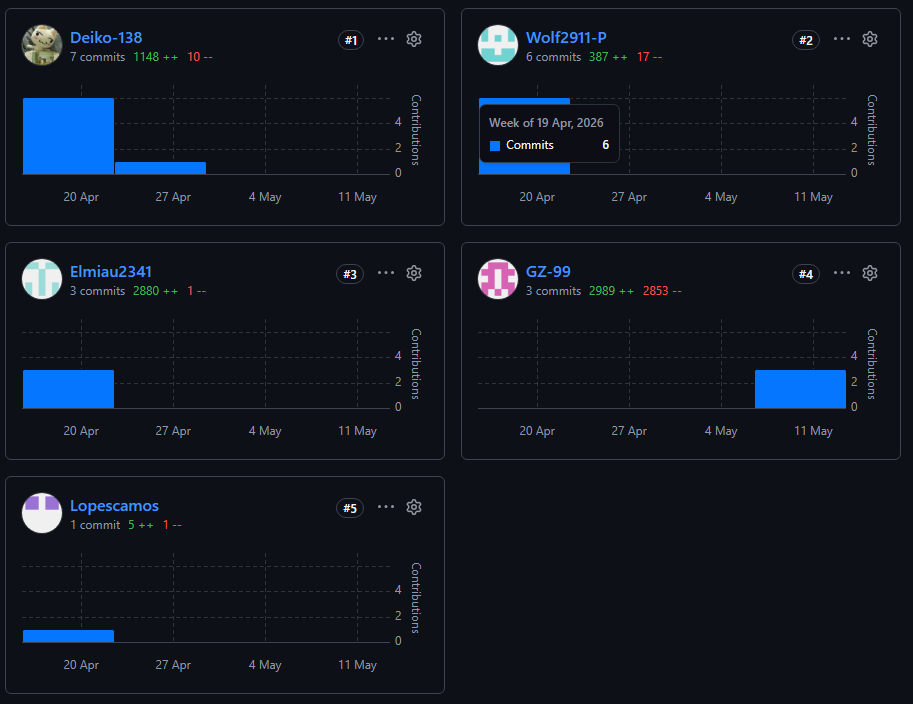
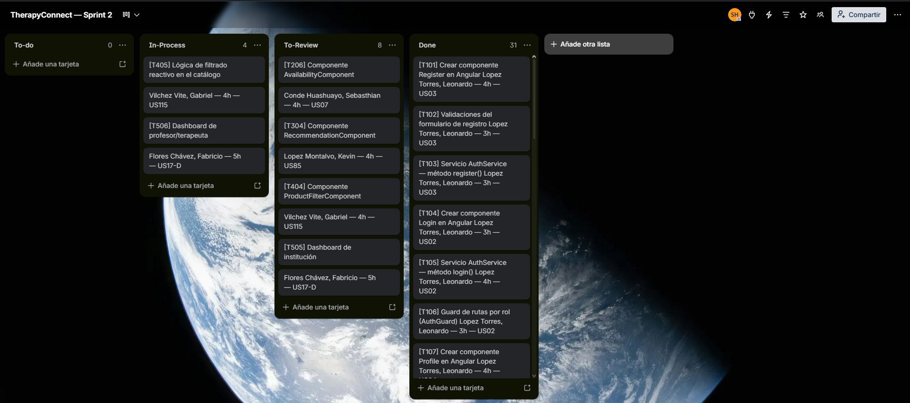

# Capítulo V: Product Implementation, Validation & Deployment

## 5.1. Software Configuration Management

### 5.1.1. Software Development Environment Configuration

En esta sección se describen los productos de software utilizados por los miembros del equipo Conecta para colaborar en el ciclo de vida del producto TherapyConnect, organizados por tipo de actividad.

**Project Management**
Para la gestión del proyecto se utilizó Trello (https://trello.com), herramienta basada en el modelo Kanban que permite organizar tareas, asignar responsables y hacer seguimiento del avance por sprint de forma visual y colaborativa.

**Product UX/UI Design**
Para el diseño de wireframes, mock-ups y prototipos interactivos se utilizó Figma (https://www.figma.com), herramienta colaborativa basada en la web que permite diseñar interfaces y compartir prototipos en tiempo real. Para la elaboración de User Personas, Empathy Maps, Journey Maps e Impact Maps se utilizó UXPressia (https://uxpressia.com). Para los diagramas de Wireflows, User Flows y Event Storming se utilizó LucidChart (https://www.lucidchart.com) y Miro (https://miro.com).

**Software Development**
Para el desarrollo del Landing Page se utilizó HTML5, CSS3 y JavaScript, editados mediante Visual Studio Code (https://code.visualstudio.com), editor de código ligero y extensible ampliamente adoptado en el equipo.

**Software Documentation**
Para la documentación de los Web Services se utilizó Swagger UI mediante la especificación OpenAPI (https://swagger.io), lo que permite visualizar y probar los endpoints del API de forma interactiva. Para los diagramas de arquitectura de software bajo el modelo C4 se utilizó Miro (https://miro.com). Para diagramas UML y de base de datos se utilizó LucidChart y Vertabelo (https://vertabelo.com).

**Software Deployment**
Para el despliegue del Landing Page se utilizó GitHub Pages (https://pages.github.com), servicio gratuito integrado con GitHub que permite publicar sitios estáticos directamente desde un repositorio. Para el despliegue de la Web Application y los Web Services se utilizarán servicios cloud como Railway o Render, a definir en sprints posteriores.

**Version Control**
Para el almacenamiento y control de versiones del código fuente se utilizó Git gestionado desde GitHub (https://github.com), aplicando el flujo de trabajo GitFlow, Conventional Commits y Semantic Versioning.

---

### 5.1.2. Source Code Management

El equipo Conecta utiliza GitHub como plataforma de control de versiones y colaboración, bajo la organización pública:

**Organización GitHub:** https://github.com/1ASI0729-2610-11913

Los repositorios establecidos para cada producto de la solución son los siguientes:

| Producto | Repositorio URL |
|---|---|
| Startup / Informe | https://github.com/1ASI0729-2610-11913/upc-pre-202610-1asi0729-11913-TherapyConnect.git |
| Landing Page | https://github.com/1ASI0729-2610-11913/upc-pre-202610-1asi0729-11913-TherapyConnect-website.git |
| Frontend Web Application | (por definir — se creará bajo la misma organización) |
| RESTful Web Services | (por definir — se creará bajo la misma organización) |

#### GitFlow Workflow

Se implementará el modelo de ramificación propuesto por Vincent Driessen en su artículo *“A successful Git branching model”*, conocido como **GitFlow**. Este modelo organiza el trabajo en las siguientes ramas:

- `main`: Rama principal, contiene siempre el código en producción.
- `develop`: Rama de desarrollo principal, donde se integran las funcionalidades antes de pasar a producción.
- `feature/*`: Ramas creadas a partir de `develop` para desarrollar nuevas funcionalidades.**Convención de nombres:** `feature/<nombre-corto-descriptivo>`_Ejemplo: `feature/login-auth`_
  **Convención de nombres:** `feature/<descripción-corta>`
  _Ejemplo: `feature/version-testing`_

#### Convenciones de Commits

Se utilizará el estándar de **Conventional Commits** para los mensajes de commits. Esto facilitará la automatización en los procesos de integración continua y generación de changelogs.

**Ejemplos:**

- `feat: add login functionality`
- `fix: correct null pointer exception on user service`
- `chore: update dependencies`
- `docs: add and update documents`

---

### 5.1.3. Source Code Style Guide & Conventions

Esta sección está dedicada a determinar y establecer las convenciones y estándares que serán utilizados en la codificación por el equipo para que la solución garantice consistencia, legibilidad y mantenibilidad. Los lineamientos aquí aplicados tienen su base en guías definidas y posteriormente bien conocidas como Google Style Guides, Angular Style Guide y las prácticas de Spring Boot.

**Principios Generales:**
- Todo el código debe neutralizarse en inglés (nombres de variable, función, clase, etc.).
- Se prioriza la claridad sobre la complejidad.
- El código debe ser autoexplicativo: no se permiten comentarios.
- Se debe respetar una estructura común en todos los archivos.
- Se aplicará el principio de SRP (Single Responsibility) a funciones y clases.

**Nomenclatura General:**
- **Variables:** Se utilizará la nomenclatura camelCase para nombrar variables, iniciando con minúscula y usando palabras descriptivas. Ejemplos: `userName`, `sessionDate`, `patientAge`.
- **Functions:** Las funciones se nombran en camelCase, utilizando verbos que describen la acción que realizan. Ejemplos: `getUserData()`, `createSession()`, `validateLogin()`.
- **Classes:** Las clases se nombran en PascalCase, iniciando cada palabra con mayúscula. Ejemplos: `TherapySession`, `UserProfile`, `AppointmentManager`.
- **Interfaces:** Se utilizará PascalCase para interfaces, representando estructuras de datos del dominio. Ejemplos: `Patient`, `SessionRecord`, `UserAccount`.
- **Constants:** Las constantes se escribirán en UPPER_CASE, separando palabras con guiones bajos. Ejemplos: `MAX_SESSIONS`, `API_URL`, `DEFAULT_TIMEOUT`.
- **Files:** Los archivos se nombran en kebab-case, usando palabras en minúscula separadas por guiones. Ejemplos: `user-profile.component.ts`, `session-service.js`.
- **Components:** Los componentes se nombran en PascalCase y deben reflejar su funcionalidad dentro del sistema. Ejemplos: `SessionCardComponent`, `LoginFormComponent`.
- **CSS Classes:** Se utilizará kebab-case para clases CSS, priorizando nombres descriptivos y reutilizables. Ejemplos: `main-container`, `primary-button`, `session-card`.

**Convenciones HTML:**
- Uso de HTML5 semántico (`section`, `article`, `nav`).
- Uso de etiquetas en minúscula.
- Indentación de 2 espacios.
- Clases descriptivas.

**Convenciones CSS:**
- Uso de kebab-case.
- Evitar IDs.
- Clases reutilizables.
- Separación por componentes.

**Convenciones JavaScript:**
- Uso de `const` y `let`.
- Evitar `var`.
- Funciones pequeñas.
- Uso de arrow functions.

**Convenciones TypeScript:**
- Tipado obligatorio.
- Evitar `any`.
- Uso de interfaces.
- Modularización.

**Convenciones Angular:**
- Estructura por módulos.
- Uso de servicios.
- Componentes reutilizables.

**Convenciones Java:**
- Clases en PascalCase.
- Métodos en camelCase.
- Encapsulamiento.

**Convenciones Spring Boot:**
- Arquitectura: Controller, Service, Repository.
- Uso de anotaciones estándar.

**Convenciones Gherkin:**
- Given / When / Then.
- Escenarios claros.

**Prácticas Adicionales:**
- Evitar duplicación de código (DRY).
- Mantener funciones cortas (< 20 líneas).
- Usar nombres descriptivos.
- Validar entradas de usuario.

---

### 5.1.4. Software Deployment Configuration
Esta sección detalla los pasos necesarios para desplegar de forma satisfactoria los productos digitales que componen la solución: el Business-Web-Page, la aplicación web (frontend) y los Web Services (backend), partiendo desde sus respectivos repositorios de código fuente.

**1. Business-Web-Page - HTML, CSS y Javascript**

**Tecnología Base**

* Lenguajes: HTML5, CSS3, JavaScript
* Hosting: GitHub Pages

**Configuración y Despliegue**

* Repositorio de Código Fuente:
  La Business-Web-Page se desarrolla utilizando HTML, CSS y JavaScript puro. Todos los archivos del proyecto deben subirse a un repositorio público en GitHub. Es obligatorio que el archivo `index.html` esté ubicado en la raíz del repositorio (`/`) para que GitHub Pages lo detecte correctamente como punto de entrada del sitio.

**Configuración del despliegue en GitHub Pages** :

* Acceder al repositorio en GitHub.
* Ir a la sección **Settings** del repositorio.
* En el menú lateral, seleccionar  **Pages** .
* En el campo  **Source** , elegir:
    * Rama: `main`
    * Carpeta: `/ (root)`
* Guardar los cambios.

**Publicación** :

Una vez guardada la configuración, GitHub generará automáticamente una URL pública donde la Business-Web-Page estará disponible. Esta URL sigue el formato: `https://<usuario>.github.io/<repositorio>/`

**Actualizaciones** :

Cualquier nuevo commit hecho a la rama `main` será detectado automáticamente por GitHub Pages y aplicado en la versión publicada sin necesidad de acciones adicionales.

---

## 5.2. Landing Page, Services & Applications Implementation

### 5.2.1. Sprint 1
El primer sprint es un hito importante en nuestro proceso de desarrollo ágil. Durante este período, nos enfocamos en la implementación de las características y funcionalidades prioritarias identificadas en la planificación inicial. Esto implica traducir los requisitos y especificaciones en código funcional, desarrollando las bases de nuestro producto de manera iterativa.

#### 5.2.1.1. Sprint Planning 1

En esta sección se especifican los aspectos principales del Sprint Planning Meeting del Sprint 1. A continuación se presenta el cuadro resumen de la reunión de planificación.

| Sprint # | Sprint 1 |
|---|---|
| **Sprint Planning Background** | |
| Date | 2026-04-21 |
| Time | 09:00 AM |
| Location | Reunión virtual mediante Google Meet |
| Prepared By | Lopez Torres, Leonardo Gabriel |
| Attendees (to planning meeting) | Lopez Torres, Leonardo Gabriel / Lopez Montalvo, Kevin Edu / Conde Huashuayo, Sebasthian Alex / Vilchez Vite, Gabriel Alejandro / Flores Chávez, Fabricio |
| Sprint 0 Review Summary | Al ser el primer sprint del proyecto, no existe un sprint anterior que revisar. Se parte desde cero con el levantamiento de requisitos, la definición del producto y la planificación inicial. |
| Sprint 0 Retrospective Summary | Al ser el primer sprint, no aplica retrospectiva de sprint anterior. El equipo realizó una sesión inicial de alineamiento para establecer acuerdos de trabajo, herramientas de colaboración y metodología a seguir durante el desarrollo del proyecto. |
| **Sprint Goal & User Stories** | |
| Sprint 1 Goal | Desarrollar la landing page completa y responsive de la plataforma, establecer los style guidelines del sistema de diseño y habilitar el flujo básico de acceso (registro, inicio de sesión y recuperación de contraseña) para los tres segmentos de usuario: padres de familia, profesores e instituciones terapéuticas. |
| Sprint 1 Velocity | 40 Story Points (Capacidad establecida para el equipo en este primer sprint, considerando la familiarización con el proyecto y la configuración del entorno de desarrollo.) |
| Sum of Story Points | 40 Story Points (Distribuidos en: Landing Page: 28 SP \| Style Guidelines: 10 SP \| Acceso básico EP01: 8 SP — con redondeo de 6 SP descontados por ajuste de velocidad inicial) |

---

#### 5.2.1.2. Aspect Leaders and Collaborators

En esta sección el equipo incluye la elaboración de un artefacto Leadership-and-Collaboration Matrix (LACX), que indique por cada aspecto dentro del alcance del Sprint, quién es el líder y quién o quiénes son colaboradores en dicho aspecto, con el fin de brindar mayor claridad y efectividad en la comunicación al interior del equipo. La sección incluye una introducción donde se explica cuáles son los principales aspectos que se toma en cuenta en el Sprint. Dependiendo del Sprint un aspecto puede ser un subconjunto del alcance funcional de la solución (por ejemplo feature, bounded context, etc.).

Los aspectos considerados en el Sprint 1 son: Landing Page, Style Guidelines, y Flujo de Acceso (Autenticación). Cada aspecto agrupa las User Stories relacionadas trabajadas durante este sprint.

| Team Member (Last Name, First Name) | GitHub Username | Landing Page L / C | Style Guidelines L / C | Flujo de Acceso L / C |
|---|-----------------|---|---|---|
| Flores Chávez, Fabricio | Elmiau2341      | L | C | C |
| Vilchez Vite, Gabriel Alejandro | GZ-99           | C | C | C |
| Lopez Torres, Leonardo Gabriel | Deiko-138       | C | L | C |
| Lopez Montalvo, Kevin Edu | Lopescamos      | C | C | L |
| Conde Huashuayo, Sebasthian Alex | Wolf2911-P      | C | C | C |

---

#### 5.2.1.3. Sprint Backlog 1

El objetivo del Sprint 1 es establecer la base del producto TherapyConnect: desarrollar la landing page completa y responsive, definir los style guidelines del sistema de diseño y habilitar el flujo básico de acceso para los tres segmentos de usuario.

Trello: https://trello.com/invite/b/6a01270ea96c0a53e6826d61/ATTI1da43f25bafa713ad39a42e4bf04ea24CA66726B/therapyconnect-sprint-1

 

| User Story Id | User Story Title | Task Id | Task Title | Description | Estimation (Hours) | Assigned To | Status |
|---|---|---|---|---|---|---|---|
| US128 | Visualización de la landing page | T001 | Estructura base HTML | Crear el archivo index.html con la estructura semántica de todas las secciones de la landing. | 4h | Flores Chávez, Fabricio | Done |
| | | T002 | Estilos CSS globales | Implementar main.css con variables de color, tipografía y reset general del proyecto. | 4h | Flores Chávez, Fabricio | Done |
| | | T003 | Testing de carga y visualización | Verificar que la landing carga sin errores en distintos navegadores. | 2h | Vilchez Vite, Gabriel | Done |
| US129 | Sección Hero con llamada a la acción | T004 | Maquetación HTML del Hero | Implementar la estructura HTML con título, subtítulo y botón CTA. | 3h | Flores Chávez, Fabricio | Done |
| | | T005 | Estilos CSS del Hero | Aplicar estilos de fondo, tipografía, colores y alineación del Hero. | 3h | Flores Chávez, Fabricio | Done |
| | | T006 | Vincular CTA al registro | Configurar el enlace del botón 'Comenzar ahora' hacia el formulario de registro. | 2h | Lopez Torres, Leonardo | Done |
| US130 | Sección de funcionalidades principales | T007 | Maquetación HTML de funcionalidades | Implementar tarjetas de funcionalidades con íconos y textos descriptivos. | 4h | Vilchez Vite, Gabriel | Done |
| | | T008 | Estilos CSS de tarjetas | Aplicar estilos con hover y animaciones de entrada a las tarjetas. | 4h | Vilchez Vite, Gabriel | Done |
| US131 | Sección de segmentos objetivo | T009 | Maquetación HTML de segmentos | Crear las tres tarjetas para padres, instituciones y profesores con íconos representativos. | 4h | Conde Huashuayo, Sebasthian | Done |
| | | T010 | Interacción hover por segmento | Implementar la funcionalidad que muestra beneficios específicos al seleccionar cada tarjeta. | 4h | Conde Huashuayo, Sebasthian | Done |
| US132 | Sección de planes y precios | T011 | Maquetación HTML de planes | Implementar tarjetas de planes con nombre, precio, duración y lista de beneficios. | 4h | Flores Chávez, Fabricio | Done |
| | | T012 | Estilos y destacado del plan recomendado | Aplicar estilos y resaltar el plan recomendado con etiqueta o borde diferenciado. | 4h | Flores Chávez, Fabricio | Done |
| US133 | Sección de testimonios | T013 | Maquetación HTML de testimonios | Crear tarjetas con avatar, nombre y texto del comentario del usuario. | 3h | Vilchez Vite, Gabriel | Done |
| | | T014 | Implementar carrusel de testimonios | Desarrollar el carrusel en JavaScript con navegación por flechas y autoavance. | 5h | Vilchez Vite, Gabriel | Done |
| US134 | Sección de preguntas frecuentes (FAQ) | T015 | Maquetación HTML del FAQ | Implementar la estructura de acordeón con preguntas y respuestas. | 3h | Conde Huashuayo, Sebasthian | Done |
| | | T016 | Funcionalidad JS del acordeón | Implementar el despliegue y colapso de respuestas al hacer clic en cada pregunta. | 3h | Conde Huashuayo, Sebasthian | Done |
| US135 | Sección de contacto y footer | T017 | Maquetación HTML del footer | Implementar el footer con columnas de contacto, redes sociales y enlaces a términos. | 3h | Lopez Montalvo, Kevin | Done |
| | | T018 | Formulario de contacto y validación | Desarrollar el formulario de contacto con validación de campos y mensaje de confirmación. | 5h | Lopez Montalvo, Kevin | Done |
| US136 | Navegación interna de la landing page | T019 | Implementar menú de navegación | Crear el menú con enlaces a cada sección de la landing page. | 3h | Lopez Torres, Leonardo | Done |
| | | T020 | Scroll suave y menú fijo | Implementar desplazamiento suave entre secciones y menú fijo al hacer scroll. | 4h | Lopez Torres, Leonardo | Done |
| | | T021 | Menú hamburguesa para móvil | Implementar el menú hamburguesa responsive con funcionalidad de apertura y cierre. | 3h | Lopez Torres, Leonardo | Done |
| US137 | Diseño responsive de la landing page | T022 | Media queries para móvil | Agregar media queries CSS para adaptar el layout a pantallas de smartphone. | 6h | Flores Chávez, Fabricio | Done |
| | | T023 | Media queries para tablet | Agregar media queries CSS para el layout intermedio en dispositivos tablet. | 4h | Flores Chávez, Fabricio | Done |
| | | T024 | Testing responsive multi-dispositivo | Verificar la correcta visualización en distintos tamaños de pantalla y navegadores. | 2h | Vilchez Vite, Gabriel | Done |
| US-SG01 | Definición de paleta de colores | T025 | Seleccionar y definir paleta | Seleccionar colores primarios, secundarios y de estado para la plataforma. | 3h | Lopez Torres, Leonardo | Done |
| | | T026 | Documentar paleta en guía de estilos | Registrar códigos hexadecimales y uso de cada color en el documento de style guidelines. | 2h | Lopez Torres, Leonardo | Done |
| | | T027 | Aplicar variables CSS de paleta | Implementar las variables CSS (--color-primary, etc.) en el proyecto. | 3h | Lopez Torres, Leonardo | Done |
| US-SG02 | Definición de tipografía | T028 | Seleccionar fuente y escala tipográfica | Elegir la tipografía principal y definir tamaños H1-H4, cuerpo y etiquetas. | 3h | Lopez Torres, Leonardo | Done |
| | | T029 | Documentar tipografía en guía de estilos | Registrar fuente, tamaños y pesos tipográficos en el documento de style guidelines. | 2h | Lopez Torres, Leonardo | Done |
| US-SG03 | Componentes base de UI | T030 | Diseñar botones y variantes | Definir y maquetar estilos de botones (primario, secundario, deshabilitado) con estados hover y active. | 4h | Lopez Torres, Leonardo | Done |
| | | T031 | Diseñar inputs, cards y alertas | Definir y maquetar estilos de inputs, tarjetas y componentes de alerta con sus variantes. | 4h | Lopez Torres, Leonardo | Done |
| US-SG04 | Definición de espaciados y grilla | T032 | Definir sistema de grilla | Establecer número de columnas, gutter y márgenes para desktop, tablet y móvil. | 3h | Lopez Torres, Leonardo | Done |
| | | T033 | Documentar y aplicar espaciados | Registrar valores de espaciado y aplicar variables CSS en el proyecto. | 2h | Lopez Torres, Leonardo | Done |
| US01 | Registro de usuario | T034 | Maquetación HTML del formulario de registro | Implementar la pantalla de registro con campos de nombre, correo, contraseña y selector de rol. | 4h | Lopez Montalvo, Kevin | Done |
| | | T035 | Validación de campos del formulario | Implementar validaciones de campos obligatorios, formato de correo y longitud de contraseña. | 4h | Lopez Montalvo, Kevin | Done |
| | | T036 | Detección de correo duplicado | Implementar verificación para detectar correo ya registrado y mostrar mensaje de error. | 4h | Lopez Montalvo, Kevin | Done |
| | | T037 | Confirmación y redirección tras registro | Implementar mensaje de éxito y redirección al dashboard según el rol seleccionado. | 4h | Lopez Montalvo, Kevin | Done |
| US02 | Inicio de sesión | T038 | Maquetación HTML de la pantalla de login | Implementar la vista de inicio de sesión con campos de correo, contraseña y botón de ingreso. | 3h | Lopez Montalvo, Kevin | Done |
| | | T039 | Autenticación y redirección por rol | Implementar la lógica que valida credenciales y redirige al dashboard según el rol del usuario. | 6h | Lopez Montalvo, Kevin | Done |
| | | T040 | Mensaje de error en credenciales incorrectas | Mostrar mensaje claro cuando el correo o contraseña ingresados sean incorrectos. | 2h | Lopez Montalvo, Kevin | Done |
| US03 | Recuperación de contraseña | T041 | Pantalla de solicitud de recuperación | Implementar la vista donde el usuario ingresa su correo para solicitar el restablecimiento. | 3h | Conde Huashuayo, Sebasthian | Done |
| | | T042 | Envío de enlace de recuperación | Implementar el envío de correo con enlace seguro y temporizado para restablecer la contraseña. | 5h | Conde Huashuayo, Sebasthian | Done |
| | | T043 | Pantalla de nueva contraseña | Desarrollar el formulario donde el usuario define su nueva contraseña tras seguir el enlace. | 4h | Conde Huashuayo, Sebasthian | Done |
| US07 | Cierre de sesión seguro | T044 | Implementar botón de cierre de sesión | Agregar la opción de cerrar sesión en el menú, eliminar el token y redirigir al login. | 3h | Lopez Montalvo, Kevin | Done |
| | | T045 | Cierre automático por inactividad | Implementar el temporizador de inactividad que cierra la sesión y notifica al usuario. | 5h | Lopez Montalvo, Kevin | Done |

---

#### 5.2.1.4. Development Evidence for Sprint Review

Durante el Sprint 1, el alcance de implementación estuvo enfocado exclusivamente en el desarrollo y despliegue de la primera versión del Landing Page de TherapyConnect, así como en la definición del sistema de diseño base (Style Guidelines) y la habilitación del flujo de acceso básico (registro, inicio de sesión, recuperación de contraseña y cierre de sesión) a nivel de interfaz de usuario.
Landing Page  

Durante el Sprint 1 se implementó la Landing Page. Los principales avances fueron:

Diseño responsivo para diferentes tamaños de pantalla.  
Creación de secciones: Hero, Sobre Nosotros, Beneficios, Testimonios, Preguntas Frecuentes, Tutorial, Contacto y Footer.  
Aplicación de buenas prácticas de accesibilidad (etiquetado semántico, contraste adecuado).
Implementación de navegación fluida entre secciones.  
Validación de compatibilidad en navegadores y dispositivos.

En consecuencia, no se ha realizado en este sprint el desarrollo de Web Services ni la implementación de endpoints RESTful, por lo que no existe documentación de servicios mediante OpenAPI/Swagger que reportar en esta entrega. La documentación de servicios será incorporada a partir del Sprint 2, cuando se inicie la implementación del backend con Spring Boot, conforme al plan de desarrollo establecido en el Product Backlog.

---

#### 5.2.1.5. Execution Evidence for Sprint Review

---

#### 5.2.1.6. Services Documentation Evidence for Sprint Review

| Repository | Branch                     | Commit Id | Commit Message | Committed on (Date) |
|---|----------------------------|---|---|---|
| https://github.com/1ASI0729-2610-11913/upc-pre-202610-1asi0729-11913-TherapyConnect | developer                  | 13677da | doc: javascript | 04/25/2026 |
| https://github.com/1ASI0729-2610-11913/upc-pre-202610-1asi0729-11913-TherapyConnect | developer                       | 9ff63a4 | Add main.css with base styles and layout | 04/25/2026 |
| https://github.com/1ASI0729-2610-11913/upc-pre-202610-1asi0729-11913-TherapyConnect | developer                       | 29e223d | Update print statement from 'Hello' to 'Goodbye' | 04/25/2026 |
| https://github.com/1ASI0729-2610-11913/upc-pre-202610-1asi0729-11913-TherapyConnect | developer                       | 8002da7 | Add mobile menu and language switch functionality | 04/25/2026 |
| https://github.com/1ASI0729-2610-11913/upc-pre-202610-1asi0729-11913-TherapyConnect | developer                       | ddd2592 | Add initial CSS styles for the project | 04/25/2026 |
| https://github.com/1ASI0729-2610-11913/upc-pre-202610-1asi0729-11913-TherapyConnect | developer    | db339dc | Merge branch 'hotfix/fix-pages-index' | 04/25/2026 |
| https://github.com/1ASI0729-2610-11913/upc-pre-202610-1asi0729-11913-TherapyConnect | developer    | 8af213b | fix(pages): relocate index.html to public root. | 04/25/2026 |
| https://github.com/1ASI0729-2610-11913/upc-pre-202610-1asi0729-11913-TherapyConnect | developer| e294786 | Merge branch 'hotfix/github-pages-deploy' | 04/25/2026 |
| https://github.com/1ASI0729-2610-11913/upc-pre-202610-1asi0729-11913-TherapyConnect | developer| c66ca2f | fix: configure GitHub Pages deployment from public folder | 04/25/2026 |
| https://github.com/1ASI0729-2610-11913/upc-pre-202610-1asi0729-11913-TherapyConnect | developer            | d925511 | Merge branch 'release/v0.0.1' | 04/25/2026 |
| https://github.com/1ASI0729-2610-11913/upc-pre-202610-1asi0729-11913-TherapyConnect | developer           | fe1ld8e | fix(release): normalize contact placeholder information. | 04/25/2026 |
| https://github.com/1ASI0729-2610-11913/upc-pre-202610-1asi0729-11913-TherapyConnect | developer            | 7d61e80 | fix(release): replace empty footer placeholder links with non-navigable placeholders. | 04/25/2026 |
| https://github.com/1ASI0729-2610-11913/upc-pre-202610-1asi0729-11913-TherapyConnect | developer           | 62f432f | fix(release): add required validation to contact form fields | 04/25/2026 |
| https://github.com/1ASI0729-2610-11913/upc-pre-202610-1asi0729-11913-TherapyConnect | developer          | 4a6a864 | fix(release): remove obsolete inline onerror attribute from logo image. | 04/25/2026 |
| https://github.com/1ASI0729-2610-11913/upc-pre-202610-1asi0729-11913-TherapyConnect | developer                       | dc69480 | fix(layout): correct asset paths in static resources | 04/25/2026 |
| https://github.com/1ASI0729-2610-11913/upc-pre-202610-1asi0729-11913-TherapyConnect | developer                       | c5b6780 | feat(footer): implement footer section | 04/25/2026 |
| https://github.com/1ASI0729-2610-11913/upc-pre-202610-1asi0729-11913-TherapyConnect | developer                       | 6a2f108 | feat(contact): implement contact form section | 04/25/2026 |
| https://github.com/1ASI0729-2610-11913/upc-pre-202610-1asi0729-11913-TherapyConnect | developer                       | cff85a2 | feat(pricing): implement pricing plans section | 04/25/2026 |

---

#### 5.2.1.7. Software Deployment Evidence for Sprint Review

Durante el Sprint 1, el equipo Conecta realizó el despliegue de la primera versión pública de la Landing Page de TherapyConnect utilizando GitHub Pages, servicio gratuito y estático integrado directamente con el repositorio de GitHub.

**Plataforma de despliegue:** GitHub Pages — https://pages.github.com

**URL de la landing page desplegada:**
https://1asi0729-2610-11913.github.io/upc-pre-202610-1asi0729-11913-TherapyConnect-website/

**Proceso de despliegue realizado:**

1. Se creó el repositorio de la Landing Page bajo la organización GitHub del equipo: https://github.com/1ASI0729-2610-11913/upc-pre-202610-1asi0729-11913-TherapyConnect.git
2. Se configuró la rama main como rama de producción del repositorio.
3. Todo el contenido estático de la landing page (HTML, CSS, JS) fue integrado a main mediante Pull Requests revisados por al menos un integrante del equipo, siguiendo el flujo GitFlow y Conventional Commits establecido.
4. En la sección Settings → Pages del repositorio, se seleccionó la rama main como fuente de publicación.
5. GitHub Pages generó automáticamente la URL pública y publicó el sitio estático.

---

#### 5.2.1.8. Team Collaboration Insights during Sprint

Durante el Sprint 1, el equipo Conecta utilizó GitHub como plataforma central de colaboración y control de versiones, aplicando el flujo de trabajo GitFlow junto con Conventional Commits y Semantic Versioning para mantener trazabilidad y orden en el desarrollo.

**Organización GitHub del equipo:**
https://github.com/1ASI0729-2610-11913/upc-pre-202610-1asi0729-11913-TherapyConnect.git

**Flujo de trabajo aplicado:**

- Cada integrante trabajó en ramas individuales siguiendo la convención `feature/US{id}-descripcion`, creadas desde la rama develop.
- Los cambios se integraron a develop mediante Pull Requests, requiriendo al menos una revisión y aprobación de otro integrante antes del merge.
- Los mensajes de commit siguieron el estándar Conventional Commits (`feat:`, `fix:`, `docs:`, `style:`, etc.), garantizando trazabilidad por funcionalidad.
- Al finalizar el sprint, develop fue fusionada a main para el despliegue en GitHub Pages.

 

### 5.2.2. Sprint 2

#### 5.2.2.1. Sprint Planning 2.

En esta sección se especifican los aspectos principales del Sprint Planning Meeting del Sprint 2. La reunión se realizó el 9 de mayo de 2026 de forma virtual mediante Google Meet, con la participación de los cinco integrantes del equipo. El objetivo de este sprint es desarrollar la primera versión funcional del Frontend Web Application de TherapyConnect, implementando las vistas principales de los bounded contexts identificados para la plataforma.

| Sprint # | Sprint 2 |
|---|---|
| **Sprint Planning Background** | |
| Date | 2026-05-09 |
| Time | 09:00 AM |
| Location | Reunión virtual mediante Google Meet |
| Prepared By | Lopez Torres, Leonardo Gabriel |
| Attendees (to planning meeting) | Lopez Torres, Leonardo Gabriel / Lopez Montalvo, Kevin Edu / Conde Huashuayo, Sebasthian Alex / Vilchez Vite, Gabriel Alejandro / Flores Chávez, Fabricio |
| Sprint 1 Review Summary | Durante el Sprint 1 se logró implementar y desplegar exitosamente la Landing Page completa de TherapyConnect en GitHub Pages, incluyendo las secciones Hero, funcionalidades, segmentos objetivo, planes y precios, testimonios, FAQ, footer y navegación responsive. Asimismo, se definieron los Style Guidelines del sistema de diseño (paleta de colores, tipografía, componentes base y grilla) y se implementaron las vistas de acceso básico (registro, inicio de sesión y recuperación de contraseña) para los tres segmentos de usuario. El equipo completó los 40 Story Points planificados dentro del plazo establecido. |
| Sprint 1 Retrospective Summary | El equipo trabajó de forma coordinada y cumplió con los entregables del Sprint 1. Se identificó como oportunidad de mejora la revisión cruzada de código mediante Pull Requests antes del merge a develop, ya que en algunos casos se integraron cambios sin revisión previa. Para el Sprint 2 se acuerda: revisar cada PR con al menos un integrante antes del merge, mantener daily check-ins de 15 minutos por Discord para alinear avances, y aplicar de forma más estricta las convenciones de Conventional Commits en todos los repositorios. |
| **Sprint Goal & User Stories** | |
| Sprint 2 Goal | Our focus is on delivering the first functional version of the TherapyConnect Web Application, enabling the three user segments to navigate their respective dashboards and interact with the core bounded contexts of the platform. We believe it delivers a tangible and interactive experience to parents, therapeutic institutions and therapists, allowing them to visualize the key functionalities of the platform and validate that the proposed solution addresses their needs. This will be confirmed when the three types of users can access their respective dashboards from the deployed frontend application, navigate between the main views of each bounded context (IAM, Sessions, Communication, Marketplace and Notifications) and the application is publicly accessible via a cloud deployment URL. |
| Sprint 2 Velocity | 45 Story Points (Capacidad establecida para el equipo considerando el inicio del desarrollo del Frontend en Angular y la curva de aprendizaje asociada al framework y la arquitectura por bounded contexts.) |
| Sum of Story Points | 45 Story Points distribuidos en los siguientes bounded contexts del Frontend: BC: IAM — 10 SP \| BC: Session Management — 10 SP \| BC: Communication & Messaging — 8 SP \| BC: Marketplace — 9 SP \| BC: Notifications & Dashboard — 8 SP |

---

#### 5.2.2.2. Aspect Leaders and Collaborators.

Para el Sprint 2, el equipo organizó el trabajo en función de los bounded contexts del Frontend Web Application desarrollado en Angular. Cada integrante asumió el liderazgo de un bounded context específico, siendo responsable de su arquitectura de componentes, servicios y su integración con el API. Los demás integrantes colaboraron según las necesidades de cada aspecto.

| Team Member (Last Name, First Name) | GitHub Username | IAM Frontend L / C | Session Management L / C | Communication & Messaging L / C | Marketplace Frontend L / C | Notifications & Dashboard L / C |
|---|---|---|---|---|---|---|
| Lopez Torres, Leonardo Gabriel | | L | C | C | C | C |
| Lopez Montalvo, Kevin Edu | Lopescamos | C | C | L | C | C |
| Conde Huashuayo, Sebasthian Alex | SebasthianAlexCH | C | L | C | C | C |
| Vilchez Vite, Gabriel Alejandro | GZ-99 | C | C | C | L | C |
| Flores Chávez, Fabricio | Elmiau2341 | C | C | C | C | L |

---

#### 5.2.2.3. Sprint Backlog 2.

El objetivo principal del Sprint 2 es implementar la primera versión funcional del Frontend Web Application de TherapyConnect utilizando Angular Framework. Las User Stories seleccionadas cubren los cinco bounded contexts del frontend: IAM (autenticación y perfiles), Session Management (calendario e historial), Communication & Messaging (chat y recomendaciones), Marketplace (catálogo y filtros) y Notifications & Dashboard (notificaciones y dashboards de los tres segmentos).

Trello: https://trello.com/invite/b/6a062855181f0f84bf6c383b/ATTI97c674eb289fbc1f56c27b91921d9b347C8CA25F/therapyconnect-sprint-2

| Sprint # | Sprint 2 |
|---|---|

| User Story Id | User Story Title | Task Id | Task Title | Description | Estimation (Hours) | Assigned To | Status |
|---|---|---|---|---|---|---|---|
| **BC: IAM — Identity & Access Management (Frontend)** | | | | | | | |
| US03 | Registro de usuario | T101 | Crear componente Register en Angular | Implementar el componente RegisterComponent con formulario reactivo para nombre, correo, contraseña y selector de rol. | 4h | Lopez Torres, Leonardo | To-do |
| | | T102 | Validaciones del formulario de registro | Implementar validaciones reactivas: campos obligatorios, formato de correo, longitud mínima de contraseña y coincidencia. | 3h | Lopez Torres, Leonardo | To-do |
| | | T103 | Servicio AuthService — método register() | Implementar el método register() en AuthService que realiza la llamada HTTP POST al endpoint de registro. | 3h | Lopez Torres, Leonardo | To-do |
| US02 | Inicio de sesión | T104 | Crear componente Login en Angular | Implementar LoginComponent con formulario reactivo de correo y contraseña, y botón de ingreso. | 3h | Lopez Torres, Leonardo | To-do |
| | | T105 | Servicio AuthService — método login() | Implementar login() en AuthService con llamada HTTP POST, almacenamiento del token JWT y redirección por rol. | 4h | Lopez Torres, Leonardo | To-do |
| | | T106 | Guard de rutas por rol (AuthGuard) | Implementar AuthGuard para proteger rutas privadas y redirigir al login si el usuario no está autenticado. | 3h | Lopez Torres, Leonardo | To-do |
| US04 | Configuración de perfil | T107 | Crear componente Profile en Angular | Implementar ProfileComponent con formulario de edición de datos personales y datos del hijo (para padres). | 4h | Lopez Torres, Leonardo | To-do |
| | | T108 | Servicio ProfileService — getProfile() y updateProfile() | Implementar métodos para obtener y actualizar el perfil del usuario mediante llamadas al API. | 3h | Lopez Torres, Leonardo | To-do |
| **BC: Session Management (Frontend)** | | | | | | | |
| US17 | Visualización de calendario | T201 | Integrar librería de calendario en Angular | Instalar y configurar una librería de calendario (ej. FullCalendar o Angular Calendar) en el módulo de sesiones. | 4h | Conde Huashuayo, Sebasthian | To-do |
| | | T202 | Componente CalendarComponent | Implementar CalendarComponent que muestra sesiones, citas y recordatorios organizados por día y semana. | 5h | Conde Huashuayo, Sebasthian | To-do |
| | | T203 | Servicio SessionService — getSessions() | Implementar getSessions() en SessionService para obtener las sesiones del usuario y mapearlas al calendario. | 3h | Conde Huashuayo, Sebasthian | To-do |
| US26 | Acceso a historial de sesiones | T204 | Componente SessionHistoryComponent | Implementar la vista de historial de sesiones con lista ordenada por fecha, estado y resumen de observaciones. | 4h | Conde Huashuayo, Sebasthian | To-do |
| | | T205 | Componente SessionDetailComponent | Implementar la vista de detalle de sesión mostrando observaciones, evidencias y recomendaciones registradas. | 3h | Conde Huashuayo, Sebasthian | To-do |
| US07 | Visualización de horarios disponibles | T206 | Componente AvailabilityComponent | Implementar la vista de disponibilidad de terapeutas con selector de fecha y bloques horarios libres/ocupados. | 4h | Conde Huashuayo, Sebasthian | To-do |
| **BC: Communication & Messaging (Frontend)** | | | | | | | |
| US18 | Mensajería entre terapeuta y padre | T301 | Componente ChatComponent | Implementar la vista de chat con lista de conversaciones, burbuja de mensajes enviados/recibidos y campo de texto. | 5h | Lopez Montalvo, Kevin | To-do |
| | | T302 | Servicio MessageService — getConversations() y sendMessage() | Implementar métodos para obtener conversaciones y enviar mensajes mediante llamadas HTTP al API. | 4h | Lopez Montalvo, Kevin | To-do |
| | | T303 | Componente ConversationListComponent | Implementar la lista de conversaciones activas con preview del último mensaje y estado de lectura. | 3h | Lopez Montalvo, Kevin | To-do |
| US85 | Envío de recomendaciones a padres | T304 | Componente RecommendationComponent | Implementar la vista de envío y recepción de recomendaciones del terapeuta al padre con formulario de redacción. | 4h | Lopez Montalvo, Kevin | To-do |
| **BC: Marketplace (Frontend)** | | | | | | | |
| US111 | Visualización de catálogo de productos | T401 | Componente ProductCatalogComponent | Implementar la vista del catálogo con tarjetas de productos, imagen, nombre, descripción y precio. | 4h | Vilchez Vite, Gabriel | To-do |
| | | T402 | Componente ProductDetailComponent | Implementar la vista de detalle del producto con descripción completa, beneficios y enlace de compra. | 3h | Vilchez Vite, Gabriel | To-do |
| | | T403 | Servicio ProductService — getProducts() y getProductById() | Implementar métodos para obtener el listado de productos y el detalle de uno específico. | 3h | Vilchez Vite, Gabriel | To-do |
| US115 | Filtrado por condición del niño | T404 | Componente ProductFilterComponent | Implementar el panel de filtros por condición (autismo, TDAH, Asperger), tipo de producto y nivel de necesidad. | 4h | Vilchez Vite, Gabriel | To-do |
| | | T405 | Lógica de filtrado reactivo en el catálogo | Implementar el filtrado reactivo usando RxJS para actualizar el catálogo dinámicamente al aplicar filtros. | 4h | Vilchez Vite, Gabriel | To-do |
| **BC: Notifications & Dashboard (Frontend)** | | | | | | | |
| US09 | Recepción de notificaciones | T501 | Componente NotificationBellComponent | Implementar el ícono de campana en el header con contador de notificaciones no leídas. | 3h | Flores Chávez, Fabricio | To-do |
| | | T502 | Componente NotificationListComponent | Implementar el panel desplegable con la lista de notificaciones ordenadas por fecha. | 3h | Flores Chávez, Fabricio | To-do |
| | | T503 | Servicio NotificationService — getNotifications() y markAsRead() | Implementar métodos para obtener notificaciones del usuario y marcarlas como leídas. | 3h | Flores Chávez, Fabricio | To-do |
| US17-D | Visualización de dashboard | T504 | Dashboard de padre de familia | Implementar el dashboard principal del padre con resumen de sesiones próximas, notificaciones recientes y acceso rápido a funcionalidades. | 5h | Flores Chávez, Fabricio | To-do |
| | | T505 | Dashboard de institución | Implementar el dashboard de la institución con resumen de terapeutas activos, sesiones del día y alertas de gestión. | 5h | Flores Chávez, Fabricio | To-do |
| | | T506 | Dashboard de profesor/terapeuta | Implementar el dashboard del terapeuta con horario del día, pacientes asignados y sesiones pendientes. | 5h | Flores Chávez, Fabricio | To-do |

**Total de horas estimadas del Sprint 2: 120h**

---

#### 5.2.2.4. Development Evidence for Sprint Review.
En esta sección se presentan los avances realizados durante el Sprint 2, centrado en el desarrollo de los módulos principales del Frontend Web Application de TherapyConnect en Angular. El objetivo principal fue implementar las funcionalidades clave de los cuatro bounded contexts priorizados: IAM (Identity & Access Management), Profile & Preferences, Session Management y Communication, con el fin de ofrecer una experiencia navegable y funcional para los tres segmentos de usuario: padres de familia, profesores e instituciones terapéuticas.

---

#### 5.2.2.5. Execution Evidence for Sprint Review.

---

#### 5.2.2.6. Services Documentation Evidence for Sprint Review.
Durante el Sprint 2, se avanzó en el desarrollo del Frontend Web Application de TherapyConnect en Angular, habilitando múltiples rutas navegables para los tres segmentos de usuarios autenticados (padres de familia, profesores e instituciones), en una estructura basada en Angular Router, Domain-Driven Design y carga diferida de módulos por bounded context.

Si bien los endpoints REST aún no han sido documentados con OpenAPI dado que el desarrollo del backend con Spring Boot se inicia en el Sprint 3, los recursos navegables disponibles que forman parte del ecosistema de la aplicación se detallan a continuación.

**Descripción del logro:**

- Implementación del Frontend Web Application modular con rutas específicas por rol y bounded context.
- Estructura basada en Angular Router con lazy loading por módulo (IAM, Profile, Sessions, Communication).
- Integración visual con Angular Material siguiendo el Design System definido en el Sprint 1.
- Separación clara por bounded contexts con sus propios componentes, servicios e interfaces TypeScript.
- Uso de datos mock en los servicios para simular el comportamiento del API hasta la integración con el backend.
  **Rutas del sistema accesibles (Frontend desplegado):**

| Ruta | Descripción | Segmento |
|---|---|---|
| /login | Pantalla de inicio de sesión | Todos |
| /register | Formulario de registro con selector de rol | Todos |
| /profile | Configuración de perfil del usuario autenticado | Todos |
| /calendar | Calendario de sesiones programadas | Padre / Profesor |
| /appointments/new | Formulario de reserva de cita | Padre |
| /schedule | Horario semanal del terapeuta | Profesor |
| /messages | Listado de conversaciones activas | Todos |
| /messages/:id | Hilo de chat de una conversación específica | Todos |
| /notifications | Panel de notificaciones del usuario | Todos |

**URL del repositorio Frontend:** https://github.com/1ASI0729-2610-11913/upc-pre-202610-1asi0729-11913-TherapyConnect-frontend.git

---

#### 5.2.2.7. Software Deployment Evidence for Sprint Review.
Durante el Sprint 2, el equipo Conecta realizó el despliegue de la primera versión pública del Frontend Web Application de TherapyConnect, desarrollado en Angular, utilizando Firebase Hosting como plataforma de despliegue estático.

**Plataforma de despliegue:** Firebase Hosting — https://firebase.google.com/products/hosting

**URL del Frontend desplegado:** [Insertar URL pública de Firebase]

**Proceso de despliegue realizado:**

1. Se creó el proyecto en Firebase Console bajo la cuenta del equipo y se habilitó Firebase Hosting para el repositorio del Frontend.
2. Se instaló Firebase CLI en el entorno de desarrollo y se ejecutó `firebase login` para autenticar la cuenta del equipo.
3. Se configuró el archivo `firebase.json` indicando el directorio de salida del build de Angular (`dist/therapy-connect`) como carpeta pública del hosting.
4. Se ejecutó `ng build --configuration production` para generar el build optimizado del proyecto Angular.
5. Se ejecutó `firebase deploy` para publicar el build en Firebase Hosting.
6. Firebase Hosting generó automáticamente la URL pública del frontend desplegado con soporte HTTPS.
   Adicionalmente, se actualizó la Landing Page desplegada en GitHub Pages con mejoras en el diseño y la incorporación de los call-to-action que redirigen al Frontend Web Application desplegado.

---

#### 5.2.2.8. Team Collaboration Insights during Sprint.
Durante el Sprint 2, el equipo Conecta adoptó estrategias de colaboración eficaces que permitieron un desarrollo fluido y bien organizado del Frontend Web Application en Angular. Las prácticas aplicadas fueron las siguientes:

Se crearon ramas específicas por bounded context y User Story, siguiendo la convención `feature/US{id}-descripcion`, creadas desde la rama develop. Esto facilitó el trabajo en paralelo sin conflictos y mantuvo la estructura del repositorio organizada por funcionalidad.

Todas las funcionalidades se integraron a la rama develop mediante Pull Requests, garantizando el control de calidad a través de revisiones cruzadas entre integrantes antes de aprobar cada merge.

La comunicación entre los miembros del equipo fue constante, utilizando WhatsApp y Google Meet como canales principales para la coordinación diaria, la resolución de dudas técnicas y la toma de decisiones sobre el diseño de componentes. Se aplicaron buenas prácticas de control de versiones con Git, incluyendo descripciones claras en los commits, ramas temáticas por bounded context y revisión colaborativa mediante Pull Requests. El equipo también se enfocó en la consistencia visual y estructural del código, siguiendo el Angular Style Guide y los Style Guidelines definidos en el Sprint 1.

**Organización GitHub del equipo:**
https://github.com/1ASI0729-2610-11913

**Repositorio Frontend Web Application:**
https://github.com/1ASI0729-2610-11913/upc-pre-202610-1asi0729-11913-TherapyConnect-frontend.git

